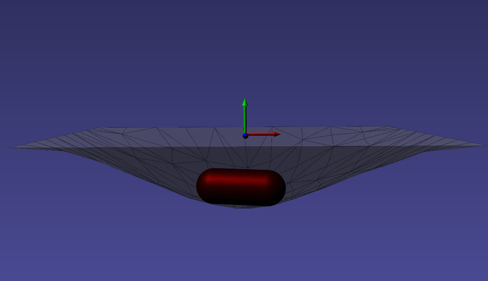
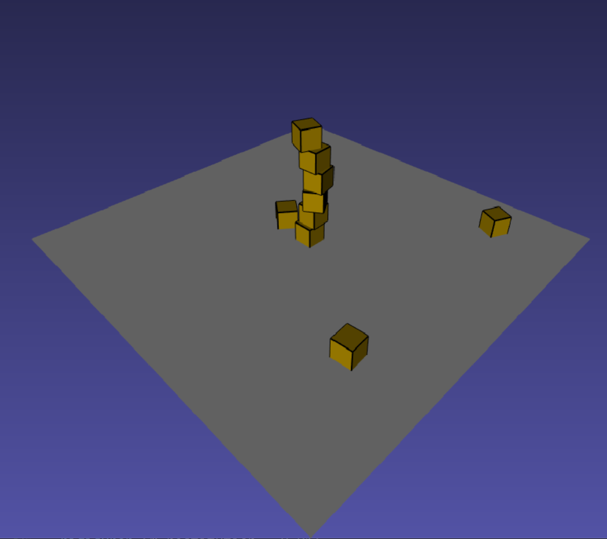

# Collision

Physics-based objects won't do much without an external force (such as gravity provided in many models). One such interaction is contact. At a high level iMSTK provides various objects for one to specify a collision between two objects.

## PbdObjectCollision

Collision between two PBD simulated objects can be specified like so:

```cpp
auto collision = std::make_shared<PbdObjectCollision>(myPbdObject, myOtherPbdObject);
scene->addSceneObject(collision);
```

Both objects must contain a collision geometry
```cpp
myPbdObject->setCollidingGeometry(mySphereGeometry);
```

These collisions are two-way interactions. Whether it's a rigid or deformable (cloth, tissues). Both objects will experience reactions.

Note: Not all geometries collide with all other geometries. See the collision page for a chart on supported collisions.

### PbdObjectCollision Parameters

`PbdObjectCollision` supports friction, restitution, and contains a compliance/stiffness. It has appropriate defaults.

When rigid-rigid or rigid-deformable collisions are used one can supply the rigid body compliance to alter how "stiff" the collision is. 0 represents infinitely rigid collisions. In reality these are hard to keep stable. So a small epsilon of a compliance is often used. This parameter can also be used to loosen the collision greatly like a spring.

```cpp
auto collision = std::make_shared<PbdObjectCollision>(myPbdObject, myOtherPbdObject);
collision->setFriction(0.1); // 0-1 value. 0 is no friction. 1 is max friction.
collision->setRestitution(0.0); // 0-1 value. 0 is full bounce. 1 is no bounce.
collision->setRigidBodyCompliance(0.000001); // 0 is completely rigid
```

When deformable-deformable collisions are used one instead can supply a stiffness for each side of the collision. If one side of the collision objects is static/non-simulated then its deformable stiffness is zeroed out. Stiffness here can be seen as step size. With one step of the solver 1.0 is a valid. With multiple steps a smaller value is desirable to avoid overshooting.

```cpp
auto collision = std::make_shared<PbdObjectCollision>(myPbdObject, myOtherPbdObject);
collision->setFriction(0.1); // 0-1 value. 0 is no friction. 1 is max friction.
collision->setRestitution(0.0); // 0-1 value. 0 is full bounce. 1 is no bounce.
collision->setDeformableStiffnessA(0.3); // 0 is completely loose
collision->setDeformableStiffnessB(0.3); // 0 is completely loose
```

<p align="center">
  
</p>

### Collision with Statics

Collisions with non-simulated objects is also supported, just supply a `CollidingObject` to the `PbdObjectCollision` on the right hand side:

```cpp
auto collidingObject = std::make_shared<CollidingObject>();
auto pbdObject = std::make_shared<PbdObject>();
...
auto collision = std::make_shared<PbdObjectCollision>(pbdObject, collidingObject);
scene->addSceneObject(collision);
```

## RigidObjectCollision

Gives collision for `RigidObject2` types. These are older deprecated types. It is setup in a similar way though.

```cpp
auto collision = std::make_shared<RigidObjectCollision>(myRbdObject, myRbdObject);
// OR with a static
auto collision = std::make_shared<RigidObjectCollision>(myRbdObject, myCollidingObject);
```

It does not allow any compliance, the solver always converges to complete rigidity. It has a friction term, and a baumgarte stabilization term which can vary the restitution and effects the `stiffness` of the collision. When high it will allow the object to penetrate more over a step but bounce more.

<p align="center">
  
</p>

## SphObjectCollision

Gives collision for `SphObject`. Can only be used for collision between a `SphObject` fluid and static `CollidingObject`.

```cpp
scene->addInteraction(std::make_shared<SphObjectCollision>(mySphObject, myCollidingObject));
```

## [Collision Detection](Collision/Collision_Detection.md)

For details on `CollisionDetectionAlgorithm`, this page describes the geometric operations under the hood used to compute a collision. Collision can be used standalone if the user does not required resolution.

```cpp
SphereToSphereCD detector;
detector.setInput(0, mySphereA);
detector.setInput(1, mySphereB);
detector.update();
```

Which then produces `CollisionData` for later usage.

## [Collision Handling](Collision/Collision_Handling.md)

For details on PbdObjectCollision and implementations of resolution. Not neccesary for average users but can be helpful. A `CollisionHandler` implements how to consume `CollisionData`. iMSTK provides handling methods, typically these call upon the functions of a DynamicalModel to respond (explicit solve) or add something (such as a constraint) to later implicitly solve.