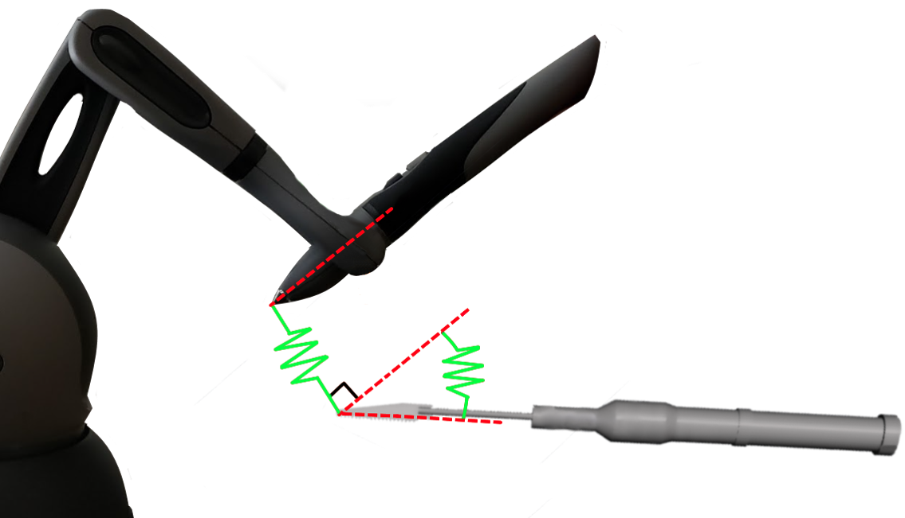

# Controllers

Controllers take device input and do something with it. A variety of predefined controls exist in iMSTK as well as some base classes for users to extend their own.

## Virtual Coupling

A common iMSTK control is the `PbdObjectController`, used to couple a tool to a 3d tracking device.

```cpp
auto controller = myPbdObject->addComponent<PbdObjectController>();
controller->setControlledObject(pbdToolObj);
controller->setLinearKs(20000.0);
controller->setAngularKs(8000000.0);
controller->setUseCritDamping(true);
controller->setForceScaling(0.05);
controller->setSmoothingKernelSize(15);
controller->setUseForceSmoothening(true);
```

This class applies virtual coupling. Virtual coupling takes a physical and virtual position and couples them with a linear and angular spring.

<p align="center">
  
</p>

The spring is kept very tight. But loosening can be used. With a spring when a virtual body contacts a plane extremely large forces are not produced to stop it. Instead a spring is used and the force gradually increases from zero. This creates the ideal haptic experience. The spring used also applies a damper. That damper can be overriden but is automatically determined with critical damping.

```cpp
kd = 2.0 * sqrt(mass * ks);
```

In an ideal system (one that isn't discretized) this represents a spring that would only cross zero once.

### Ghost Rendering

In the below gif one can see the physical tool with a transparent rendering, and the opaque with the virtual tool.

<p align="center">
  
</p>

To quickly do this in iMSTK one can add a `ObjectControllerGhost` to an entity and provide it the controller. Fade in can be set to fade opacity with a growing force.

```cpp
// Add extra component to tool for the ghost
auto controllerGhost = lapTool->addComponent<ObjectControllerGhost>();
controllerGhost->setUseForceFade(true);
controllerGhost->setController(controller);
```

### Force Text Rendering

It can often be useful to see the forces experienced by the user. This can be done easily by adding a `ControllerForceText` component.

```cpp
auto controllerForceTxt = lapTool->addComponent<ControllerForceText>();
controllerForceTxt->setController(controller);
```

## Control Abstract Classes

Provided in iMSTK are `MouseControl`, `KeyboardControl`, & `TrackingDeviceControl`. These are abstract base classes inteded for users to subclass and implement their own control via overrides.

```cpp
class CustomMouseControl : public MouseControl
{
public:
    CustomMouseControl(const std::string& name = "CustomMouseControl") : MouseControl(name) { }

protected:
    void OnButtonPress(const int key) override { }
    void OnButtonRelease(const int key) override { }
    void OnScroll(const double dx) override { }
    void OnMouseMove(const Vec2d pos) override { }
};

void main()
{
    ...
    // In main we could set it up like so:
    auto control = mySceneObject->addComponent<CustomMouseControl>();
    control->setDevice(viewer->getMouseDevice());
    ...
}
```

While subclassing is preferred. C++ lambdas may also be used for fast prototyping. Not recommended at scale:
```cpp
void main()
{
    ...
    connect<KeyEvent>(viewer->getKeyboardDevice(), &KeyboardDeviceClient::keyPress,
        [&](KeyEvent* e)
        {
            if (e->m_key == '1')
            {
            }
        });
    ...
}
```