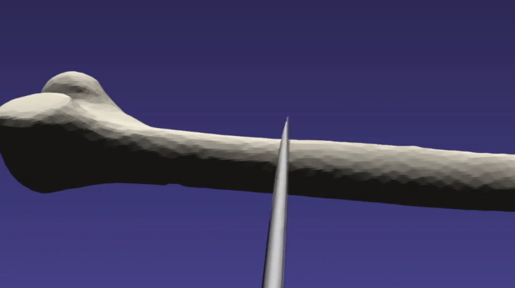
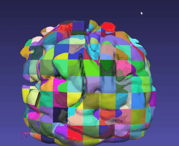

# Cutting

Cutting is available in iMSTK. There are a large amount of cutting methods in surgical simulation. iMSTK currently supports a discrete mesh based cutting method in it's `PbdObjectCutting`. Discrete cut meaning it can only cut once in an instance and is not suitable for continuous cutting.

## PbdObjectCutting

Setting up a PBD cloth and a cut quad mesh one can configure `PbdObjectCutting` like so:

```cpp
auto cutting = std::make_shared<PbdObjectCutting>(tissueObj, toolObj);
scene->addSceneObject(cutting);
```

It could, for example, be hooked up to a key press `g`.
```cpp
connect<KeyEvent>(viewer->getKeyboardDevice(), &KeyboardDeviceClient::keyPress,
    [&](KeyEvent* e)
    {
        if (e->m_key == 'g')
        {
            cutting->apply();
        }
    });
```

This also works for `LineMesh` meshes. Useful for `ConnectiveTissue` cutting.


## PbdObjectTearing

## PbdObjectBurning

## RigidObjectLevelSetCollision

The `RigidObjectLevelSetCollision` can be used for material removal. It is good for bone sawing, burring and tooth milling actions where the object being removed from is static. It does this with the `LevelSetModel` in iMSTK, intended for movement of the levelset with a rigid body tool. It can be utilized like so:

```cpp
// Setup cutting interaction between level set femur and rigid object tool
auto cutting = std::make_shared<RigidObjectLevelSetCollision>(rbdObj, femurObj);
scene->addInteraction(cutting);
```

It can further be modified with:

```cpp
auto colHandlerA = std::dynamic_pointer_cast<RigidBodyCH>(cutting->getCollisionHandlingA());
colHandlerA->setUseFriction(false);
colHandlerA->setBaumgarteStabilization(0.05); // inelastic collision

auto colHandlerB = std::dynamic_pointer_cast<LevelSetCH>(cutting->getCollisionHandlingB());
colHandlerB->setLevelSetVelocityScaling(0.01);
colHandlerB->setKernel(3, 1.0);
//colHandlerB->setLevelSetVelocityScaling(0.0); // Can't push the levelset
colHandlerB->setUseProportionalVelocity(true);
```

The femurObj here must be setup with a `SignedDistanceField` geometry provided to the `LevelSetModel` for initialization.

<p align="center">
  
</p>

To visualize the `SignedDistanceField` one can volume render it or isosurface extract it every frame. Doing this every frame for a large image may be costly so iMSTK provides a `LocalMarchingCubes` operation that can be read about in the [Filtering](./Extras/Filtering.md) section of this documentation. It effectively chunks the image and only re-extracts modified portions of it.

<p align="center">
  
</p>