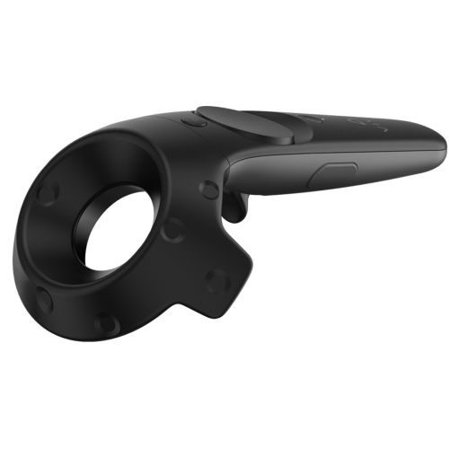
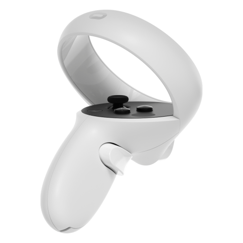
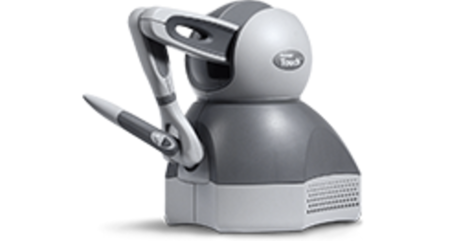
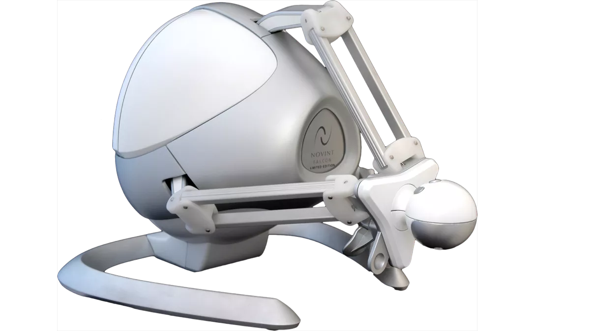

# Devices

## Overview

Devices in iMSTK give live interactive input for iMSTK. In iMSTK devices only provide input data, they do no logic using this data. Controllers are instead used to implement the device inputs.

Examples of devices are:

- `KeyboardDeviceClient`
    - Provides an interface for the keyboard. Including checks for keys up/down and events for press/release events.
- `MouseDeviceClient`
    - Provides an interface for the mouse. Including checks for buttons up/down, getting mouse position, and recieving button press/release, scroll, and move events.
- `OpenVRDeviceClient`
    - Provides an interface for VR headset and controllers. Including checks for buttons down/up/touched, getting the 3d position & orientation, and button press/release/touch/untouch events.
- `HapticDeviceClient`
    - Provides an interface for haptic devices. Including checks for buttons up/down,getting the position & orientation, and button press/release events.

Note: `KeyboardDeviceClient`, `MouseDeviceClient`, and `OpenVRDeviceClient` can only be provided via a Viewer as they are tied to the OS.

HTC Vive Controller          |  Oculus Touch Controller
:-------------------------:|:-------------------------:
  |  


3D Touch          |  Falcon
:-------------------------:|:-------------------------:
  |  

## Keyboard and Mouse

One can get a `KeyboardDeviceClient` and `MouseDeviceClient` from the `VTKViewer`:

```cpp
auto viewer = std::make_shared<VTKViewer>();
viewer->setActiveScene(...);

std::shared_ptr<KeyboardDeviceClient> keyboardDevice = viewer->getKeyboardDevice();
std::shared_ptr<MouseDeviceClient> mouseDevice = viewer->getMouseDevice();

auto simManager = std::make_shared<SimulationManager>();
simManager->addModule(viewer);
simManager->start();
```

Directly query the device with:

```cpp
if (keyboardDevice->getButton('o') == KEY_PRESS)
{
    printf("Key is down\n");
}
```

Get callback events, only once, when the button is pressed.

```cpp
connect<KeyEvent>(keyboardDevice, &KeyboardDeviceClient::keyPress,
[](KeyEvent* e)
{
    printf("%d key was pressed\n", e->m_key);
});
```
Alternatively, connect directly to an function on an object.

```cpp
class MyObject : public EventObject
{
public:
    void activate(KeyEvent* e) { }
};
auto myObject = std::make_shared<MyObject>();
connect<KeyEvent>(keyboardDevice, &KeyboardDeviceClient::keyPress, myObject, &MyObject::activate);
```

## Virtual Reality Devices

iMSTK supports OpenVR, when a `VTKOpenVRViewer` is used, a device `OpenVRDeviceClient` can be acquired for each controller or the headset itself. 

```cpp
auto viewer = std::make_shared<VTKOpenVRViewer>();
viewer->setActiveScene(...);
std::shared_ptr<OpenVRDeviceClient> leftController = viewer->getOpenVRDeviceClient(OPENVR_LEFT_CONTROLLER);
std::shared_ptr<OpenVRDeviceClient> rightController = viewer->getOpenVRDeviceClient(OPENVR_RIGHT_CONTROLLER);
std::shared_ptr<OpenVRDeviceClient> headset = viewer->getOpenVRDeviceClient(OPENVR_HMD);

auto simManager = std::make_shared<SimulationManager>();
simManager->addModule(viewer);
simManager->start();
```

Directly get the state or use events from the VR device. OpenVR controllers have buttons with press, release, touched, an untouched events.

VR controllers are useful because they give you positions and orientations. These can be acquired like so:

```cpp
Vec3d position = leftController->getPosition();
Quatd orientation = leftController->getOrientation();
```

## OpenHaptics Devices

OpenHaptics can be used as a backend for devices. They can be used a lot like OpenVR controllers. They report position and orientation, they also have buttons. The same code above can be used to get position & orientation. Additionally they emit button events similar to all the other devices.

Haptic devices also allow one to feel forces. A user may send a force to the device to be rendered. Haptics are run on another thread at a very fast. Ideally >1000hz when virtual coupling is used. But >500hz is also reasonable.

The default avaiable haptic device can be acquired like so:

```cpp
std::shared_ptr<DeviceManager> hapticManager = DeviceManagerFactory::makeDeviceManager();
driver->addModule(hapticManager);
std::shared_ptr<DeviceClient> deviceClient = hapticManager->makeDeviceClient();
```

To run this `DeviceManager` would be added to the `SimulationManager`.

```cpp
auto simManager = std::make_shared<SimulationManager>();
simManager->addModule(hapticManager);
// typically you would add a VTKViewer and SceneManager here
simManager->start();
```

To apply force on a haptic device so they can feel feedback use:

```cpp
client->applyForce(Vec3d(0.0, 1.0, 0.0));
```

CAUTION: Large forces could cause haptic devices to move violently.

## Haply Devices

The Haply Inverse3 haptic device is supported in iMSTK. If Haply Hardware API is built with it will be the default device and can be used just as the OpenHaptics device is. By default the Haply pen is searched for and used, if found. One can get a list of Haply port names:

```cpp
// Haply Inverse3
HaplyDeviceManager::getInverse3PortNames();
// Haply Pen
HaplyDeviceManager::getHandlePortNames();
```

## VRPN Devices

iMSTK supports the Tracker, Button and Analog device types of the VRPN library. It utilizes the normal VRPN server that will be in the installation directory when VRPN is enabled. The VRPNManager utilizes the VRPN client protocol to connect to the server and retrieve the data delivered by the VRPN. As VRPN uses TCP/IP for communication devices may be connected to a remote machine. With VRPN most of the device configuration is being done in the vrpn.cfg that is being used, ports, speeds, or world to virtual space transforms can be set up there. To use VRPN in iMSTK vrpn_server has to be started from the command line. When VRPN is enabled it will be installed in the iMSTK binary directory.

```cpp
auto server = std::make_shared<VRPNDeviceManager>("localhost", 38833);
auto client = vrpnManager->makeDeviceClient("Tracker0", VRPNTracker)

auto manager = std::make_shared<SimulationManager>();
manager->addModule(server)
``` 

If a special device is needs there are multiple extensions points, VRPNDeviceClient can be derived from and data could be mapped there. There are some VRPN devices that map data, or a specific VRPN device client could be implemented by overriding the update() method in the client.

## DummyClient Devices

DummyClient is a `DeviceClient` it can often be useful to supply to a control instead of a device client. It implements no API and just lets users set/get the position and orientation directly. For example, it can be used in Unity or Unreal VR controls. It's often used in examples to map mouse input too before supplying the DeviceClient to a control.