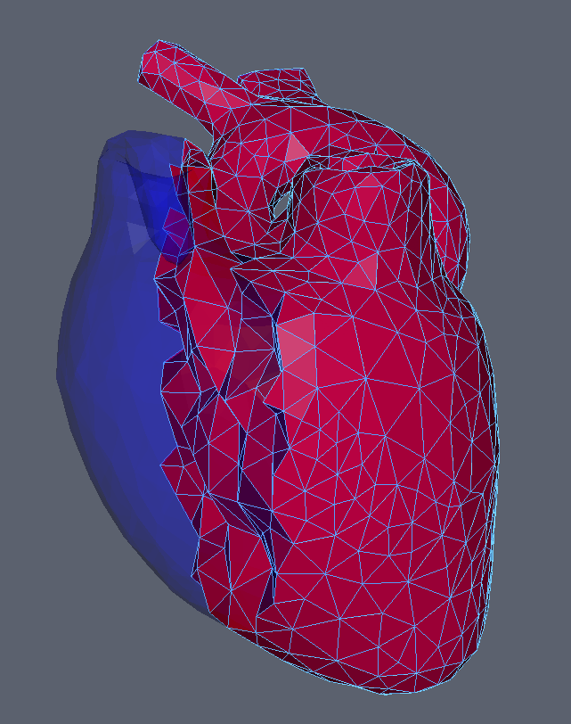

# Finite Element Method (FEM)

The finite element method allows for simulation of many things but is aimed at deformable bodies in iMSTK. Particularly those with a tetrahedral mesh. FEM is currently one of the slower approaches in iMSTK but can be more accurate. In real-time simulation the problem is often performance/time not just performance.

> **Note:** The `FEMDeformableBodyModel` is being deprecated, it is no longer supported by us and will most likely be removed in the next release. Use PBD and the appropriate strain engergy constraints.

## Usage

FEM finds its use for tissues in iMSTK.

<p align="center">
  
</p>

## Code

FE dynamical model can be configured by using an external configuration file or in code.

```cpp
// Setup config
auto config = std::make_shared<FEModelConfig>();
config->m_fixedNodeIds = input.fixedNodeIds;
config->m_femMethod = FEMMethodType::StVK;

// Setup the model
auto dynaModel = std::make_shared<FEDeforambleBodyModel>();
dynaModel->configure(config);
dynaModel->setTimeStepSizeType(TimeSteppingType::Fixed);
dynaModel->setModelGeometry(tetMesh);
dynaModel->setTimeIntegrator(std::make_shared<BackwardEuler>(0.01));
```

Alternatively a configuration file may be used. A configuration file specifies (a) an external file listing the IDs of the nodes that are fixed, (b) density, (c) Damping coefficients, (d) elastic modulus, (e) Poisson’s ratio, (f) the choice of FE formulation available. The formulation that are available are (i) Linear (ii) Co-rotation (iii) invertable (iv) Saint-Venant Kirchhoff. Currently backward Euler is the only time stepping that is available in iMSTK.

```cpp
// Setup the model
auto dynaModel = std::make_shared<FEMDeformableBodyModel>();
dynaModel->configure(iMSTK_DATA_ROOT "/asianDragon/asianDragon.config");
dynaModel->setTimeStepSizeType(TimeSteppingType::Fixed);
dynaModel->setModelGeometry(tetMesh);
dynaModel->setTimeIntegrator(std::make_shared<BackwardEuler>(0.01));
```

This can be given to a FeDeformableObject for usage in the scene.

## Reduced FEM

Reduced FEM provides a faster, less accurate FEM, it is currently only supported on Linux when the proper build flag is used. The example code is outdated.

In the solid mechanics community, the finite element methods are usually used to simulate the dynamic systems of deformable objects. These simulations are set up in an offline, non-interactive manner, partially due to the high computational and storage cost. For example, in a typical simulation there are tens of thousands of degrees of freedoms. Hence, interactive simulations are prohibited for objects with complex geometry and non-trivial material. As an alternative, model order reduction (MOR, also called dimensional model reduction) provides quantitatively accurate descriptions of the dynamics of systems at a computational cost much lower than the original numerical model.

The idea is to project the original, high-dimensional solution space onto a low-dimensional subspace to arrive at a reduced model that approximates the original system. The low-dimensional subspace is carefully chosen such that the most important characteristics (also known as modes) of the original system’s behaviors are preserved. With much less degrees of freedom, the reduced model can be solved much faster than the original system.

In the following is an example of how to create and configure an MOR dynamical model. Two input files generated in Vega for the time being have to be specified, one storing the coefficients of the cubic polynomials for the reduced internal forces, and the other the basis matrix.

```cpp
// Setup config
auto config = std::make_shared<ReducedStVKConfig>();
config->m_cubicPolynomialFilename = iMSTK_DATA_ROOT "/asianDragon/asianDragon.cub";
config->m_modesFileName = iMSTK_DATA_ROOT "/asianDragon/asianDragon.URendering.float";

// Setup the model
auto dynaModel = std::make_shared<ReducedStVK>();
dynaModel->configure(config);
dynaModel->setTimeStepSizeType(TimeSteppingType::Fixed);
dynaModel->setModelGeometry(volTetMesh);
dynaModel->setTimeIntegrator(std::make_shared<BackwardEuler>(0.01));
```