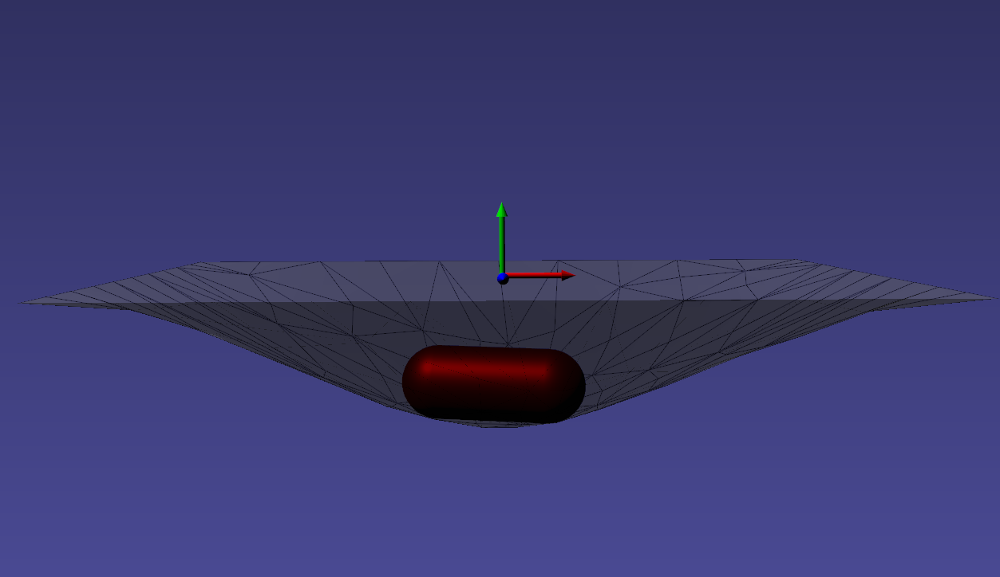

# Position Based Dynamics (PBD)

Position based dynamics [[pbd]](#pbd) is a first order, particle & constraint based dynamical model. It simulates the dynamics of objects through direct manipulation of particle positions with velocities computed afterwards. This has pro's and cons, a major pro is the stability of such method. During the solve step position can be reprojected implicitly, there is no need for an integratoin step.

Pbd in iMSTK is primarily used for deformable & rigid bodies but can also be used for fluids (both gas and liquid). Discussed here are its medical applications.

The particular implementation of PBD used in iMSTK is Extended PBD [[xpbd]](#xpbd) and Rigid Body PBD [rpbd](#rpbd).

The general pbd pipeline is as follows:

- **Integrate Position**: Given the current velocity of every particle, compute the new/tentative position.
- **Solve Internal Constraints**: Solve all internal constraints (directly changing positions). Resolving any violations.
- **Update Velocities**: Compute new velocities from the displacements produced.

## Surgical Tools

To setup a rigid pbd body with capsule geometry:

```cpp
// Create the geometry
auto rigidGeom = std::make_shared<Capsule>(Vec3d(0.0, 0.0, 0.0), 0.005, 0.015);

// Setup the objects visual, collision, and physics geometry
auto capsuleObj = std::make_shared<PbdObject>("capsule0");
capsuleObj->setVisualGeometry(rigidGeom);
capsuleObj->setCollidingGeometry(rigidGeom);
capsuleObj->setPhysicsGeometry(rigidGeom);

// Setup the model used
capsuleObj->setDynamicalModel(pbdModel);

// Setup the body
capsuleObj->getPbdBody()->setRigid(
  Vec3d(0.0, 0.0, 0.0), // Position
  1.0, // Mass
  Quatd::Identity(), // Orientation
  Mat3d::Identity() * 0.1); // Inertia

scene->addSceneObject(capsuleObj);
```

Any geometry will work. Except those that can't be rigidly transformed such as `SignedDistanceField` and `ImageData`.

A rigid PBD simulated body dropped into a PBD simulated thin tissue.

<p align="center">
  
</p>

## Deformable Membranes

For thin deformable membraneous tissues (cloth like) a SurfaceMesh can be used. For this simulation one may use **PbdDistanceConstraint**, **PbdDihedralConstraint**, and/or **PbdAreaConstraint**. The most common setup is just distance and dihedral constraints though. The distance constraints keep the cloth together, whilst the dihedral constraint controls how resistent to bending the membrane is. It's useful to note that tissues can stretch but most cloths cannot (only bend). Hollow organs can also be modelled like this however they have poor recovery from inversion and may fold over. For this reason a deformable can better approximate a hollow organ.

2D Tissue Membrane        |  2D Cloth
:-------------------------:|:-------------------------:
  |  

To setup a thin deformabl membrane:

```cpp
// Setup the Geometry
std::shared_ptr<SurfaceMesh> mesh =
    GeometryUtils::toTriangleGrid(Vec3d::Zero(),
        Vec2d(width, height), Vec2i(rowCount, colCount),
        Quatd::Identity(), 2.0);

// Setup the Parameters
auto pbdParams = std::make_shared<PbdModelConfig>();
pbdParams->enableConstraint(PbdModelConfig::ConstraintGenType::Distance, 10000.0);
pbdParams->enableConstraint(PbdModelConfig::ConstraintGenType::Dihedral, 0.1);
pbdParams->m_gravity    = Vec3d(0.0, -0.01, 0.0);
pbdParams->m_dt         = 0.005;
pbdParams->m_iterations = 4;
pbdParams->m_linearDampingCoeff = 0.01;

// Setup the Model
auto pbdModel = std::make_shared<PbdModel>();
pbdModel->configure(pbdParams);

// Setup the VisualModel
auto material = std::make_shared<RenderMaterial>();
material->setBackFaceCulling(false);

// Setup the Object
auto tissueObj = std::make_shared<PbdObject>(name);
tissueObj->setVisualGeometry(mesh);
tissueObj->getVisualModel(0)->setRenderMaterial(material);
tissueObj->setPhysicsGeometry(mesh);
tissueObj->setCollidingGeometry(mesh);
tissueObj->setDynamicalModel(pbdModel);

// Fix the edges
for (int x = 0; x < rowCount; x++)
{
    for (int y = 0; y < colCount; y++)
    {
        if (x == 0 || y == 0 || x == rowCount - 1 || y == colCount - 1)
        {
            tissueObj->getPbdBody()->fixedNodeIds.push_back(x * colCount + y);
        }
    }
}
tissueObj->getPbdBody()->uniformMassValue = 1.0;
```

## Deformable Volumetric Tissue

For volumetric deformable tissues discretized with tetrahedrons may be used. With the tetrahedrons one may either use (a) **PbdVolumeConstraint** & **PbdDistanceConstraint** constraints Or (b) use **PbdStrainEnergyConstraint** constraints. The Strain Energy constraints are more accurate than the volume+distance. However, they are much slower in that one may not be able to achieve the target element count or timestep, iteration count, & stiffness. The volume constraints behave well with sign inversion, recovering well from inverted tetrahedrons quickly. **PbdStrainEnergyConstraint** can recover from inversion even better than the volume ones but it is costly. Best if you only have a couple tetrahedrons inverting for a short period.

Tetrahedral Needle Puncture        |  Endoscope Tissue Press
:-------------------------:|:-------------------------:
  |  

PBD Strain Energy simulation can be setup with NeoHookean, StVK, Linear, or CoRotation models. NeoHookean is recommended for large deformation but slightly more costly than StVK.

```cpp
// Setup the Model
auto pbdModel = std::make_shared<PbdModel>();
pbdModel->getConfig()->m_dt = 0.005;
pbdModel->getConfig()->m_iterations = 4;
pbdModel->getConfig()->m_linearDampingCoeff = 0.01;
pbdModel->getConfig()->m_gravity = Vec3d(0.0, -0.01, 0.0);

// Setup the Geometry
std::shared_ptr<TetrahedralMesh> tissueMesh = GeometryUtils::toTetGrid(center, size, dim);

// Setup the Object
auto tissueObj = std::make_shared<PbdObject>(name);

// Setup the visuals
auto visuals = tissueObj->addComponent<VisualModel>();
visuals->setGeometry(tissueMesh);
auto material = std::make_shared<RenderMaterial>();
material->setShadingModel(RenderMaterial::ShadingModel::PBR);
visuals->setRenderMaterial(material);

// Setup the physics
tissueObj->setPhysicsGeometry(tissueMesh);
tissueObj->setDynamicalModel(model);
tissueObj->getPbdBody()->uniformMassValue = 0.05;

// Fix/hold in place the borders of the simulated geometry
for (int z = 0; z < dim[2]; z++)
{
    for (int y = 0; y < dim[1]; y++)
    {
        for (int x = 0; x < dim[0]; x++)
        {
            if (x == 0 || /*z == 0 ||*/ x == dim[0] - 1 /*|| z == dim[2] - 1*/)
            {
                tissueObj->getPbdBody()->fixedNodeIds.push_back(x + dim[0] * (y + dim[1] * z));
            }
        }
    }
}
model->getConfig()->m_secParams->m_YoungModulus = 4000.0;
model->getConfig()->m_secParams->m_PoissonRatio = 0.45;
model->getConfig()->enableStrainEnergyConstraint(PbdStrainEnergyConstraint::MaterialType::NeoHookean);
model->getConfig()->setBodyDamping(tissueObj->getPbdBody()->bodyHandle, 0.001);
```

## Deformable Threads

Surture threads are very common in surgical scenarios. For threads one may use **PbdDistanceConstraint** & **PbdBendConstraint** constraints. The distance constraints keep the particles of the thread together, whilst the bend controls the rigidity of the the thread. The bend constraints may also be generated between multiple sets of particles to reduce iteration count. It's useful to note that a LineMesh threads **PbdDistanceConstraint**'s will be solved in fewer iterations if the lines are ordered from end effector to tail.

<p align="center">
  
</p>

To setup a `LineMesh` that is simulated with PBD:

```cpp
// Setup the Geometry
std::shared_ptr<LineMesh> stringMesh = GeometryUtils::toLineGrid(start, dir, length, dim);

const int numVerts = stringMesh->getNumVertices();

// Setup the Parameters
auto pbdParams = std::make_shared<PbdModelConfig>();
pbdParams->m_gravity    = Vec3d(0.0, -9.8, 0.0);
pbdParams->m_dt         = 0.0005;
pbdParams->m_iterations = 1;
pbdParams->m_linearDampingCoeff = 0.03;

// Setup the Model
auto pbdModel = std::make_shared<PbdModel>();
pbdModel->configure(pbdParams);

// Setup the VisualModel
auto material = std::make_shared<RenderMaterial>();
material->setBackFaceCulling(false);
material->setLineWidth(4.0);
material->setDisplayMode(RenderMaterial::DisplayMode::Wireframe);

// Setup the Object
auto stringObj = std::make_shared<PbdObject>(name);
stringObj->setVisualGeometry(stringMesh);
stringObj->getVisualModel(0)->setRenderMaterial(material);
stringObj->setPhysicsGeometry(stringMesh);
stringObj->setCollidingGeometry(stringMesh);
stringObj->setDynamicalModel(pbdModel);

stringObj->getPbdBody()->uniformMassValue = 0.0001 / numVerts; // grams
stringObj->getPbdBody()->fixedNodeIds     = { 0, }; // Fix the first vertex
pbdParams->enableConstraint(PbdModelConfig::ConstraintGenType::Distance, 200.0);
pbdParams->enableBendConstraint(0.01, 1);
```

## Liquids

Liquids can be modeled with pbd using **PbdConstantDensityConstraint**. Generally, the stiffness is kept as high as possible as liquids are incompressible. If not, you may observe "bouncey" behaviour. Liquids in iMSTK are most useful for bleeding simulation.

<p align="center">
  
</p>

To setup a PBD fluid:

```cpp
// Load a sample mesh
std::shared_ptr<PointSet> fluidMesh = MeshIO::read("myPointSet.vtk");

const double particleRadius = 0.5;
auto material = std::make_shared<RenderMaterial>();
material->setDisplayMode(RenderMaterial::DisplayMode::Fluid);
material->setVertexColor(Color::Red);
material->setPointSize(particleRadius); // Control visual particle size

auto fluidObj = std::make_shared<PbdObject>();
fluidObj->setVisualGeometry(fluidMesh);
fluidVisualModel->getVisualModel(0)->setRenderMaterial(material);
fluidObj->setCollidingGeometry(fluidMesh);
fluidObj->setPhysicsGeometry(fluidMesh);

auto pbdModel = std::make_shared<PbdModel>();
std::shared_ptr<PbdModelConfig> pbdParams = pbdModel->getConfig();
pbdParams->enableConstantDensityConstraint(1.0, particleRadius);
pbdParams->m_gravity    = Vec3d(0.0, -9.8, 0.0);
pbdParams->m_dt         = 0.005;
pbdParams->m_iterations = 2;

fluidObj->setDynamicalModel(pbdModel);
fluidObj->getPbdBody()->uniformMassValue = 1.0;
```

## Gasses

The primary usage for gas is particles during electrocautery. Often these would be billboarded smoke images on particles that fade fairly quickly. There are currently no examples for gas in iMSTK. It is a fluid though, so its approach is not much different than liquids. The **PbdConstantDensityConstraint** may be used. I would suggest using a lower stiffness as liquids tend to be incompressible (constant density) whereas gasses are compressible. The other issue is the lack of proper boundary conditions. Often we are modeling a gas suspended in air. This air must be modeled too if you want accuracy. There do exist some solutions with "ghost particles" to approximate air without adding air particles, but iMSTK does not have such solutions yet. If this is for visual purposes I might suggest lowering gravity, fiddling with mass, etc to get believable behaviour without being suspended in anything.

## Constraints and Parameters

To use a `PbdModel`, create a `PbdBody` from it. In the above code when a `PbdObject` is created this is automatically done for you. The `PbdBody` represents the `PbdObject` in the `PbdModel`. Multiple `PbdModel`'s could be used but normally only one large system is shared among all simulated objects. The PbdBody can be rigid or deformable. If rigid, geometry doesn't matter. If deformable, it can only be supplied one `Geometry` for constraint generation of its particles. So this means it can only be SurfaceMesh deformable, a LineMesh deformable, or a TetrahedralMesh deformable. But one is able to attach constraints between `PbdBody`'s should you need to connect geometries of differing types (ex: or even connect a rigid body needle to a deformable suture thread).

The PbdModel has a bunch of constraints and some global parameters.

**Constraints**: Constraints of varying types may be used via ``PbdModelConfig::enableConstraint``, internally this uses PbdConstraintFunctor's which defines how to generate constraints. If one needs more hands on with constraints you may write your own ``PbdConstraintFunctor``. Implemented by subclassing PbdConstraintFunctor and overriding the operator() function. See existing functors in ``imstkPbdConstraintFunctor.h``.

```cpp
auto myCustomFunctor = std::make_shared<MySuperCustomFunctor>();
myCustomFunctor->setStiffness(0.95);
pbdModel->addPbdConstraintFunctor(myCustomFunctor);
```

**dt**: The timestep is used during integration to move the particles. Small timesteps are preferable for stability. Real time steps may be used by varying dt every update of the simulation.

```cpp
connect<Event>(sceneManager, &SceneManager::postUpdate, [&](Event*)
{
    pbdConfig->m_dt = sceneManager->getDt();
});
```

**Iterations**: The iterations of the solver used in the internal constraints. More iterations give changes more time to percolate through the body. For example, a really long thread with numerous segments may have a really high stiffness but if it doesn't have enough iterations it will never be able to reach maximum stiffness. In the original PBD paper stiffness varied with the number of iterations. In xPBD (default) it does not.

**linearDampingCoeff** & **angularDampingCoeff**: Multiplied with velocity to slow any particles. Globally applied. There are also per `PbdBody` coefficients.

## Constraints

Pbd is a constraint based model. Constraints are made for particles in pbd. This constrains the movement of a particle. Constraints are given via a constraint function q, and the gradient of the function q. To solve a constraint is to reduce the scalar, q, to 0. The gradient gives the direction to move the particle to do this. A pbd particle may also optionally have an orientation, similarly constraints can be defined for orientations.

There are four types of pbd constraints in iMSTK.
 - PbdConstraint: Only linear constraints, not used for collision at all.
 - PbdCollisionConstraints: Used for deformable-deformable linear only collisions
 - PbdContactConstraints: Used for rigid-deformable and rigid-rigid collisions, applies force and torque. Has a support point, to define torque through that axes.
 - PbdAngularConstraint: Used only for changing the orientation of a body.

Among the PbdConstraints are:
- **PbdDistanceConstraint**: Constraints two points by the initial distance between them.
- **PbdDihedralConstraint**: Constrains two triangles by the initial angle between their planes.
- **PbdVolumeConstraint**: Constrains all points of a tetrahedron by the initial volume.
- **PbdFETetConstraint**:
- **PbdBendConstraint**: Constrains 3 points by the angle between the two lines. (like a 1d Dihedral)
- **PbdConstantDensityConstraint**: Constrains all points of a system to achieve constant density using SPH kernels (ie: repels particles in a spherical manner).
- **PbdAreaConstraint**: Constrains 3 points of a triangle by the initial area of that triangle.
- **PbdAngularDistanceConstraint**: Constraints two bodies by an angle, or one body to a fixed angle.
- **PbdBodyToBodyDistanceConstraint**: Constraints two rigid pbd bodies by a distance defined between two points local to each body (off center of mass).

This does not include all of them, a number of collision constraints were omitted.

To implement a custom constraint, subclass a `PbdConstraint`, construct or initialize it appropriately, then implement/override ``computeValueAndGradient`` which should fill out the constraint value C and constraint gradient dC/dx. This constraint would then need to be added to an existing system or solved in its own computational block.

## Bibliography

<a id="pbd">[pbd]</a>
Matthias Müller, Bruno Heidelberger, Marcus Hennix, and John Ratcliff. 2007.
Position based dynamics.
J. Vis. Comun. Image Represent. 18, 2 (April 2007), 109-118

<a id="xpbd">[pbd]</a>
Miles Macklin, Matthias Müller, and Nuttapong Chentanez.
XPBD: position-based simulation of compliant constrained dynamics.
In Proc. of Motion in Games. 49–54

<a id="rpbd">[rpbd]</a>
Matthias Mullerm, Miles Macklin, Nuttapong Chentanez, Stefan Jeschke, and Tae-Yong Kim. 2020.
Detailed Rigid Body Simulation with Extended Position Based Dynamics
Computer Graphics Forum Vol 39, Issue 8, 101-112

<a id="spbd">[spbd]</a>
Jan Bender, Matthias Muller, Miles Macklin. 2017.
A Survey on Position Based Dynamics.
Proc. of European Association for Computer Graphics. No. 6, 1-31