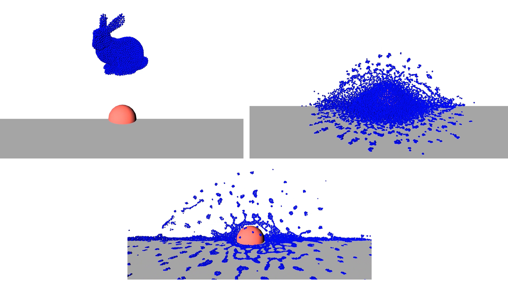

# Smooth Particle Hydrodynamics (SPH)

Our SPH model allows fluid simulations (liquids and gasses). But its oriented for liquids. It is not as fast as PBD liquids but provides more accuracy. The main difference being that PBD solves on the position level whilst SPH solves velocities.

The SPH model in iMSTK is a form of Weakly Compressible SPH (WSPH) introduced by Becker and Teschner [sph1]_, but with a number of modifications. In particular, their proposed momentum equation for acceleration update and Tait’s equation for pressure computation was employed. However, two different functions for kernel evaluation and evaluation of kernel derivatives were used, similar to Muller et al. [sph2]_. In addition, a variant of XSPH [sph3]_ is used to model viscosity that is computationally cheaper than the traditional formulation. The forces of surface tension are modeled using a robust formulation proposed by Akinci et al. [sph4]_ allowing simulation of large surface tension forces in a realistic manner.

During the simulation, each of the SPH particles needs to search for its neighbors within a preset radius of influence of the kernel function (see figure 1). In iMSTK, the nearest neighbor search is achieved using a uniform spatial grid data structure or using spatial hashing based lookup [sph5]. For fluid-solid interaction, the current implementation only supports one-way coupling in which fluid particles are repelled from solids upon collision by penalty force generation.

## Usage

SPH main usage is for blood, in the future it may find use for smoke.

<p align="center">
  
</p>

## Code

To setup a SPHModel we do:

```cpp
// Setup config
imstkNew<SPHModelConfig> sphConfig(particleRadius);
sphConfig->m_bNormalizeDensity = true;
sphConfig->m_kernelOverParticleRadiusRatio = 6.0;
sphConfig->m_surfaceTensionStiffness = 5.0;

// Setup the model
imstkNew<SPHModel> sphModel;
sphModel->setModelGeometry(geometry);
sphModel->configure(sphParams);
sphModel->setTimeStepSizeType(TimeSteppingType::RealTime);
```

This can be given to a SPHObject for usage in the scene.