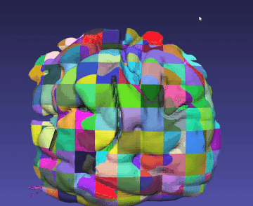

# Filtering

The filtering module in iMSTK provides classes that take one or more input geometries and produces one or more output geometries. General usage looks something like the following:

```cpp
// mesh1 and mesh2 are instances of SurfaceMesh
AppendMesh appendMesh;
appendMesh.setInput(mesh1, 0);
appendMesh.setInput(mesh2, 1);
appendMesh.update(); // Perform the append operation

auto results =	std::dynamic_pointer_cast<SurfaceMesh>(appendMesh->getOutput());

// Often convenience methods are provide to cast for you
results = appendMesh->getOutputMesh();
```

This particular filter takes two input SurfaceMeshes and combines/appends them.

This pattern can be applied to many geometric operations. Many filters wrap 3rd party APIs (such as VTK) to achieve an operation. A full list can be found in files [here](https://gitlab.kitware.com/iMSTK/iMSTK/-/tree/master/Source/Filtering).

## Signed Distance Field Generation

To generate a signed distance field (SDF) one can use the `ImageDistanceTransform` or `SurfaceMeshDistanceTransform` operation. SDFs are very useful for collision.

### SurfaceMeshDistanceTransform

`SurfaceMeshDistanceTransform` takes an input triangle mesh and produces an output `ImageData` that represents the signed distance field. This input `SurfaceMesh` must be closed. If having trouble with it, it is recommended to use `CleanMesh` before running to ensure duplicate vertices are resolved. One can also adjust the tolerance of the floating point calculation.

```
SurfaceMeshDistanceTransform computeSdf;
computeSdf.setInputMesh(dragonSurfMesh);
computeSdf.setDimensions(100, 100, 100);
computeSdf.update();
auto myImageData = computeSdf.getOutputImage();
```

One can also supply it the input mesh and perform individual nearest distance queries.

```
SurfaceMeshDistanceTransform computeSdf;
computeSdf.setInputMesh(dragonSurfMesh);
computeSdf.setupDistFunc();
Vec3d nearestPtToMyPoint = computeSdf.getNearestPoint(myPoint);
```

<p align="center">
  
</p>

## SurfaceMeshFlyingEdges

This is our fastest isosurface extraction method when the entire isosurface is needed.

## LocalMarchingCubes

Local marching cubes does marching cubes in chunks on a single ImageData. This requires no reordering of the ImageData in memory, and no special accessors. It produces N SurfaceMesh's, one for each chunk. The purpose of LocalMarchingCubes is to avoid remeshing the entire domain reducing computational cost.

To properly divide an image the dimensions - 1 must be divisible by the number of chunks. So if you're image is 100, 100, 100. Then you need to use divisors of 99, 99, 99. If inputs provided is not a divisor it will choose the next divisor and warn.

```cpp
LocalMarchingCubes isoExtract;
isoExtract.setInputImage(inputImage);
isoExtract.setIsoValue(0.0);
isoExtract.setNumberOfChunks(Vec3i(32, 9, 9));
isoExtract.update();

// Output given, some chunks may have no vertices
for (int i = 0; i < 39 * 9 * 9; i++)
{
	isoExtract->getOutput(i);
}
```

Below shows the level set cutting method with chunked marching cubes.

<p align="center">
  
</p>

## LineMeshCut & SurfaceMeshCut

These cutting methods produce division of a mesh given an input analytic geometry.

## CollisionDetectionAlgorithm

All of the `CollisionDetectionAlgorithm`'s stem from `GeometryAlgorithm`.