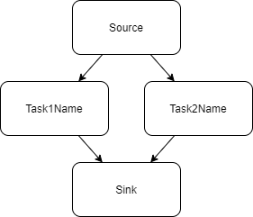
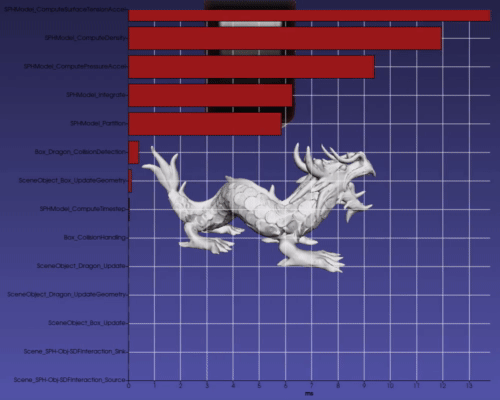

# Parallelism

Parallelization is used in iMSTK in various locations. Primarily one will find loop parallelization. TBB is used as the parallelization backend which maintains a thread pool and does its own scheduling.

iMSTK haptics also, by default, runs on a separate STL thread.

## Loop Parallelism

iMSTK uses loop based parallelism throughout code. For this use parallelFor.

```cpp
#include "imstkParallelUtils.h"

int main()
{
    ParallelUtils::parallelFor(100000, [&](const size_T i)
    {
        // Do something
    });
    return 1;
}
```

Here something is done 100000 times in parallel. The optimal number of threads is used.

## Task Graph

The `TaskGraph` in iMSTK contains a source and sink. A set of `TaskNode`'s, and set of directional edges. The edges express the succeeding and preceding tasks. A task may not execute until all its preceding tasks are complete. See examples here.

Task graphs are used internally in iMSTK as well. Every DynamicalModel (PBD, SPH, FEM) contains a TaskGraph. Sometimes it's as simple as a few tasks in sequence. Sometimes it's more complex. This is especially useful for inserting intermediate tasks and defining custom physics pipelines.

Here is a simple task graph construction:

```cpp
TaskGraph graph;

// Create and add the nodes
std::shared_ptr<TaskNode> task1Node = graph.addFunction("Task1Name",
    [&]()
    {
        // Do task 1 here
    });
std::shared_ptr<TaskNode> task2Node = graph.addFunction("Task2Name",
    [&]()
    {
        // Do task 2 here
    });

// Define the edges, add and mult steps will be done in parallel
graph.addEdge(graph.getSource(), task1Node );
graph.addEdge(graph.getSource(), task2Node );
graph.addEdge(task1Node, graph.getSink());
graph.addEdge(task2Node, graph.getSink());
```

This defines the following graph where Task1Name and Task2Name may be done in parallel.

<p align="center">
  
</p>

There are also numerous convenience functions in TaskGraph's. One may insert a node after or before a existing node in the graph (automatically adding edges).

```cpp
auto task = std::make_shared<TaskNode>("MyTask",
    [&]()
    {
        // do task here
    });
graph->insertAfter(task1Node, task);
```

There are also functions to check for cyclic dependencies, remove non-functional nodes, remove redundant edges (transient reduction), and topological sort.

Additionally, if TaskNode timing is enabled, a stopwatch may be used for every node and times reported. In many iMSTK examples, if you press `P` twice, you may see the Scene's task graph node timings making bottlenecks very easy to find.

<p align="center">
  
</p>