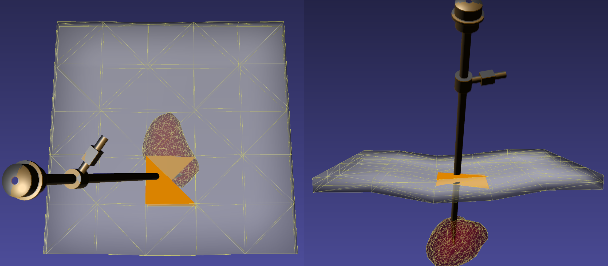

# Port Holes

Laparoscopic tools are often used in surgery. These are long cylindrical tools that are placed through a port punctured at the surface of the body. There are three options for this in iMSTK.

## PortHoleInteraction

The `PortHoleInteraction` is a very simple `Behaviour` one can add to an `Entity` in their `Scene`. It adds a constraint of a long line to a point specified to the system of constraints. It is setup like so:

```cpp
auto portHole = myObject->addComponent<PortHoleInteraction>();
portHole->setPosition(Vec3d(0.5, 1.0, 0.0)); // Some position
portHole->setTool(myToolObject);
portHole->setCompliance(0.01); // Completely optional. 0 is perfectly rigid
```

The compliance term is optional here but useful to avoid perfect rigidity as the skin is not. Avoid setting 0 for complete rigidity, use a small epsilon instead.


## Tissue Needle Interactions

One is able to simulate a skin layer and a "Needle" going through that skin to emulate the port hole. This is the most computationally expensive route and generally not recommended.

<p align="center">
  
</p>

## Physical Setup

A physical setup can be used. One can create a stand and physical laprascopic tools can be tracked through that setup. Of course, this is not very portable and requires more accurate registration.