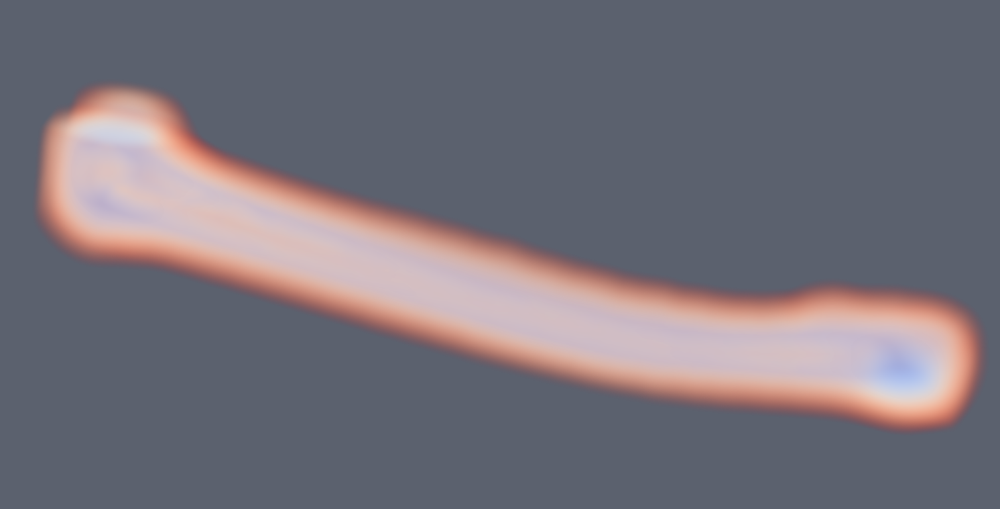

# Geometry

## Base Geometry

Geometry base class implements pre and post states of geometry as well as two types of transforms.

- `ApplyToData`: One transform directly applies to both pre and post geometry immediately.
- `ConcatenateToTransform`: The other transform applies to pre geometry in order to produce post geometry.
  
First see how to get both post and pre vertices of a PointSet. A similar convention is used among the other geometries (even post and pre values of primitive shapes)

```cpp
std::shared_ptr<PointSet> myPoints = MeshIO::read<PointSet>("file path here");
auto preVerticesPtr  = myPoints->getVertexPositions(Geometry::DataType::PostTransform);
auto postVerticesPtr = myPoints->getVertexPositions(Geometry::DataType::PreTransform);
```

With any geometry, apply transforms to either pre and/or post.

```cpp
std::shared_ptr<SurfaceMesh> mySurfaceMesh = MeshIO::read<SurfaceMesh>("file path here");

// Apply immediately to data, transforming both post and pre vertices
mySurfaceMesh->translate(Vec3d(1.0, 0.0, 0.0), Geometry::TransformType::ApplyToData);
mySurfaceMesh->rotate(Vec3d(0.0, 1.0, 0.0), 1.57, Geometry::TransformType::ApplyToData);
// Also available are Quatd (quaternion) and Mat3d(3x3 matrix) rotations
mySurfaceMesh->scale(Vec3d(2.0, 2.0, 2.0), Geometry::TransformType::ApplyToData);
mySurfaceMesh->transform(myTransform, Geometry::TransformType::ApplyToData);

// Concat the transform, when get is later called it will update (lazy update)
mySurfaceMesh->translate(Vec3d(1.0, 0.0, 0.0), Geometry::TransformType::ConcatenateToTransform);
mySurfaceMesh->rotate(Vec3d(0.0, 1.0, 0.0), 1.57, Geometry::TransformType::ConcatenateToTransform);
mySurfaceMesh->scale(Vec3d(2.0, 2.0, 2.0), Geometry::TransformType::ConcatenateToTransform);
mySurfaceMesh->transform(myTransform, Geometry::TransformType::ConcatenateToTransform);
```

The advantage of the `ConcatenateToTransform` is transforms are not applied four times and the initial vertices are preserved.

## Analytical & Implicit

Analytical geometries are basic primitives such as sphere, box, capsule, plane, etc. They are given by parameters. All analytical geometries are also implicit. Implicit geometries provide a function value for all points in space (usually signed or unsigned distance).

Similarly they have post and pre geometry as well as a transform, but some transforms may not apply fully. For instance, a sphere cannot anisotropically scale or shear.

```cpp
auto sphere = std::make_shared<Sphere>(Vec3d(0.0, 3.0, 0.0), 2.0); // center, radius
sphere->translate(Vec3d(0.0, 1.0, 0.0)); // Default is ConcatenateToTransform
Vec3d newPos = sphere->getPosition(Geometry::DataType::PostTransform);
// newPos is (0.0, 4.0, 0.0)

double signedDistance = sphere->getFunctionValue(Vec3d(0.0, 0.0, 0.0));
// signedDistance is 2.0
signedDistance = sphere->getFunctionValue(Vec3d(0.0, 2.0, 0.0));
// signedDistance is 0.0
signedDistance = sphere->getFunctionValue(Vec3d(0.0, 4.0, 0.0));
// signedDistance is -2.0
```

## PointSet

PointSets represent a collection of points. A set of vertices. They can be created like so:

```cpp
auto pointSet = std::make_shared<PointSet>();

auto verticesPtr = std::make_shared<VecDataArray<double, 3>>(2);
VecDataArray<double, 3>& vertices = *verticesPtr;
vertices[0] = Vec3d(0.0, 1.0, 0.0);
vertices[1] = Vec3d(0.0, 2.0, 2.0);

pointSet->initialize(verticesPtr);
```

PointSet can also come with named per vertex "attributes". These are abstract arrays. The abstract arrays could be single per vertex scalars, 3d vectors (normals, displacements, velocities), matrices, 2d texture coordinates, etc. There are then a set of designated/labeled/active attributes for normals, texture coordinates, tangents, and scalar. This gives context so other codes can just ask the PointSet what the active normals, texture coordinates, etc are.

Add and access an attribute to the same geometry:

```cpp
auto scalarsPtr = std::make_shared<DataArray<double>>(2);
DataArray<double>& scalars = *scalarsPtr;
scalars[0] = 5.0;
scalars[1] = 14.0;

pointSet->setVertexAttribute("myScalars", scalarsPtr);

// Can later access by name, or designate the active scalars to provide context
pointSet->setVertexScalars("myScalars");
```

## LineMesh, SurfaceMesh, TetrahedralMesh, & HexahedralMesh

Subclassing PointSet there are `LineMesh`, `SurfaceMesh`, `TetrahedralMesh`, & `HexahedralMesh`. These are all mostly the same stemming off a AbstractCellMesh base class giving indices/order of the vertices per cell. For instance, a triangle has 3 integer indices that specify the location of the 3 vertices involved in the triangle (from the vertex array). Similarly a LineMesh has 2, TetrahedralMesh has 4, HexahedralMesh has 8.

```cpp
auto verticesPtr = std::make_shared<VecDataArray<double, 3>>(3);
VecDataArray<double, 3>& vertices = *verticesPtr;
vertices[0] = Vec3d(0.0, 1.0, 0.0);
vertices[1] = Vec3d(-1.0, 0.0, 0.0);
vertices[2] = Vec3d(0.0, 0.0, 1.0);

auto cellsPtr = std::make_shared<VecDataArray<int, 3>>(1);
VecDataArray<int, 3>& cells = *cellsPtr;
cells[0] = Vec3i(0, 1, 2);

// Create SurfaceMesh with given buffers
SurfaceMesh surfMesh;
surfMesh.initialize(verticesPtr, cellsPtr);
```

Similar to vertex data you may have per cell attributes. That is a normal, scalar, matrix, etc specified per cell given a name and labeled/designated as active.

Other notable functions:

- SurfaceMesh::computeVertexNormals
- SurfaceMesh::computeTriangleNormals
- SurfaceMesh::computeVertexTangents
- SurfaceMesh::computeTriangleTangents
- TetrahedralMesh::extractSurfaceMesh

<p align="center">
  
</p>

### Shared Buffers

It is often useful to share the vertex buffer or other large buffers between meshes.

```cpp
auto verticesPtr = std::make_shared<VecDataArray<double, 3>>(3);
VecDataArray<double, 3>& vertices = *verticesPtr;
vertices[0] = Vec3d(0.0, 1.0, 0.0);
vertices[1] = Vec3d(-1.0, 0.0, 0.0);
vertices[2] = Vec3d(0.0, 0.0, 1.0);
vertices[3] = Vec3d(0.0, 0.0, -1.0);

auto cellsPtr1 = std::make_shared<VecDataArray<int, 3>>(1);
VecDataArray<int, 3>& cells1 = *cellsPtr1;
cells1[0] = Vec3i(0, 1, 2);

auto cellsPtr2 = std::make_shared<VecDataArray<int, 4>>(1);
VecDataArray<int, 4>& cells2 = *cellsPtr2;
cells2[0] = Vec4i(3, 1, 2, 0);

// Create two meshes with differing index buffers
SurfaceMesh surfMesh;
surfMesh.initialize(verticesPtr, cellsPtr1);

TetrahedralMesh tetMesh;
tetMesh.initialize(verticesPtr, cellsPtr2);
```

## ImageData

An ImageData has points that are not explicitly computed (unless asked for), given implicity via origin, spacing, and dimensions of an image. It supports 3d and 2d images.

```cpp
auto imageData = std::make_shared<ImageData>();
myImage->allocate(
    IMSTK_DOUBLE, // Scalar Type
    1, // Number of Components
    Vec3i(10, 10, 10), // XYZ Dimensions
    Vec3d(1.0, 1.0, 1.0), // XYZ Spacing
    Vec3d(0.0, 0.0, 0.0)); // XYZ origin

// Another type of allocation, 3 tuple, 2d
myImage->allocate(
    IMSTK_DOUBLE, // Scalar Type
    3, // Number of Components
    Vec3i(10, 10, 1), // XYZ Dimensions
    Vec3d(1.0, 1.0, 1.0), // XYZ Spacing
    Vec3d(0.0, 0.0, 0.0)); // XYZ origin
```

How to access:

```cpp
std::shared_ptr<AbstractDataArray> myAbstractScalars = myImage->getScalars();
auto myScalarArray = std::dynamic_pointer_cast<DataArray<double>>(imageData->getScalars());

std::shared_ptr<AbstractDataArray> myAbstractScalars = myImage->getScalars();
auto myScalarArray = std::dynamic_pointer_cast<VecDataArray<double, 3>>(imageData->getScalars());
```

<p align="center">
  
</p>

ImageData does not support transformations due to sampling performance purposes. You may change the origin for translational offsets and change the spacing for scaling.

Other notable functions:

- ImageData::computePoints
    - Computes the points of the underlying PointSet for the regular grid
- ImageData::cast
    - Returns same image of differing/specified type
- ImageData::getScalarIndex
    - Index into the 1d array for 3d coordinates.

## SignedDistanceField

SignedDistanceField's are types of ImplicitGeometries. They provide signed distances via trilinear interpolation of a field of values. That is, given a uniform (or non-uniform) field of values it finds the the voxel (8 nearest neighbors) and linearly interpolates the value to give you the value at the point.

<p align="center">
  
</p>

<p align="center">
  
</p>

```cpp
// This shows how to use a filter to compute the SDF of a SurfaceMesh (slow)
auto myWatertightMesh = MeshIO::read<SurfaceMesh>("file path here");

SurfaceMeshDistanceTransform computeSdf;
computeSdf.setInputMesh(myWatertightMesh);
computeSdf.setDimensions(100, 100, 100);
computeSdf.update();

// Construct SDFs with images
auto sdf = std::make_shared<SignedDistanceField>(computeSdf.getOutputImage());

// Access with
double signedDist = sdf->getFunctionValue(position);
```

You may set a scale to the SDF as well which is multiplied with the return value. One should be careful not to anistropically scale an SDF.

The pro to SDFs is that they give some of the fastest collision available just by sampling the 3d image. (normalized gradient = normal, value = penetration depth). Additionally one can inverse transform into them for dynamic objects. The downside is memory consumption and topology changes.

## CompositeImplicitGeometry

CompositeImplicitGeometries allow you to do boolean operations between implicit geometries dynamically. That is, it does not precompute anything but when asked what the signed distance is given a point, it does min & max operations to compute unions, intersections, or differences on the fly.

For example, you can punch and move a hole or grow a capsule in a signed distance field in real time, without any added cost. You are not updating the field. Simply doing some mins/maxes when getting the SDF value. You can also rasterize this back into a field.

```cpp
// Subtract the sphere from the plane to make a crater
auto planeGeom = std::make_shared<Plane>();
planeGeom->setWidth(40.0);
auto sphere = std::make_shared<Sphere>();
sphereGeom->setRadius(25.0);
sphereGeom->setPosition(0.0, 10.0, 0.0);

auto compGeom = std::make_shared<CompositeImplicitGeometry>();
compGeom->addImplicitGeometry(planeGeom, CompositeImplicitGeometry::GeometryBoolType::Union);
compGeom->addImplicitGeometry(sphereGeom, CompositeImplicitGeometry::GeometryBoolType::Difference);
```

<p align="center">
  
</p>
