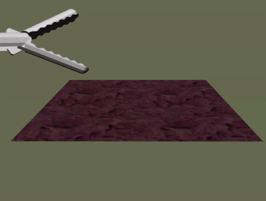
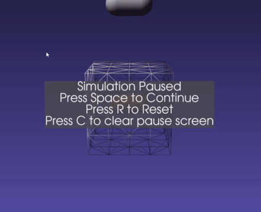

# Grasping

Grasping constrains a physics simulated object through contact by another. The object doing grasping must be a rigid tool such as shown in the DynamicalModel's section. The object being grasping can be a deformable (such as a tissue) or a rigid (such as a needle or tool).

<p align="center">
  
</p>

```cpp
auto grasping = std::make_shared<PbdObjectGrasping>(objectThatGrasps, objectToGrasp);
scene->addSceneObject(grasping);
```

It is expected a user would link this up with a button, or some other trigger. Activating it with:

```cpp
// Vertex based grasping of objectToGrasp
grasping->beginVertexGrasp(capsuleGeometryAreaToGrasp);
// OR
// Grasp lines, triangles, or tetrahedrons
grasping->beginCellGrasp(capsuleGeometryAreaToGrasp);
```

To release the grasp:

```cpp
grasping->endGrasp();
```

## Two-Way or One-Way Grasping

iMSTK supports both two-way and one way grasping

### Two-Way

With two-way grasping there must be two physics enabled PbdObjects. When the grasp occurs forces will be felt on both objects.

As shown earlier this can be setup like so:
```cpp
auto grasping = std::make_shared<PbdObjectGrasping>(objectThatGrasps, objectToGrasp);
scene->addSceneObject(grasping);
```

This can be used together with `PbdObjectController` to feel forces on objects in two-way.

<p align="center">
  
</p>

### One-Way

With one-way grasping one can grasp a physics simulated PbdObject with a non-physics simulated one or even an object using a different `DynamicalModel`.

Setup with:
```cpp
auto grasping = std::make_shared<PbdObjectGrasping>(objectToGrasp);
scene->addSceneObject(grasping);
```

Perform the grasp with:
```cpp
grasping->beginCellPick(myCapsuleGeometry);
```

In the instance of one-way the grasped particles will deform with the `myCapsuleGeometry` as it transforms.

## Mapping

The grasping class supports mapping of geometries. One can supply it a `GeometryMap` to map back to another geometry. For example, if the user sets up a TetrahedralMesh with a SurfaceMesh mapped onto it. They can then supply that `GeometryMap` to the `PbdObjectGrasping`. This can be used to grasp only a specific portion of a simulated object. Or to grasp using differing topologies.

## Multi Point Grasping

Two graspings may be setup on the same objects.

```cpp
auto grasping1 = std::make_shared<PbdObjectGrasping>(myPbdTool1, myPbdNeedle);
scene->addSceneObject(grasping1);
auto grasping2 = std::make_shared<PbdObjectGrasping>(myPbdTool2, myPbdNeedle);
scene->addSceneObject(grasping2);
```

Multiple graspings can occur on the same object (needle in this example). Works with two-way as well.


## Grasp Tools in VR


Grasping tools in VR is common use case. In these instances one can model a pair of hands with `Sphere` geometry, controlled by VR controllers using `PbdObjectController`.

```cpp
auto mySphere = std::make_shared<Sphere>(Vec3d(0.0, 0.0, 0.0), 0.2);
auto pbdHands = std::make_shared<PbdObject>();
pbdHands->setPhysicsGeometry(mySphere);
pbdHands->setDynamicalModel(myPbdModel);
pbdHands->setRigid(Vec3d(0.0, 0.0, 0.0), 1.0); // Position, Mass

// Adds visuals
auto visuals = pbdHands->addComponent<VisualModel>();
visuals->setGeometry(mySphere);

// Control the pbd hands with the VR device
auto controller = pbdHands->addComponent<PbdObjectController>();
controller->setDevice(myVrViewer->getDeviceClient(VR_CONTROLLER_LEFT));
controller->setControlledObject(pbdHands);
controller->setLinearKs();
controller->setAngularKs();
```

Then grasping can be setup between a rigid tool and hand.

```cpp
auto grasping = std::make_shared<PbdObjectGrasping>(pbdHands, myPbdTool);
scene->addSceneObject(grasping);
```

With two-way pbdHands and the controller should "feel" the forces from grasping the tool.

## Grasp with Dilated Geometry

Often it is usefult to use collision and grasping. In these instances it's recommended to use a slightly dilated geometry to grasp.

```cpp
std::shared_ptr<Capsule> myDilatedCapsule = myCapsule->clone();
myDilatedCapsule->setRadius(myDilatedCapsule->getRadius() * 1.2); // 1.2x larger
grasping->beginCellGrasp(myDilatedCapsule);
```