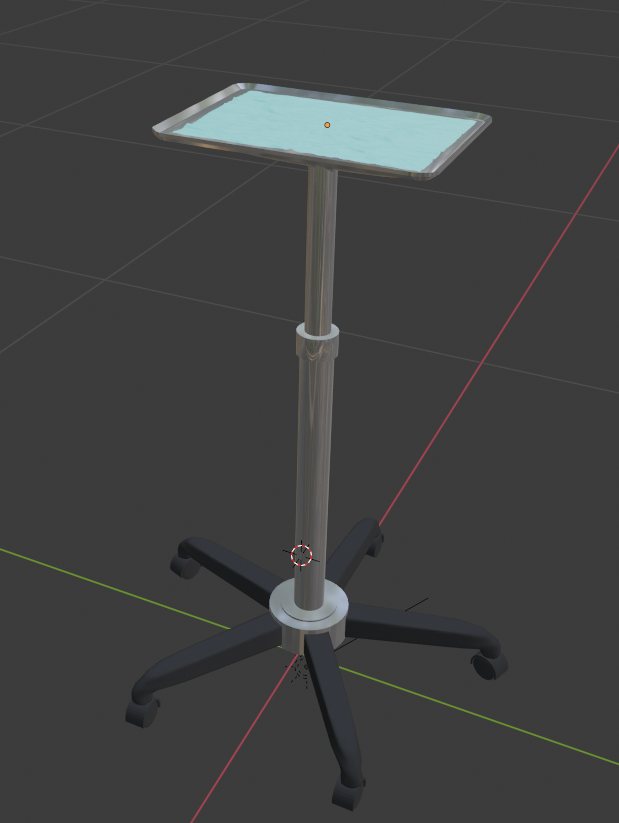

# Mesh & Scene IO

## Mesh IO
------

Mesh and Scene IO are backed by VTK and assimp along with a couple custom readers. All geometry can read/write through MeshIO.

```cpp
// Read ".vtk" file into tetMesh
auto tetMesh = MeshIO::read<TetrahedralMesh>("C:/ExampleLocation/exampleFile.vtk");
// Write out
MeshIO::write(tetMesh , "C:/MyLocationToWriteTo/exampleFileOut.vtk");
```

## SceneObject IO
------

The VisualObjectImporter is for importing more complex objects in the scene that cannot be described by a single geometry. This may involve multiple separable meshes, materials, textures, etc. Or even hierarchically defined meshes with multiple parts (it will flatten). It supports reading 3ds, obj, fbx, and dae. It can be used as follows:

```cpp
std::shared_ptr<SceneObject> myObject = ObjectIO::importSceneObject("Object Name", "C:/ExamplePath/ExampleFile.dae", "C:/ExamplePath/");
// This can then be added to the scene
scene->addSceneObject(myObject);
```

<p align="center">
  
</p>

## Supported Geometry Types
------

|        File Format        |     Extension     |     IO     | Backend |                     Geometry                       |
| :---                      |      :----:       |   :----:   | :----:  |                     :----:                         |
| VTK                       |      `.vtk`       | read/write |   VTK   | `PointSet`, `LineMesh`, `SurfaceMesh`, `TetrahedralMesh`, `HexahedralMesh` |
| VTU                       |      `.vtu`       | read/write |   VTK   |      `TetrahedralMesh` , `HexahedralMesh`          |
| VTP                       |      `.vtp`       | read/write |   VTK   |                 `SurfaceMesh`                      |
| Stereolithic              |      `.stl`       | read/write |   VTK   |                 `SurfaceMesh`                      |
| Polygon                   |      `.ply`       | read/write |   VTK   |                 `SurfaceMesh`                      |
| Nearly Raw Raster Data    |      `.nrrd`      | read/write |   VTK   |                  `ImageData`                       |
| NIFTI                     |      `.nii`       | read/write |   VTK   |                  `ImageData`                       |
| Meta Image                |  `.mhd` + `.raw`  | read/write |   VTK   |                  `ImageData`                       |
| Joint Photo Experts Group | `.jpg` or `jpeg`  | read/write |   VTK   |                  `ImageData`                       |
| Portable Network Graphics |      `.png`       | read/write |   VTK   |                  `ImageData`                       |
| Bitmap                    |      `.bmp`       | read/write |   VTK   |                  `ImageData`                       |
| Wavefront                 |      `.obj`       |    read    |  Assimp |            `LineMesh`, `SurfaceMesh`               |
| Collada                   |      `.dae`       |    read    |  Assimp |            `LineMesh`, `SurfaceMesh`               |
| Filmbox                   |      `.fbx`       |    read    |  Assimp |            `LineMesh`, `SurfaceMesh`               |
| Autodesk 3ds              |      `.3ds`       |    read    |  Assimp |            `LineMesh`, `SurfaceMesh`               |
| GMSH                      |      `.msh`       | read/write |  iMSTK  | `LineMesh`, `SurfaceMesh`, `TetrahedralMesh`, `HexahedralMesh` |

* Note `.mhd` is the only format that supports read/write of 3d images with linear offsets.
* No image format here supports orientations
* TetWild can generate TetrahedralMesh's from SurfaceMesh in the ".msh" format, directly read by iMSTK.
* iMSTK does not support any mixed cell geometries
