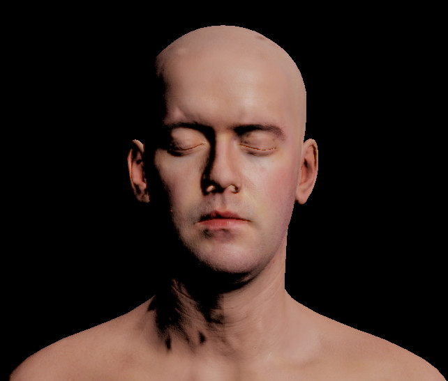
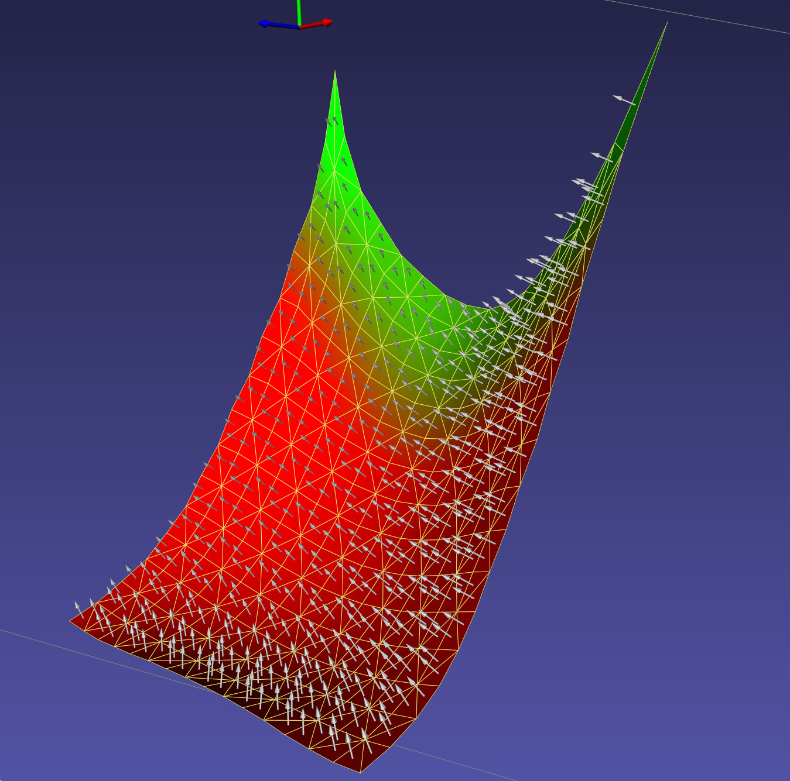
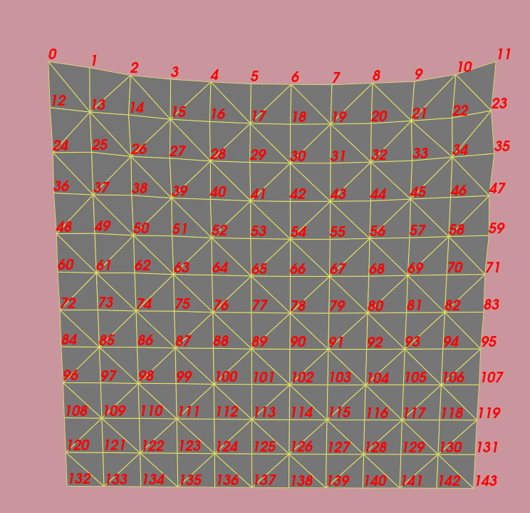

# Overview

VTK is the primary rendering backend for iMSTK, though it can be used without rendering/standalone. This also allows one to utilize any rendering backend they wish.

A VTKViewer is used to render an iMSTK Scene. Setup as:

```cpp
auto viewer = std::make_shared<VTKViewer>();
viewer->setActiveScene(myScene);
```

Given the scene it sets up RenderDelegates for every VisualModel. While a VisualModel model gives what is to be rendered. The RenderDelegate implements it. Keeping rendering backend separate from iMSTK. Typically the VTKViewer is given to the SimulationManager to update. But if one would instead like to invoke render themselves. Just call update on the viewer.

```cpp
viewer->update(); // Renders now
```

## Camera

Cameras in iMSTK are used for rendering. They must be given to the scene and set as active. There are default cameras with the iMSTK scene. Camera's allow control with (position, focal point, up) or by view matrix directly.

```cpp
// Often the default active camera from the scene is used
scene->getActiveCamera()->setFocalPoint(0.0, 0.0, 0.0);
scene->getActiveCamera()->setPosition(-0.0237419, 0.0368787, 0.338374);
scene->getActiveCamera()->setViewUp(0.0, 1.0, 0.0);
```

OR

```cpp
// Camera transition over time t
Mat4d initView = ...;
Mat4d finalView = ...;
getActiveCamera()->setView(t * (finalView - initView) + initView);
```

Additionally the fov can change.

```cpp
camera->setFieldOfView(90.0); // Degrees
```

A camera also has a near and far. That is how close and far it can render. These are not adjusted automatically at any point in iMSTK.
```cpp
camera->setNearZ(0.01);
camera->setFarZ(1000.0);
```

Quickly get the forward direction with `Camera::getForward`

Ask the `Camera` for a ray direction emanating from where the user has clicked:

```cpp
// Get mouse position (0, 1) with origin at bot left of screen
const Vec2d mousePos = viewer->getMouseDevice()->getPos();
// Convert to (-1,1)
const Vec3d normalizedMousePos = Vec2d(mousePos[0] * 2.0 - 1.0, mousePos[1] * 2.0 - 1.0);
const Vec3d rayDir = scene->getActiveCamera()->getEyeRayDir(normalizedMousePos);
const Vec3d rayStart = scene->getActiveCamera()->getPosition();
```

## RenderMaterial

RenderMaterials give properties of VisualModel to be rendered. Importantly we have a DisplayMode

- Surface: Renders only the surface of the geometry.
- Wireframe: Renders only the wireframe of the geometry, edges of the cells.
- Points: Renders only the vertices of the geometry.
- WireframeSurface: Renders both the surface of the cells

As well as a choice between ShadingModels:
- Phong: Computes lighting with normals per every fragments/pixels.
- Gourand: Computes lighting with normals per vertex then interpolates over fragments/pixels.
- Flat: Computes lighting per cell and uses it for every fragment/pixel of that cell.
- PBR: Uses phong shading but has a very specific model based on realistic parameters.

To setup a basic material we can do:

```cpp
RenderMaterial mat;
mat.setDisplayMode(RenderMaterial::DisplayMode::WireframeSurface);
mat.setLineWidth(2.0);
mat.setEdgeColor(Color::Orange);
```

This gives us orange edges, gray default surface color, and edges that are displayed with size 2. The typical phong model allows us to specify specular, diffuse, and ambient lighting. We give scales and colors for each.

### Physically Based Rendering (PBR)

Alternatively utilize PBR which is parameterized differently based on realistic parameters such as "roughness" or "metalness". There are also a number of other features. Here is how to use that with textures for diffuse, normals, and ambient occlusion.

```cpp
auto material = std::make_shared<RenderMaterial>();
material->setDisplayMode(RenderMaterial::DisplayMode::Surface);
material->setShadingModel(RenderMaterial::ShadingModel::PBR);
auto headDiffuseTexture = std::make_shared<Texture>(iMSTK_DATA_ROOT "head/HeadTexture_BaseColor.png", Texture::Type::Diffuse);
auto headNormalTexture = std::make_shared<Texture>(iMSTK_DATA_ROOT "head/HeadTexture_Normal.png", Texture::Type::Normal);
auto headAoTexture  = std::make_shared<Texture>(iMSTK_DATA_ROOT "head/HeadTexture_AO.png", Texture::Type::AmbientOcclusion;

material->setRoughness(10.0);
material->setMetalness(0.0);
material->addTexture(headDiffuseTexture);
material->addTexture(headNormalTexture);
material->addTexture(headAoTexture);
```

<p align="center">
  
</p>


### Optimization

Two important flags of this material that are by default on.

- RenderMaterial::setRecomputeVertexNormals: When on the vertex buffer is continuously updated.
- RenderMaterial::setIsDynamicMesh: When off buffers aren't not even checked for changes. A transform can still be applied through the shader.

### DisplayMode::SurfaceNormals

This display mode can be used to quickly render face windings.

<p align="center">
  
</p>

### DisplayMode::Fluid

This display mode uses screen-space fluids to render.

<p align="center">
  
</p>

## DebugGeometryModel

The `DebugGeometryModel` can be used to quickly render primitives.

```cpp
auto debugGeomVisuals = mySceneObject->addComponent<DebugGeometryModel>();
debugGeomVisuals->addPoint(myVertex, myColor);
debugGeomVisuals->addLine(...);
debugGeomVisuals->addTriangle(...);
```

## CollisionDataDebugModel

The `CollisionDataDebugModel` extends the `DebugGeometryModel` providing quick rendering of `CollisionData` from a `CollisionDetectionAlgorithm`.

```cpp
SpheretoSphereCD detector;
...
detector.update();

auto cdDebugModel = mySceneObject->addComponent<CollisionDataDebugModel>();
cdDebugModel->setInputCD(detector.getCollisionData());
```

## TextVisualModel

`TextVisualModel` can be used in iMSTK to render text to the corners or center of the screen:

```cpp
auto txtVisuals = mySceneObject->addComponent<TextVisualModel>();
txtVisuals->setPosition(TextVisualModel::DisplayPosition::UpperLeft);
txtVisuals->setFontSize(30.0);
txtVisuals->setTextColor(Color::Orange);
```

## Ghost Rendering

Given a `PbdObjectController` one can quickly render the ghost of the controller with `ObjectControllerGhost` as follows:

```cpp
// Add extra component to tool for the ghost
auto controllerGhost = lapTool->addComponent<ObjectControllerGhost>();
controllerGhost->setUseForceFade(true);
controllerGhost->setController(controller);
```

<p align="center">
  
</p>

## Force Text Rendering

It can often be useful to see the forces experienced by the user. This can be done easily by adding a `ControllerForceText` component.

```cpp
auto controllerForceTxt = mySceneObject->addComponent<ControllerForceText>();
controllerForceTxt->setController(controller);
```

## Per Vertex Labelings

The `VertexLabelVisualModel` was introduce to allow quick debugging and numbering of vertex indices/numberings. It can be configured like so:

```cpp
auto vertexLabelModel = mySceneObject->addComponent<VertexLabelVisualModel>();
vertexLabelModel->setGeometry(myMeshToRender);
```

<p align="center">
  
</p>

## AxesModel

The AxesModel can be used to quickly render a axes basis.

```cpp
auto axesModel = mySceneObject->addComponent<AxesModel>();
axesModel->setPosition(Vec3d(0.0, 20.0, 4.0));
axesModel->setPosition(Quatd::FromTwoVectors(Vec3d(0.0, 1.0, 0.0), Vec3d(1.0, 1.0, 0.0)));
```

## VolumeRenderMaterial

The VolumeRenderMaterial exposes VTK objects for rendering, it can be used as:

```cpp
auto material = std::make_shared<VolumeRenderMaterial>();
vtkNew<vtkColorTransferFunction> colorFunc;
colorFunc->AddRGBPoint(0.0, 1.0, 0.0, 0.0);
colorFunc->AddRGBPoint(8.0, 0.0, 0.0, 1.0);
volumeMaterial->getVolumeProperty()->SetColor(colorFunc);
vtkNew<vtkPiecewiseFunction> opacityFunc;
opacityFunc->AddPoint(0.0, 0.0);
opacityFunc->AddPoint(1.0, 1.0);
volumeMaterial->getVolumeProperty()->SetScalarOpacity(opacityFunc);
```

Here set both a color and opacity function. As we render the volume (by marching along a ray shot from the screen) we sample the image we are rendering and lookup a color and opacity. These functions specify this. AddRGBPoint(intensity, r, g, b) and AddPoint(intensity, opacity).

A number of presets (which may or may not fit your image/volume) are also available which can be used as below:

```cpp
std::shared_ptr<VolumeRenderMaterial> volumeMaterial = VolumeRenderMaterialPresets::getPreset(currMatId);
```

<p align="center">
  
</p>

## Custom RenderDelegates & VisualModels

If one needs to implement their own rendering capabilities the VisualModel's and RenderDelegates can be extended. Extending the VisualModel the delegate hint can be provided.

```cpp
class ChartVisualModel : public VisualModel
{
public:
    ChartVisualModel()
    {
        // Setup delegate hint here
        setDelegateHint("Chart");
    }
    ~ChartVisualModel() override = default;
```

If iMSTK is provided a delegate hint in a VisualModel it will first look to construct the corresponding RenderDelegate using this hint. iMSTK, by default, has many registrations. One can add a registration in their own code by defining a `VTKChartRenderDelegate` and adding:

```cpp
RenderDelegateRegistrar<VTKChartRenderDelegate> registerChartDelegate("Chart");
```

## Lights

iMSTK provides three types of lights.
 - PointLight: Specified with a position, intensity, color.
 - DirectionalLight: Specified with a direction, intensity, color.
 - SpotLight: Specified with a position, focal point, cone angle, intensity, color.

```cpp
// Light
auto light = std::make_shared<SpotLight>();
light->setFocalPoint(Vec3d(0.0, 0.0, 0.0));
light->setPosition(Vec3d(0.0, 10.0, 0.0));
light->setIntensity(1.0);
light->setSpotAngle(10.0);
scene->addLight("light0", light);
```

All lights can also work with constant, linear, and quadratic falloff.

```cpp
light->setAttenuationValues(0.0, 0.0, 1.0); // Constant a
light->setAttenuationValues(0.0, 0.5, 0.0); // Linear falloff a + bx
light->setAttenuationValues(50.0, 0.0, 0.0); // Quadratic a + bx + cx^2
```

