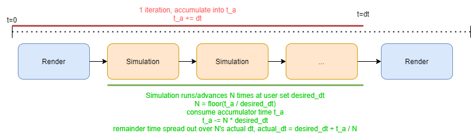

# SimulationManager & Modules

## Usage

Central to iMSTK is the SimulationManager and modules. The SimulationManager defines the main processing (game) loop using modules. Modules implement update functions and the SimulationManager manages the update scheduling of modules. Modules are separate from each other and can be thought of as separate logical threads that are scheduled for update by the SimulationManager.

The 3 major modules in iMSTK:
* **SceneManager**: Manages and updates a scene, this includes all objects in the scene and physics. See more on `Scene` later.
* **Viewer**: Manages and updates rendering of a scene.
* **DeviceManager**: Read & writes from a device. Such as writing forces, and reading position or orientation.

A common setup would look like:

```cpp
auto simManager = std::make_shared<SimulationManager>();
simManager->addModule(viewer);
simManager->addModule(sceneManager);
simManager->addModule(hapticManager);
simManager->setDesiredDt(0.01);
simManager->start(); // async
```

iMSTK's SimulationManager provides a substep approach to scheduling renders and scene updates. It updates the scene numerous times per render, varying at a rate to keep up with real time. The desired timestep allows one to vary/trade the amount of render vs scene updates being done. The smallest timstep is ideal for physics whilst maintaining rendering rates suitable for display. If vsync is used, a target visual rate can be achieved whilst SceneManager updates at the rate given.

- Example: If it takes 1s to render+scene update and desired_dt=0.1. Ten updates will be done next iteration.

<p align="center">
  
</p>

To supply and setup a Viewer and SceneManager the following is often used:
```cpp
// Setup a scene manager to advance the scene
auto sceneManager = std::make_shared<SceneManager>();
sceneManager->setActiveScene(scene);

// Setup a viewer to render the scene
auto viewer = std::make_shared<VTKViewer>();
viewer->setActiveScene(scene);
```

Modules are very independent of each other. To use as a simulation backend (such as in Unity, Unreal, or Slicer) one can use:

```cpp
auto sceneManager = std::make_shared<SceneManager>();
sceneManager->setActiveScene(scene);
sceneManager->init();
while(running)
{
    // sceneManager->setDt(<time to advance scene by>);
    sceneManager->update();
}
```

Even further one can forego the SceneManager entirely:
```cpp
auto scene = std::make_shared<Scene>("MyScene");
// ... Setup Scene ...
scene->initialize();
while (running)
{
    scene->advance(<your timestep here>);
}
```

This only updates the scene. Similarly VTKViewer can operate independently. Or even multiple VTKViewer's for one scene.

## Control

As shown one can start the `SimulationManager` using `SimulationManager::start`. This call won't return until it is done.

To stop the entire SimulationManager submit a thread safe request to change it:

```cpp
driver->requestStatus(ModuleDriverStopped);
```

Alternatively stop or pause an individual module:
```cpp
sceneManager->pause();
sceneManager->resume();
```

The thread will continue to run but glance over this particular module.

Some simulators need a pause function, many don't ever pause and just run from the start of the app until closing, others implmenent their own concepts of state.

## Initialization

When using the `SimulationManager` it may be useful to plugin to callback after everything is initialized. To do this one can connect a function callback to `SimulationManager::starting`.

```cpp
connect<Event>(driver, &SimulationManager::starting,
    [&](Event*)
    {
        // .. Do logic ...
    });
```

## Timestep and Scheduling

Consider a particle moving in one direction/dimensions on two separate machines/hardwares with differing processor speeds using the below function.

```cpp
void update(double dt)
{
    position += velocity * dt
}
```

With a constant velocity=5m/s. Consider a slow and fast computer.

- Fast Computer: Calls this function 6 times over 10 real seconds.
- Slow Computer: Calls this function 3 times over 10 real seconds.

The two computers have produced differing displacements of the particle despite the same amount of real time passing.

- Fast Computer: Particle moved 6x5=30 meters.
- Slow Computer: Particle moved 5x3=15 meters.

One naive but possible solution is to use timestep (dt) here. Use dt=1 on the fast computer and dt=2 on the slow computer. Assuming both computers processors were consistent identical displacements are produced. In actuality processors rarely run at deterministic speeds at this fine of a level. Instead, a common heuristic is to use the time the last update took as a prediction for the time the current update will take.

```cpp
Timer timer;
timer.start();
double dt = 0.0;
while (running)
{
    update(dt);
    dt = timer.getElapsedTime(); // Also resets timer
}
```

This is the basic real time timestep. If the computer slows down there are larger dts. If it speeds up there are smaller dts. Even more computation is introduced, such as rendering after the update. The time that lost is still accounted for. This timestep may make some simulation engineers nervous though. This is for two reasons:
1. They do not know what dt will be. Perhaps there is a lot of work done and dt gets quite large to catch up. This could easily cause a simulation to explode on a slow machine, and be fine on a fast one. Min or max dt's might be used. This sort of issues make portability and distribution very difficult.
2. The results are always indeterministic. If the simulation is run twice on the same system. It could produce very slightly differing answers.

The solution is substepping. It is fairly common. The idea is to "use a fixed timestep but vary the amount of update calls per render".

```cpp
Timer timer;
timer.start();
while(running)
{
    timer.getElapsedTime();
    N = ... computed via time passed ...
    for (int i = 0; i < N; i++)
    {
        update(FIXED_DT);
    }
    render();
}
```

This, for example, can allow 1000 simulation updates per render. The trick is that N varies with the machine. A faster computer may perform more updates per render. Where a slow computer may perform less. But both computers use the same unchanging timestep. Resulting in portable, non exploding, deterministic code.

To compute N setup a time accumulator/bank. Add time as it passes to this accumulator. And dispense it when updates are completed. This keeps up with real time.

```cpp
Timer timer;
timer.start();
double timeBank = 0.0;
while(running)
{
    timeBank += timer.getElapsedTime();
    N = static_cast<int>(timeBank / FIXED_DT); // Floored
    timeBank -= N * FIXED_DT;
    for (int i = 0; i < N; i++)
    {
        update(FIXED_DT);
    }
    render();
}
```

There will often be a remainder. If 5s have passed and FIXED_DT=2s. There is a 1s remainder. This can cause a problem if the system is running consistently giving a remainder of 1s. Resulting in something like 2 updates, 3 updates, 2 updates, ... so forth. Sometimes this can be noticable, there are a few solutions.
1. Don't deal with it at all and hope your updates are small/many enough that the small stutter is not noticable.
2. Divide out the remainder time over the N frames. However, this produces a non-determinsitic timestep again.

By default iMSTK does 2 favouring smooth fast simulation. However, one can disable division:

```cpp
simManager->setUseRemainderTimeDivide(false);
```

To set the desired/fixed dt:

```cpp
driver->setDesiredDt(0.003);
```

A timestep of 0.01 is pretty standard. 0.016 will give 16ms updates for 60fps. If using haptics one may need a fast update rate. 1000hz (dt=0.001) is the gold standard. But looser haptics are possible at ~500hz.

## Note on Real Time Systems

iMSTK uses VTK which by default runs event based rendering (events invoke render calls). iMSTK does not use VTKs event based rendering. Event based rendering is more suitable for UI applications to avoid rendering when nothing has changed on screen, saving battery, freeing up the processor for other tasks, allowing better multitasking, also good when render calls aren't consistent.

Real-time system scheduling is a large area of research. Most games, consistently push frames and can more easily quantify how much work different subsystems of the game will take. Physics, rendering, input, animation all are updated in a given pipeline that is cyclic executive, touched only once in sequence repetively, providing absolute determinism to when the next one will occur with no scheduling overhead (managing priorities, alternation schemes, no pre-emption other than OS's, etc). All that being said, nothing stops one from putting iMSTK into any event loop (VTKs included).