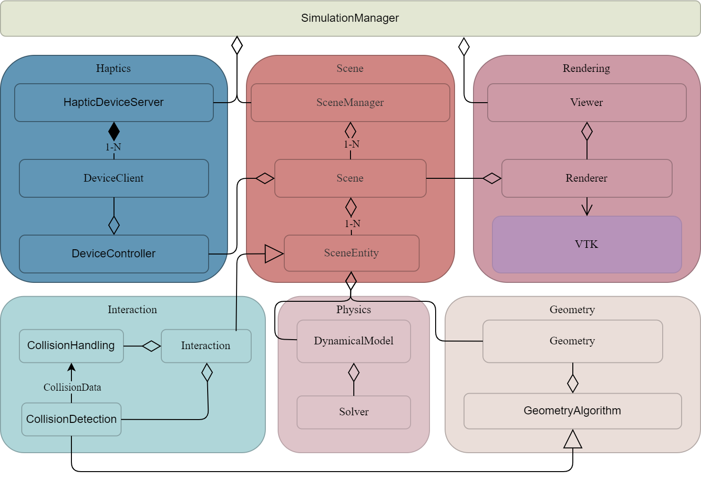
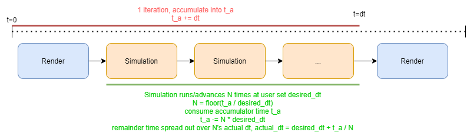
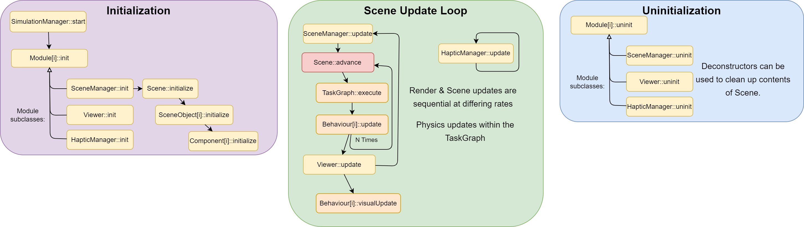
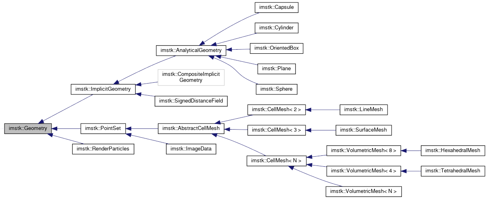

<p align="center">
  
</p>

## Introduction
---

Welcome to the iMSTK user documentation! iMSTK is an open-source C++-based software toolkit for real-time physics-based surgical simulations. It provides a modular and easy-to-use framework for the development of medical simulators without restrictive licenses.

This page provides an overview of iMSTK, with links to subpages for users to explore more. This should give a sense of imstk's capabilities as well as an introduction to iMSTK for beginners. One may also refer to our [examples page](Examples.md) or our [code documentation](https://imstk.gitlab.io/) for implementation level help.

## Setup for Development

iMSTK supports Windows, Linux, & macOS. Also comes with a CMake automated build system (superbuild), CI & nightly testing, and SWIG wrapping backend (C# supported).

See the iMSTK [README.md](https://gitlab.kitware.com/iMSTK/iMSTK/-/blob/master/README.md#getting-started-with-imstk) for build instructions and various configurations.

## [Overview of iMSTK]()
---

iMSTK consists of a set of modules to develop a surgical simulation. Surgical simulators have many varying parts resulting in a variety of requirements, use cases, and resulting heterogeneous design found in many surgical toolkits. iMSTK is foremost for real-time physics-based simulation but additionally provides rendering, Mesh IO (read/write), 3d haptic rendering, and geometry processing algorithms useful to surgical simulation.

The following diagram shows a simple high-level UML overview of the systems of iMSTK grouped into six categories representing the major functionalities of iMSTK.

<p align="center">
  
</p>

## [SimulationManager & Modules](SimManager_Modules.md)
---

Central to iMSTK is the SimulationManager and modules. The SimulationManager defines the main processing (game) loop using modules. Modules implement update functions and the SimulationManager manages the update scheduling of modules. Modules are separate from each other and can be thought of as separate logical threads that are scheduled for update by the SimulationManager.

The 3 major modules in iMSTK:

* **SceneManager**: Manages and updates a scene, this includes all objects in the scene and physics. See more on `Scene` later.
* **Viewer**: Manages and updates rendering of a scene.
* **DeviceManager**: Read & writes from a device. Such as writing forces, and reading position or orientation.

A common setup would look like:

```cpp
auto simManager = std::make_shared<SimulationManager>();
simManager->addModule(viewer);
simManager->addModule(sceneManager);
simManager->addModule(hapticManager);
simManager->setDesiredDt(0.01);
simManager->start(); // async
```

iMSTK's SimulationManager provides a substep approach to scheduling renders and scene updates. It updates the scene numerous times per render, varying at a rate to keep up with real time. The desired timestep allows one to vary/trade the amount of render vs scene updates being done. The smallest timstep is ideal for physics whilst maintaining rendering rates suitable for display. If vsync is used, a target visual rate can be achieved whilst SceneManager updates at the rate given.

- Example: If it takes 1s to render+scene update and desired_dt=0.1. Ten updates will be done next iteration.

<p align="center">
  
</p>

To supply and setup a Viewer and SceneManager the following is often used:
```cpp
// Setup a scene manager to advance the scene
auto sceneManager = std::make_shared<SceneManager>();
sceneManager->setActiveScene(scene);

// Setup a viewer to render the scene
auto viewer = std::make_shared<VTKViewer>();
viewer->setActiveScene(scene);
```

Modules are independent of each other. To use as a simulation backend (such as in Unity, Unreal, or Slicer) one can use:

```cpp
auto sceneManager = std::make_shared<SceneManager>();
sceneManager->setActiveScene(scene);
sceneManager->init();
while(running)
{
    // sceneManager->setDt(<time to advance scene by>);
    sceneManager->update();
}
```

This only updates the scene. Similarly VTKViewer can operate independently. Or even multiple VTKViewer's for one scene.

## [Scene and the Object Model](Scene.md)
---

While the `SimulationManager` defines how the program is run and scheduled the `Scene` defines what is done. A `Scene` contains a flat collection of `SceneObject`s and fully represents the virtual environment. `SceneObject`s may be a surgical tool, a tissue, OR table, a leg, light, or even non-visual objects. A simple visual object can be added to the `Scene` as:

```cpp
auto scene = std::make_shared<Scene>("MyScene");

auto myObject = std::make_shared<SceneObject>("MyObject");
auto visuals = myObject->addComponent<VisualModel>();
// visuals->setGeometry(<my geometry here>);
scene->addSceneObject(myObject);
```

iMSTK contains an entity-component (ECS) model that is still a work in progress. Whilst objects/entities represent whole concepts such as a `tool` or `table`. A component represents a **swappable** part of the object/entity such as the legs of a table or reciprocation of a saw tool. ECS's are common in many game engines for modularity and flexibility. One may subclass Component or Behaviour to add new functionality.

### Component

Component represents a data-only part of an entity. It does no function, has an initialization, and a reference to the entity it is part of. Components can be placed on/off entities/objects whenever. One can extend to hold relevant data and use elsewhere.

```cpp
class MyComponent : public Component
{
public:
    Mat4d myTransform = Mat4d::Identity();
};
```

### Behaviour

A `Behaviour` is a `Component` that has function. Generally only recommend for small independent bits of logic. Anything that involves multiple components, call order, lots of communication, or multiple `Entity`'s may need its own system such the VTKRenderer or Scene. Alternatively the TaskGraph can be used.

```cpp
class MyBehaviour : public Behaviour
{
public:
    void update() override {} // Called per SceneManager::update (Scene::advance)
    void visualUpdate() override {} // Called per VTKViewer::update
};
```

It is safe to assume the physics system is complete before entering any components. See more in the computational flow section.

## [Rendering](Rendering.md)
---

Rendering of a `Scene` in iMSTK is done through delegation to support multiple backends. A `RenderDelegate` is setup for each `VisualModel` to render. `VisualModel` is independent of rendering backends, whilst `RenderDelegate`s implement the backend details. iMSTK can also be plugged into other systems such as Unity Game Engine via our [imstk-unity extension](https://assetstore.unity.com/packages/tools/physics/imstk-225525). Read more on rendering at the page linked above.

## [Computational Flow]()
---

Now that the SimulationManager, its modules, and the scene are established one can understand the computational flow of iMSTK. There are 3 major steps to the computational flow.

* Initialization: Called at the start. Initializes all Modules. SceneManager initializes all SceneObjects. Viewer sets up render delegates.
* Update: Called continuously. Every TaskGraph step executed, then all behaviours updated.
* Uninitialization: Cleans up

<p align="center">
  
</p>

## [Geometry](Geometry.md)
---

Geometries are used throughout iMSTK. The geometries themselves can be used standalone. Geometries include:

<p align="center">
  
</p>

```cpp
auto mySphereGeometry = std::make_shared<Sphere>(Vec3d(0.0, 0.0, 0.0), 0.5);
```

Example usage for rendering:
```cpp
visuals->setGeometry(mySphereGeometry);
```

## [Mesh IO](Mesh_IO.md)
---

To fully leverage geometry one must be able to import from other tools which are much better at creating Geometry. Read more about the files types supported by iMSTK. Additionally about Scene and SceneObject importing at the link above.

```cpp
auto mySurfMesh = MeshIO::read<SurfaceMesh>("myTriangleMesh.obj");
auto myTetMesh = MeshIO::read<TetrahedralMesh>("myTetMesh.vtk");
```

## [Dynamical Models]()
---

DynamicalModels implement iMSTK physics. Geometries are more or less static, but when supplied to a model and loaded with some force they can begin to move in time. iMSTK primarily uses a unified position-based-dynamics model (PBD) which can be used to model two-way interaction between:
 * Rigids (such as surgical tools)
 * Deformables/Soft Bodies (such as soft tissues or cloth)
 * Fluids (such as blood)

Alternatively iMSTK also provides a smooth-particle-hydrodynamics (SPH), finite-element (FEM), level-set (LSM), and rigid body (RBD) model. But these cannot interact two-way. Meaning one can exert forces from one system to the next, but with no reaction. Should two-way be required, PBD is recommended.

Physics operates separately from the object-model so to add physics functionalities we must first define a system for physics.
```cpp
auto model = std::make_shared<PbdModel>();
model->getConfig()->m_dt      = 0.001;
model->getConfig()->m_gravity = Vec3d::Zero();
```

Then setup a rigid pbd object sphere:
```cpp
auto myPbdObject = std::make_shared<PbdObject>();
myPbdObject->setDynamicalModel(model); // Set the system to use
myPbdObject->getPbdBody()->setRigid(
    Vec3d(0.0, 0.05, 0.0),            // Position
    7.0,                              // Mass
    Quatd::Identity(),                // Orientation
    Mat3d::Identity() * 100000000.0); // Inertia
myPbdObject->setPhysicsGeometry(mySphereGeometry);
scene->addSceneObject(myPbdObject);
```

See more of each model below

* ### [Position Based Dynamics (PBD)](Dynamical_Models/PbdModel.md)

* ### [Smoothed Particle Hydrodynamics (SPH)](Dynamical_Models/SphModel.md)

* ### [Finite Element Method (FEM)](Dynamical_Models/FeDeformableModel.md)

* ### [LevelSet Method (LSM)](Dynamical_Models/LevelSetModel.md)

* ### [Rigid Body Dynamics (RBD)](Dynamical_Models/RigidBodyModel2.md)

## [Collision](Collision.md)
---

Physics-based objects won't do much without an external force (such as gravity provided in many models). One such interaction is contact. At a high level iMSTK provides various objects for one to specify a collision between two objects.

```cpp
auto collision = std::make_shared<PbdObjectCollision>(myPbdObject, myCollidingObjectOrPbdObject);
scene->addSceneObject(collision);
```

Both objects must contain a collision geometry
```cpp
myPbdObject->setCollidingGeometry(mySphereGeometry);
```

Our collision can be used standalone as well. Under the hood a `CollisionDetectionAlgorithm` is defined and setup like so:
```cpp
SphereToSphereCD detector;
detector.setInput(0, mySphereA);
detector.setInput(1, mySphereB);
detector.update();
```
Which then produces `CollisionData` for later usage.

Note: Not all geometries collide with all other geometries. See the collision page for a chart on supported collisions.

## [Grasping](Grasping.md)
---

Another common interaction is grasping. Grasping constrains a physics simulated object through contact by another. The object doing grasping must be a rigid tool such as shown in the DynamicalModel's section. The object being grasping can be a deformable (such as a tissue) or a rigid (such as a needle or tool).

```cpp
auto grasping = std::make_shared<PbdObjectGrasping>(objectThatGrasps, objectToGrasp);
scene->addSceneObject(grasping);
```

It is expected a user would link this up with a button, or some other trigger. Activating it with:

```cpp
// Vertex based grasping of objectToGrasp
grasping->beginVertexGrasp(capsuleGeometryAreaToGrasp);
// OR
// Grasp lines, triangles, or tetrahedrons
grasping->beginCellGrasp(capsuleGeometryAreaToGrasp);
```

Similarly to release the grasp:

```cpp
grasping->endGrasp();
```

## [Needles](Needles.md)
---

Needles have physics approximations in iMSTK. The needle interaction in iMSTK have not yet made it in iMSTK, however the storage of puncture points has. There are currently many examples within iMSTK that do implement needles to check out.

## [Connective Tissue](Connective_Tissue.md)
---

Connective tissue has a special approximation in iMSTK. It is approximated with `LineMesh`'s. See more in future updates of iMSTK.

## [Cutting](Cutting.md)
---

Cutting is available in iMSTK. There are a large amount of cutting methods in surgical simulation. iMSTK currently supports a discrete mesh based cutting method in it's `PbdObjectCutting`. Discrete cut meaning it can only cut once in an instance and is not suitable for continuous cutting. Currently works for SurfaceMesh and LineMesh only.

```cpp
auto cutting = std::make_shared<PbdObjectCutting>(tissueObj, toolObj);
scene->addSceneObject(cutting);
connect<KeyEvent>(viewer->getKeyboardDevice(), &KeyboardDeviceClient::keyPress,
    [&](KeyEvent* e)
    {
        if (e->m_key == 'g')
        {
            cutting->apply();
        }
    });
```

## [Devices](Devices.md)
---

External devices provide interaction. iMSTK supports keyboard, mouse, 3d Touch, Haply Inverse3, VR controller, and a variety of VRPN-supported devices. These give a range of inputs such as 2d, 3d positions, orientations, buttons, or analog inputs.

Commonly desired are 3d tracking devices which provide 3d position and orientation. For haptic based device such as 3d Touch, Haply, or VRPN one can get a default from `DeviceManagerFactory` like so:
```cpp
std::shared_ptr<DeviceManager> myHapticManager = DeviceManagerFactory::makeDeviceManager(); // Create default device manager
std::shared_ptr<DeviceClient>  myDevice  = myHapticManager->makeDeviceClient();
```

Example usage:
```cpp
simManager->addModule(myHapticManager);
// later...
while(running)
{
    myDevice->getOrientation();
    myDevice->getPosition(); // Get the position while the program is running
}
```

The VR, mouse, and keyboard devices are all tied to viewers due to external system design:
```cpp
viewer->getKeyboardDevice();
viewer->getMouseDevice();
viewer->getVRDeviceClient(OPENVR_RIGHT_CONTROLLER); // Right, left, or hmd
```

## [Controllers](Controllers.md)
---

Controllers take device input and do something with it. A common iMSTK control is the `PbdObjectController`, used to couple a tool to a 3d tracking device.

```cpp
auto controller = myPbdObject->addComponent<PbdObjectController>();
controller->setControlledObject(myPbdObject);
controller->setDevice(myDevice);
controller->setLinearKs(10000.0);
controller->setAngularKs(10.0);
controller->setForceScaling(0.01);
controller->setSmoothingKernelSize(15);
controller->setUseForceSmoothening(true);
```

iMSTK provides some predefined controls and a some abstract base classes such as `MouseControl`, `KeyboardControl`, `TrackingDeviceControl`. It is encouraged to subclass and implement custom controls. C++ lambdas may also be used for fast prototyping, but not recommended at scale:
```cpp
connect<KeyEvent>(viewer->getKeyboardDevice(), &KeyboardDeviceClient::keyPress,
    [&](KeyEvent* e)
    {
        if (e->m_key == '1')
        {
        }
    });
```

## Extras
---

### [Geometric Filtering](Extras/Filtering.md)

iMSTK contains a number of geometric operations that one may find useful when implementing a surgical simulator. Read more above.

### [Parallelism](Extras/Parallelism.md)

Read about the different types of parallelism in iMSTK.

### [Events](Extras/Event_System.md)

Read about the event system available in iMSTK.
