Collision Detection
===================

A collision detection method in iMSTK is defined through the ``CollisionDetectionAlgorithm`` base class. This class assumes two input iMSTK geometries and produces a CollisionData output. Whilst iMSTK geometries can be given in either order to the ``CollisionDetectionAlgorithm`` the input order will effect the output order. For example:

.. code:: c++

   imstkNew<SurfaceMeshToSphereCD> myCollisionDetection;
   myCollisionDetection->setInput(myGeomA, 0);
   myCollisionDetection->setInput(myGeomB, 1);
   myCollisionDetection->update();
   
   std::shared_ptr<CollisionData> cdData = myCollisionDetection->getCollisionData();
   cdData->elementsA; // Refers to input 0 geometry
   cdData->elementsB; // Refers to input 1 geometry

Collision Detection Method Types
--------------------------------

There are two approaches to collision detection.

**Static**: Given a snapshot of two already overlapping geometries, find the best solution to separate them. This normally involves resolving the geometry along directions that produce minimal movement. Often objects in physics simulations move small amounts so we can reliably resolve along this direction to get believable behavior.

- If our objects move too fast, we might see some strange results. Such as objects tunneling through each other without ever observing a collision. Or geometry resolving to the wrong feature of another geometry. This also effects the maximum allowed velocity or force of a simulation. Which can make your simulation harder to tune (smaller valid parameter space).

**Dynamic**: Given two overlapping geometries and their dynamics (or two cached snapshots of them over time). Find the intersections a-priori and deal with them. Almost 100% of the time dynamic CD methods are paired with static CD methods as a fallback. This allows solvers to not guarantee non-intersecting states at the end of a timestep which may be difficult (for example, in an over constrained system).

- **CCD**: Continuous collision detection is a form of dynamic CD. It uses the dynamics of the object to compute exact time of impact. The usual solution is to linear interpolate elements of a geometry over time and find the time at which the elements are coplanar. For example, a vertex and a triangle moving. When the vertex and triangle are coplanar they intersect so long as the vertex still lies in the triangle. CCD can often be hard to tune and deal with floating point error. This can be alleviated with static CD as a fallback.

Collision Manifolds
--------------------------------

Collision manifolds define the areas/points/patches of contact should two bodies be separated and *just* touch. From there you can compute contacts or whatever you need for your solver. These manifolds are made up of N or more types of contacts. We have various types of contacts for shapes.

.. figure:: media/Collision_Detection/contactManifolds.png
    :width: 600
    :alt: Alternative text
    :align: center

    Various manifolds

* Face-Vertex:

  * For triangle meshes, popularly just called vertex-triangle or VT/TV contact.
  
* Face-Face:
  
  * Ignored, covered with Face-Vertex
  
* Face-Edge:
  
  * Ignored, covered with Face-Vertex.
  
* Edge-Edge:
* Edge-Vertex:
  
  * Ignored, covered with Face-Vertex.
  * Required when using curved surface vs meshes.
  
* Vertex-Vertex:
  
  * Ignored, covered with Face-Vertex.
  * Required when using curved surface vs meshes.

How a collision manifold is specified varies a lot among collision systems. A problem with finding the collision manifold in static CD is that you actually have an overlapping volume when looking at a snapshot of intersections:

.. figure:: media/Collision_Detection/edgeContactOverlap.png
    :width: 200
    :alt: Alternative text
    :align: center

    Manifold when overlapping

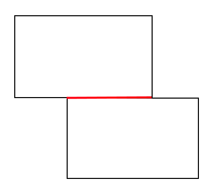

    Manifold when separated

Then it becomes of a problem of specifying this to your solver. Some collision systems report intersecting elements (ie: This triangle touched this edge, or this edge touched this point). Others report per contact points where N point-based contacts need to be used to support a face.

.. figure:: media/Collision_Detection/edgeContactResolve.png
    :width: 300
    :alt: Alternative text
    :align: center

    Two point,direction,depth contacts required to support the box

Instead of subbing points for faces though, we can directly formulate a constraint between two elements in contact. For example, Vertex-Triangle as mentioned earlier as below:

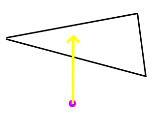

Collision Data
--------------------------------

With this approach it is required to store contact pairs of elements. Vertex-triangle, edge-edge. Whereas in the previous approach we can only store point-based contacts. iMSTK supports both methods providing the following element types.

* **PointDirectionElement**: Gives point, normal, and depth contact
* **CellIndexElement**: Gives the id of a cell or the id of a cells vertices. Check count to tell which.

  * If idCount==1. The id refers to a cell given by type.

    * IMSTK_VERTEX
    * IMSTK_EDGE
    * IMSTK_TRIANGLE
    * IMSTK_TETRA

  * If idCount > 1. The id refers to the vertex indices of the cell.

     * ex: idCount==3, means 3 vertex ids of the triangle.
     * The ability to give cells via vertex ids is useful to avoid assigning ids to cells of cells. ie: edges of triangles, triangle faces of a tetrahedron, edges of a tetrahedron.

* **CellVertexElement**: Same as a CellIndexElement but gives the vertices by value instead.

  * Useful when the other geometry doesn't contain vertices with ids (implicit geometry).

iMSTK collision methods prefer to produce contact element pairs over point-based contacts. This is because point-based contacts can be computed from element pairs when needed. But element pairs cannot so easily be computed from point-based contacts.

Collision Resolution
--------------------------------

To resolve collision I would classify approaches into two categories.

* Matrix-Free: These approaches normally resolve collisions at the moment of finding them. Or in a later iteration over all contacts found during collision.

  * Ex1: A point lies under a plane 50 units. At the moment of noticing, we move it up 50 units.
  * Ex2: A point lies under a plane 50 units. We add a contact that informs us to move it up 50 units. We later resolve all contacts.
  * If we resolve all contacts later we may find that we resolve one such that we create another. For example, stacked cubes A, B, & C. Resolving A-B might move B into C. This would normally require another collision detection pass (likely next step of the simulation). But if you noticed, Ex1 may not require another CD iteration as it does CD while resolving. Given the correct order of CD testing, they would actually resolve.

* Matrix: These approaches assemble matrices to resolve them all in a semi-implicit or implicit manner.

   * Semi-Implicit:

     * Identical to the matrix-free explicit solutions. ex1 was one iteration of gauss seidel, ex2 was one iteration of jacobi.
     * Non-penetration equations are solved in iterative manners, solutions being plugged into latter iterations.
     * Order of assembly matters.

   * Implicit:

     * All non-penetration equations solved simulatenously.
     * Order of assembly will produce same solution.

Collision Constraints
--------------------------------

The matrix ones are often "constraint based". The constraints giving a single scalar and gradient for which to solve. Often represented as a single row in our system. For a non-penetration constraint the scalar should be 0 when separated. The gradient then gives you the direction to change the inputs such that you would reach a scalar of 0 (the root). This gives us a bit of a better generalization to apply it to a lot of things, perhaps not even non-penetration constraints (springs, joints, etc).

* PBDCollisionConstraints: Given positions of geometry, computes a gradient and scalar to reach zero/non-penetration.
* RBDConstraint: Given position and orientation of body, computes a jacobian (linear and angular gradient) and scalar to reach zero/non-penetration.

A pbd constraint to keep a point to a plane:

* Scalar = distance between the plane and point
* Gradient = the plane normal (direction to resolve, direction to get to a scalar of 0)

.. image:: media/Collision_Detection/constraintEx1.png
    :width: 300
    :alt: Alternative text
    :align: center

A rbd constraint to keep a box above a plane by adding a constraint per vertex corner.

* Scalar = distance between plane and vertex/corner of box.
* Jacobian

  * Linear Gradient = plane normal (direction to resolve linearly)
  * Angular Gradient = plane normal crossed with the distance between contact point and center of body mass (direction to resolve angularly)

A useful function of these constraints is reprojection. In the PbdConstraint example, as the vertex resolves closer to the triangle we recompute the distance to the triangle. While this isn't as foolproof as recomputing collision, it does allow us to come to better solutions at a cheaper cost, especially on overconstrained systems.

Lastly the signs of the constraints matter. Unsigned constraints gradients flip 

Persistent Contacts
--------------------------------

Persistent contacts are those that persist over time. Often these are brought up with resting contacts. We keep track of the same contacts frame-to-frame. The schemes for persistent contacts vary.

* A common implementation is to build up contacts over time. Instead of computing a full new set of contacts every frame we can keep around contacts from previous frames according to a heurisitc. In some implementations this means we can afford to only report few contacts in one frame while ending up with N contacts to support whatever minimum number of contacts is required.
* Another such implementation is in ImplicitGeoetryToPointSetCCD. This CD will remember that last point outside of the implicit geometry before entering and recycle it to update the existing contact should the corresponding vertex still be inside the implicit geometry.

Collision Methods in iMSTK
--------------------------------

The following is a listing of all the collision methods available in iMSTK along with information on each one.

BidirectionalPlaneToSphereCD
--------------------------------

* Static Collision Method

**Method**

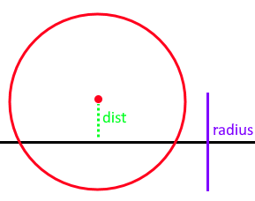

* Projects the sphere center onto the plane to compute distance to the plane. If the distance exceeds radius then we are not touching the plane. The direction to resolve is then computed from the difference between the nearest point on the plane and the sphere center.

**Additional Notes**

* If the sphere crosses the center of the plane it will resolve to the opposite side. Thus not working bidirectionally but suffers from easy tunneling depending on the sphere size and displacement.
* This method produces 1 PointDirectionElement for the sphere.
* This method produces 1 PointDirectionElement for the plane.
* Only on contact is required for sphere on a plane.

UnidirectionalPlaneToSphereCD
--------------------------------

* Static Collision Method

**Method**

* Projects the sphere center onto the plane to compute distance to the plane. If the distance exceeds the radius then we are not touching the plane. The direction to resolve is always the normal of the plane.

**Additional Notes**

* One side of the plane is considered "in" the other "out".
* Only requires one contact point.

ImplicitGeometryToPointSetCCD
--------------------------------

* Dynamic Collision Method

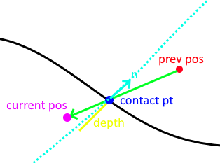

* This method traces the displacement of a point from previous to current position sampling the implicit geometry looking for the first sign change/root. This point is recorded as the contact point.
* It then computes the normalized gradient at the contact point from the implicit geometry. This is used as the contact normal.
* Lastly it projects the (current position - contact position).dot(contact normal) to produce the depth to resolve it along the contact normal for the point to arrive on the plane of the normal which should minimize.

**Additional Notes**

* This method is very unique it that it saves the last contact point outside the shape. Should a point not exit/resolve within a frame it will retrace the displacement, find the root, contact point, contact normal, and reproject to produce an updated contact using the old one.
* This method is important as it avoids sampling the interior of the implicit geometry which is useful for levelsets and non-SDF implicit geometries.

ImplicitGeometryToPointSetCD
--------------------------------

* Static Collision Method

**Method**

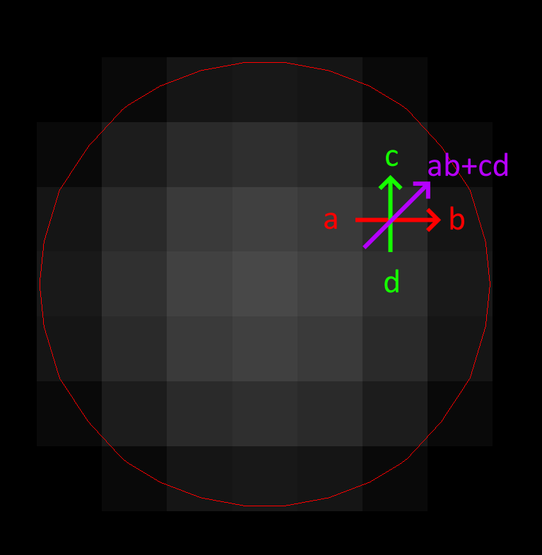

* This method samples the implicit geometry for distance and then computes the normalized gradient for the direction to resolve a point (see gradient computation in diagram via central finite difference).

**Additional Notes**

* This is your traditional point vs SDF collision resolution.
* This method produces N PointIndexDirectionElements for every point.

MeshToMeshBruteForceCD
--------------------------------

* Static Collision Method

**Method**

* This method computes collision for SurfaceMesh vs PointSet/LineMesh/SurfaceMesh. It works best for closed surfaces with an inside/outside. It also works for non-closed geometry but will still assume sides. For example, it would still work for a plane mesh.
* This method works with two brute force expensive passes:

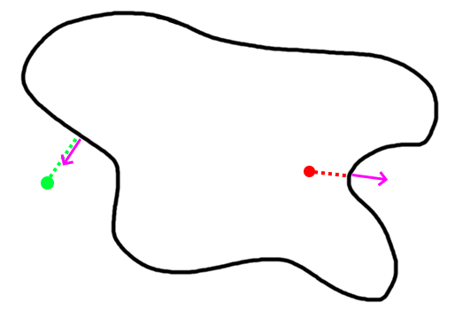

    For a curved surface this point in polygon strategy works well.

* Vertex Pass: For every point compute the nearest point on the other mesh. That point may be on a vertex, edge, or triangle. Then we compute the angled-weighted pseudonormal on that element. Using this normal we can compute sign to tell if inside/outside the SurfaceMesh. We mark which vertices lie inside/outside during this pass for later.

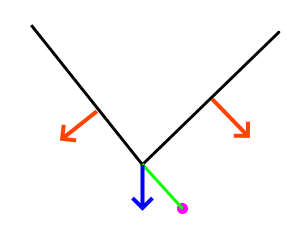

    For meshes using the normal of the element will produce incorrect results (see above where point is inside according to one face, outside according to the other). This is where the angle-weighted pseudonormal comes in.

* Edge Pass: For every edge that still lies outside the SurfaceMesh (with previously computed inside/outside mask). Compute the closest point on that edge with every edge in the SurfaceMesh. Then compute if that closest point lies inside the SurfaceMesh via another point in polygon test.

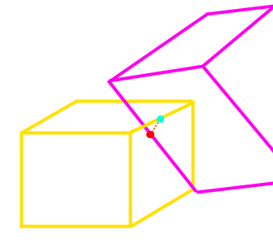

**Additional Notes**

* This method may produce vertex-triangle, vertex-edge, or vertex-vertex collision data.
* It can resolve completely deep penetrations of meshes similar to SDF collision.
* It's tougher to spatially accelerate as it requires global queries rather than bounded ones. You can specify a bound/maximum radius to search. This would establish a maximum penetration depth. This fact heavily influences what type of spatial acceleration you would want. Kdtree's, for instance, may be a bad idea.

PointSetToCapsuleCD
--------------------------------

* Static Collision Method

**Method**

.. image:: media/Collision_Detection/capsuleToPoint.png
    :width: 300
    :alt: Alternative text
    :align: center

* Given the line segment that forms the center/medial of the capsule we compute the closest poitn on it via projection. Computing both orthogonal (a) and parallel distance (b). Should the distance to this closest point exceed radius then we are outside the capsule.

**Additional Notes**

* This method may also be used to compute signed distances of a capsule.
* This method produces N PointIndexDirectionElements for each point.
* This method produces N PointDirectionElements for the capsule given each point.
* Only one contact point is required for a single point on a capsule.

PointSetToOrientedBoxCD
--------------------------------

* Static Collision Method

**Method**

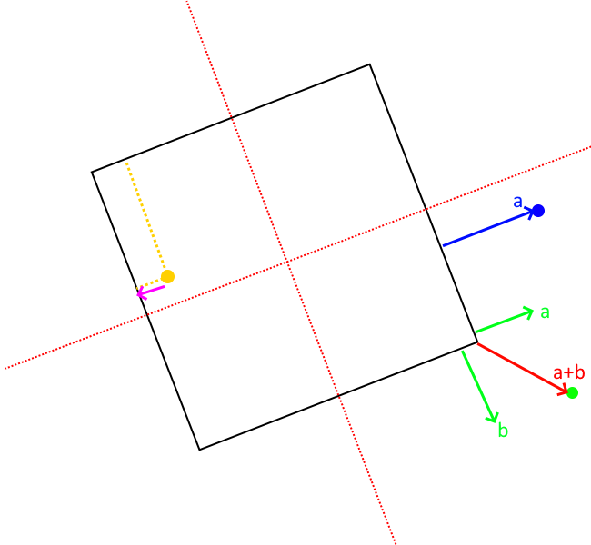

* To compute the resolution vectors (shown in pink) we first project the point along each axes of the oriented box. These axes can be acquired from the inverse (transpose) of the oriented box rotation matrix (each column).
* If within these bounds we can easily find if a point is inside the box or not.
* To then find the direction and amount to minimally resolve we find the nearest point on the box.

  * If the point is inside the box:

    * Compute the distance to each face of the box by subtracting the distance along the orienetation axes from the extent (half length, width, height). If width is 5 and you are 6 units along the axes. Then you are 1 unit in front of the face.
    * Then compute point on that face.

  * If the point outside the box (not required for contact put part of the standard computation to find closest point):

    * Sum the vectors from each face to the point so long as they lie outside the plane of the face. The resulting vector will give distance to point on nearest face, edge, or vertex of the box.

**Additional Notes**

* This method may also be used to compute signed distance of an oriented box.
* This method produces N PointIndexDirectionElements for each point.
* This method produces N PointDirectionElements for the box.
* Only one contact is required for a single point on a box.

PointSetToPlaneCD
--------------------------------

* Static Collision Method

**Method**

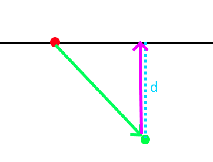

* Projects the point (in green) to the plane given the plane normal and origin (red). Resolution vector shown in pink.

**Additional Notes**

* This method produces N PointIndexDirectionElements for each point.
* This method produces N PointDirectionElements for the plane given each point.
* This method may also be used to compute signed distances to plane.
* Only one contact is required for a single point on plane.

PointSetToSphereCD
--------------------------------

* Static Collision Method

**Method**

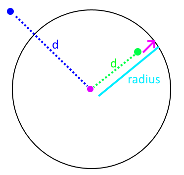

* Compute the squared distance to the center of the sphere from the point. Check it against radius.
* Penetration vector direction given by the normalized difference between the sphere center and point.
* Penetration vector magnitude given by the difference between the radius and distance (distance required to separate along that direction).

**Additional Notes**

* This method may also be used to compute signed distances to sphere.
* Only one contact required for a single point on a sphere.

SphereToCylinderCD
--------------------------------

* Static Collision Method

**Method**

* There are 3 cases. We can proceed in a point vs cylinder like fashion.
* Case 1: Nearest point on the wall of the cylinder.

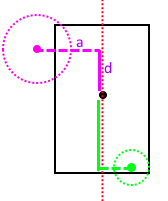

  * We project the sphere center along the cylinder axes to get distance along the axes. If the center lies outside of the half heights of the cylinder we proceed to the other 2 cases. If it lies within the range of the cylinder. The shortest way out is the wall of the cylinder.

* For the other two cases, we then look at the projected distance along the orthogonal axes. If the orthogonal distance is larger than the radius of the cylinder then the nearest point must be on the edge/rim of the cylinder. If smaller then the nearest point must be on the cap.

  * Case 2: Nearest point on the face of the cap.
    * The normal of the cap is used to resolve.
  * Case 3: Nearest point on the edge/rim of the cap.
    * The difference between the nearest point and sphere center is used as the normal.

**Additional Notes**

* One of the more expensive primitives to use.
* This primitive has sharp edges & curved surfaces. However we only need one contact point at for a sphere vs convex shape.

SphereToSphereCD
--------------------------------

* Static Collision Method

**Method**

.. image:: media/Collision_Detection/sphereToSphere.png
    :width: 300
    :alt: Alternative text
    :align: center

* To compute intersections between spheres we compute the distance between them and then check if it's less than the sum of the radii. The direction to resolve is given by the normalized difference between the centers.

**Additional Notes**

* Only one contact is needed.

BidirectionalSurfaceMeshToSphereCD
--------------------------------

* Static Collision Method

**Method**

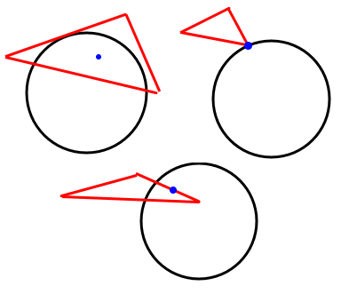

* For every triangle compute the closest point on the triangle to the sphere center. There are then 3 cases:

  * Case 1: Closest point on triangle lies on an edge. Just an edge is touching the sphere.
  * Case 2: Closest point on triangle lies on a vertex. Just a vertex is touching the sphere.
  * Case 3: Closest point on triangle lies no its face. The face is touching the sphere

**Additional Notes**

* A unidirectionl one for closed surfaces could be done via pseudonormal calculation on the sphere center.
* Only one contact required per triangle touching.

TetraToLineMeshCD
--------------------------------

* Static Collision Method

**Method**

* For every line segment we check intersection with every triangle face of every tetrahedron.

**Additional Notes**

* This method misses the case of the line segment being entirely inside of the tetrahedron. It avoids doing a line vs tet SAT like solution.

TetraToPointSetCD
--------------------------------

* Static Collision Method

**Method**

* For every point compute the barycentric coordinates (u,v,w,y) of it to test if inside or out of the tetrahedron.

**Additional Notes**

* This CD, at the moment, uses a built in spatial hashing for intersection tests.

References & Resources
--------------------------------

Much of the math for geometric intersections can be derived from SAT and GJK. I won't go into great detail here but provide briefs and resources:

* `SAT <https://en.wikipedia.org/wiki/Hyperplane_separation_theorem>`_ (Seperating Axis Theorem): Projects geometry along numerous axes in an aim to find a axes fo separation between the two. It also works for certain curved surfaces such as spheres.

  * It may also be used to find the axes of minimal separation which is useful for contact generation.

* `GJK <https://en.wikipedia.org/wiki/Gilbert%E2%80%93Johnson%E2%80%93Keerthi_distance_algorithm>`_: Ais to find the closest points and distance between two convex geometries by minkowski summing one geometry with the other and checking if the origin lies in the summed geometry.

  * Works with any convex shape so long as you can implement minkowski sum and point in convex polygon check.
  * Often combined with EPA (expanding polytope algorithm) to find minimal separation.

.. [gpp] den, B. G. van. (2010). Game physics pearls. A.K. Peters. 
  
.. [rcd] Ericson, C. (n.d.). Real-time collision detection. Elsevier. 