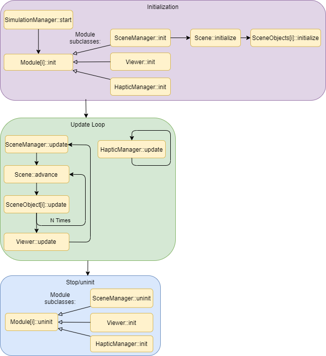

Computational Flow (Order of Execution)
=======================================

The high level computational flow of iMSTK can be summarized by the following diagram which gives a SimulationManager that has a SceneManager, Viewer, and HapticManager. These modules are not required but the standard usage when rendering, simulating, and using haptics. By default every module is initialized, every module is updated in a loop, lastly every module is uninitialized.

If you would like to learn more about how N is computed. Read the SimulationManager and modules page here. 