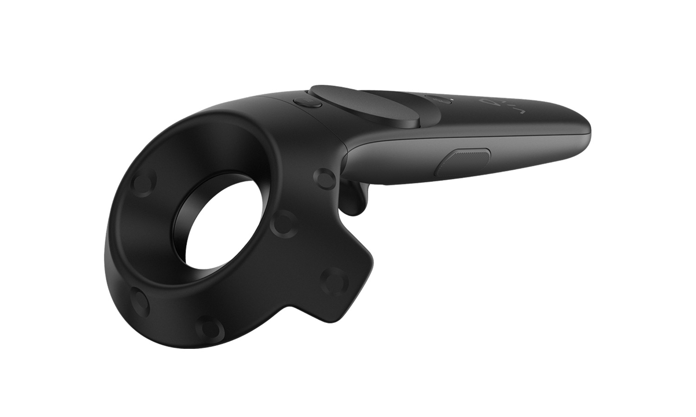
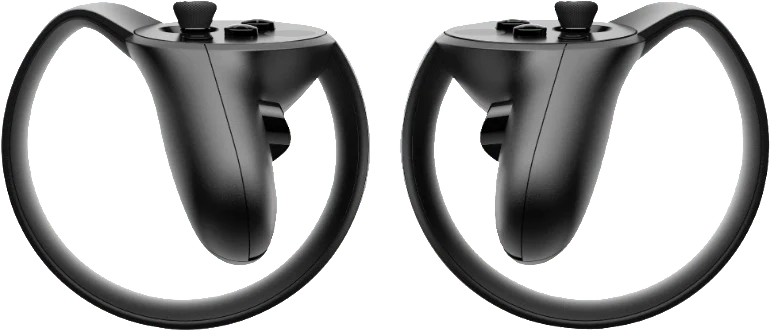

Devices
=======

Overview
========

Devices are an important part to imstk since iMSTK's applications are interactive in nature which often requires user's live inputs via external device of various types. Devices follow a pattern in imstk. First and foremost a device simply provides values and events of an external devices. It does not implement any function or controls. That is what controllers are for. Separation of device from controller is important.

Examples of devices are:

- KeyboardDeviceClient
    - This provides an interface for the keyboard. You can check if keys are down/up. You may also observe or queue press/release events.
- MouseDeviceClient
    - This provides an interface for the mouse. You can check if buttons are down/up and get mouse position. You may also observe or queue button press/release, scroll, and mouse movement events.
- OpenVRDeviceClient
    - This provides an interface for VR headset and controllers. You can check if buttons are down/up/touched. You can get the position & orientation of the controllers or headset. You may also observe or queue button press/release/touch/untouch events.

.. table:: 
    :align: center
 
    +---------------+---------------+
    | |controller1| | |controller2| |
    +---------------+---------------+

- HapticDeviceClient
    - This provides an interface for haptic devices. You can check the state of buttons or the position & orientation of the device. You may also observe or queue button state events.

.. |device1| image:: media/TouchDevice.png
    
.. |device2| image:: media/Falcon.png
    
.. table:: 
   :align: center

   +-----------+-----------+
   | |device1| | |device2| |
   +-----------+-----------+
    
It's worth noting that KeyboardDeviceClient, MouseDeviceClient, and OpenVRDeviceClient can only be provided via a Viewer.

Keyboard and Mouse
==================

We can get a KeyboardDeviceClient and MouseDeviceClient from the viewer as below:

::

    imstkNew<VTKViewer> viewer;
    viewer->setActiveScene(...);

    std::shared_ptr<KeyboardDeviceClient> keyboardDevice = viewer->getKeyboardDevice();
    std::shared_ptr<MouseDeviceClient> mouseDevice = viewer->getMouseDevice();

    imstkNew<SimulationManager> driver;
    driver->addModule(viewer);
    driver->start();

We can directly query these devices via:

::

    if (keyboardDevice->getButton('o') == KEY_PRESS)
    {
        printf("Key is down\n");
    }

You may also directly get callback when the state changes. We can do this with events:

::

    connect<KeyEvent>(keyboardDevice, &KeyboardDeviceClient::keyPress, 
    {
        printf("%d key was pressed\n", e->m_key);
    });

Here, the callback is only called when the key is pressed. Alternatively, we can connect it directly to an object function.

::

    class MyObject : public EventObject
    {
    public:
        void activate(KeyEvent* e) { }
    };
    imstkNew<MyObject> myObject;
    connect<KeyEvent>(keyboardDevice, &KeyboardDeviceClient::keyPress, myObject, &MyObject::activate);

This is effectively a controller. Another class that implements the controls of a device. You may want to consider subclassing the Controller.

Lastly, we can also queue the event as below:

::

    class MyObject : public EventObject
    {
        void update() { doAllEvents(); }
        void activate(KeyEvent* e) { }
    };
    imstkNew<MyObject> myObject;
    queueConnect<KeyEvent>(keyboardDevice, &KeyboardDeviceClient::keyPress, myObject, &MyObject::activate);

Here, we queue the key press to MyObjects event queue. It won't be done (activate won't be called) until update is called. This allows MyObject to decide when it wants to consume the event. It may even do things such as order different types of events. Its also very useful for switching threads.

OpenVR
======

Similarly in OpenVR we can only acquire devices from the viewer.

::

    imstkNew<VTKOpenVRViewer> viewer;
    viewer->setActiveScene(...);
    std::shared_ptr<OpenVRDeviceClient> leftController = viewer->getOpenVRDeviceClient(OPENVR_LEFT_CONTROLLER);
    std::shared_ptr<OpenVRDeviceClient> rightController = viewer->getOpenVRDeviceClient(OPENVR_RIGHT_CONTROLLER);
    std::shared_ptr<OpenVRDeviceClient> headset = viewer->getOpenVRDeviceClient(OPENVR_HMD);

    imstkNew<SimulationManager> driver;
    driver->addModule(viewer);
    driver->start();

As with the keyboard and mouse devices, you may directly get the state or use events from the device. OpenVR controllers have buttons with press, release, touched, an untouched events.

More commonly controllers are useful because they give you positions and orientations. These can be acquired like so:

::

    Vec3d position = leftController->getPosition();
    Quatd orientation = leftController->getOrientation();

OpenHaptics
===========
OpenHaptics tracking devices function a lot like OpenVR controllers. They report position and orientation and have buttons. You may use the same code as above to get position and orientation. Additionally, it emits button events in a similar manner. Haptic devices also allow one to feel forces. A user may send a force to the device to be rendered.

Haptics are usually run on another thread. Often at a very fast rate, >1000hz when virtual coupling is needed. For this, initialization is a bit different

::

    imstkNew<HapticManager> server;
    std::shared_ptr<HapticDeviceClient> client = server->makeDeviceClient();

    imstkNew<SimulationManager> driver;
    driver->addModule(server);
    // typically you would add a VTKViewer and SceneManager here
    driver->start();

We can also apply forces on a haptics devices so the user may feel feedback. Whether that be a rumble, or completely stopping a hand from moving.

::

    imstkNew<HapticManager> server;
    std::shared_ptr<HapticDeviceClient> client = server->makeDeviceClient();

    ...

    client->applyForce(Vec3d(0.0, 1.0, 0.0)); // Apply upwards force