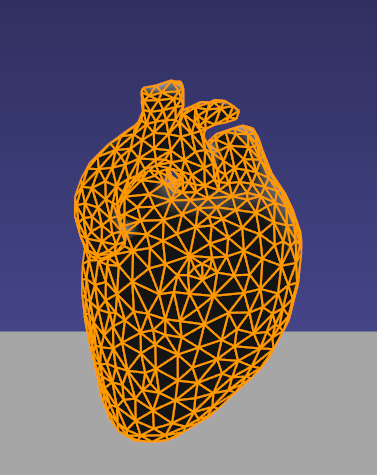

Dynamical Models
================

Overview
========
Dynamical Models, model dynamical systems which describe a function in time. Generally, this is given via some dynamical equation (usually a PDE) that can be discretized for various geometries. Commonly used geometries include tetrahedral, hexahedral, triangle meshes, pointsets, and implicit geometries.

:doc:`Position Based Dynamics (PBD) <../PbdModel>`.
=============================

PBD is probably the most common model used in iMSTK, it may be used for cloths, thin tissues, volumetric/tetrahedral tissues, fluids (both liquids and gasses), and threads/strings. Read more about it at the link above.

Smoothed Particle Hydrodynamics (SPH)
=====================================

Our SPH model allows fluid simulations (liquids and gasses). But its oriented for liquids. It is not as fast as PBD liquids but provides more accuracy. The main difference being that PBD solves on the position level whilst SPH solves velocities.

The SPH model in iMSTK is a form of Weakly Compressible SPH (WSPH) introduced by Becker and Teschner [sph1]_, but with a number of modifications. In particular, their proposed momentum equation for acceleration update and Tait’s equation for pressure computation was employed. However, two different functions for kernel evaluation and evaluation of kernel derivatives were used, similar to Muller et al. [sph2]_. In addition, a variant of XSPH [sph3]_ is used to model viscosity that is computationally cheaper than the traditional formulation. The forces of surface tension are modeled using a robust formulation proposed by Akinci et al. [sph4]_ allowing simulation of large surface tension forces in a realistic manner.

During the simulation, each of the SPH particles needs to search for its neighbors within a preset radius of influence of the kernel function (see figure 1). In iMSTK, the nearest neighbor search is achieved using a uniform spatial grid data structure or using spatial hashing based lookup [sph5]. For fluid-solid interaction, the current implementation only supports one-way coupling in which fluid particles are repelled from solids upon collision by penalty force generation.

Usage
=====

SPH main usage is for blood, in the future it may find use for smoke.

.. image:: media/sph.png
  :width: 600
  :alt: Smoothed Particle Hydrodynamics
  :align: center  

Code
====
To setup a SPHModel we do:

::

    // Setup config
    imstkNew<SPHModelConfig> sphConfig(particleRadius);
    sphConfig->m_bNormalizeDensity = true;
    sphConfig->m_kernelOverParticleRadiusRatio = 6.0;
    sphConfig->m_surfaceTensionStiffness = 5.0;

    // Setup the model
    imstkNew<SPHModel> sphModel;
    sphModel->setModelGeometry(geometry);
    sphModel->configure(sphParams);
    sphModel->setTimeStepSizeType(TimeSteppingType::RealTime);

This can be given to a SPHObject for usage in the scene.

Finite Element Method (FEM)
===========================

The finite element method allows for simulation of many things but is oriented for deformable bodies in iMSTK. Particularly those with a tetrahedral mesh. FEM is currently one of the slower approaches in iMSTK but can be more accurate.

Usage
=====
FEM finds its use for tissues in iMSTK.

Code
====

FE dynamical model can be configured by using an external configuration file or in code.

::

    // Setup config
    imstkNew<FEMModelConfig>         config;
    config->m_fixedNodeIds = input.fixedNodeIds;
    config->m_femMethod = FEMMethodType::StVK;

    // Setup the model
    imstkNew<FEMDeformableBodyModel> dynaModel;
    dynaModel->configure(config);
    dynaModel->setTimeStepSizeType(TimeSteppingType::Fixed);
    dynaModel->setModelGeometry(tetMesh);
    dynaModel->setTimeIntegrator(std::make_shared<BackwardEuler>(0.01));

Alternatively a configuration file may be used. A configuration file specifies (a) an external file listing the IDs of the nodes that are fixed, (b) density, (c) Damping coefficients, (d) elastic modulus, (e) Poisson’s ratio, (f) the choice of FE formulation available. The formulation that are available are (i) Linear (ii) Co-rotation (iii) invertable (iv) Saint-Venant Kirchhoff. Currently backward Euler is the only time stepping that is available in iMSTK.

::

    // Setup the model
    imstkNew<FEMDeformableBodyModel> dynaModel;
    dynaModel->configure(iMSTK_DATA_ROOT "/asianDragon/asianDragon.config");
    dynaModel->setTimeStepSizeType(TimeSteppingType::Fixed);
    dynaModel->setModelGeometry(tetMesh);
    dynaModel->setTimeIntegrator(std::make_shared<BackwardEuler>(0.01));

This can then be given to a FeDeformableObject for usage in the scene.

Reduced FEM
===========

Reduced FEM provides a faster, less accurate FEM, it is currently only supported on Linux when the proper build flag is used.

In the solid mechanics community, the finite element methods are usually used to simulate the dynamic systems of deformable objects. These simulations are set up in an offline, non-interactive manner, partially due to the high computational and storage cost. For example, in a typical simulation there are tens of thousands of degrees of freedoms. Hence, interactive simulations are prohibited for objects with complex geometry and non-trivial material. As an alternative, model order reduction (MOR, also called dimensional model reduction) provides quantitatively accurate descriptions of the dynamics of systems at a computational cost much lower than the original numerical model.

The idea is to project the original, high-dimensional solution space onto a low-dimensional subspace to arrive at a reduced model that approximates the original system. The low-dimensional subspace is carefully chosen such that the most important characteristics (also known as modes) of the original system’s behaviors are preserved. With much less degrees of freedom, the reduced model can be solved much faster than the original system.

In the following is an example of how to create and configure an MOR dynamical model. Two input files generated in Vega for the time being have to be specified, one storing the coefficients of the cubic polynomials for the reduced internal forces, and the other the basis matrix.

::

    // Setup config
    imstkNew<ReducedStVKConfig> config;
    config->m_cubicPolynomialFilename = iMSTK_DATA_ROOT "/asianDragon/asianDragon.cub";
    config->m_modesFileName = iMSTK_DATA_ROOT "/asianDragon/asianDragon.URendering.float";

    // Setup the model
    imstkNew<ReducedStVK> dynaModel;
    dynaModel->configure(config);
    dynaModel->setTimeStepSizeType(TimeSteppingType::Fixed);
    dynaModel->setModelGeometry(volTetMesh);
    dynaModel->setTimeIntegrator(std::make_shared<BackwardEuler>(0.01));

LevelSet Method (LSM)
=====================

The level set method can be used to smoothly evolve a PDE over a domain. This could just be distances or could even be something like the heat equation. It is currently oriented for distance. 

The LevelSetModel is currently only implemented to evolve distances for regular 3d grids. It can do so in dense or sparse mode. With dense mode every voxel of the grid is updated every iteration. Whilst the sparse mode accepts a list of impulses to the velocities, evolving only voxels which actually have something to evolve.

Usage
=====

With it we are able to achieve very fast collision detection and haptic response (>1000hz) and deformation of "statically deformable" object. This finds its uses for bone sawing, burring, drilling.

.. image:: media/lsmCutting.gif
  :width: 600
  :alt: Level Sets
  :align: center

Code
=====

::

    // Setup config
    imstkNew<LevelSetModelConfig> lvlSetConfig;
    lvlSetConfig->m_sparseUpdate = true;
    lvlSetConfig->m_substeps     = 30;

    // Setup the Model
    imstkNew<LevelSetModel> model;
    model->setModelGeometry(sdfGeometry);
    model->configure(lvlSetConfig);

This can then be given to a LevelSetDeformableObject for usage in the scene.

Rigid Body (RBD)
================

The rigid body model is backed by PhysX. It is for simulating bodies that only rigidly transform (translate and rotate) and collide with other rigid bodies. With the PhysX rigid body model all/any bodies with a RigidBodyModel will be able to collide. But you may specific which are static, kinematic, or dynamic.

Usage
=====

Rigid body simulations in iMSTK mostly find their use with tools.

.. image:: media/rbd.png
  :width: 400
  :alt: Rigid body dynamics
  :align: center

Code
====

Unlike PBD, FEM, SPH the RigidBodyModel & RigidBodyModel2 deal with multiple differing geometries in the same model for implicit solves.

With RigidBodyModel2 you setup a different RigidBodyModel for every object to be simulated.

::

    // Setup config
    imstkNew<RigidBodyConfig> rbdConfig;
    rbdConfig->m_rigidBodyType = RigidBodyType::Kinematic;

    imstkNew<RigidBodyModel>  rigidModel;
    rigidModel->configure(rbdConfig);
    rigidModel->setModelGeometry(surfMesh);

Rigid Body 2
============

The secondary rigid body model is our own implementation, very similar to the previously mentioned PhysX backed model. This one provides more extensible and flexible constraint and contact implementations. It is less performant for large amounts of bodies and contacts but often surgical scenarios require few bodies.

Usage
=====

Rigid body simulations in iMSTK mostly find their use with tools.

.. image:: media/rbd1.gif
  :width: 600
  :alt: Rigid body dynamics 2
  :align: center

Code
====

Unlike PBD, FEM, SPH the RigidBodyModel & RigidBodyModel2 deal with multiple differing geometries in the same model for implicit solves.

With RigidBodyModel2 you simply give the same model to the objects you want in the same system. It uses a delegate object, RigidBody, which you can create.

::

    // This model is shared among interacting rigid bodies
    imstkNew<RigidBodyModel2> rbdModel;
    rbdModel->getConfig()->m_gravity = Vec3d(0.0, -2500.0, 0.0);
    rbdModel->getConfig()->m_maxNumIterations = 10;

    std::shared_ptr<RigidBody> body1 = rbdModel->getRigidBody();
    body1->m_mass = 100.0;
    body1->m_initPos = Vec3d(0.0, 8.0, 0.0);
    body1->m_initOrientation = Quatd(Rotd(0.4, Vec3d(1.0, 0.0, 0.0)));
    body1->m_inertiaTensor = Mat3d::Identity();

    std::shared_ptr<RigidBody> body2 = rbdModel->getRigidBody();

    ... body 2 setup ...

However, if one is using a RigidObject2 in the scene it will create its RigidBody, usage then looks like the following:

::

    // This model is shared among interacting rigid bodies
    imstkNew<RigidBodyModel2> rbdModel;
    rbdModel->getConfig()->m_gravity = Vec3d(0.0, -2500.0, 0.0);
    rbdModel->getConfig()->m_maxNumIterations = 10;

    // Object setup for the scene
    imstkNew<RigidObject2> cubeObj("Cube");
    cubeObj->setDynamicalModel(rbdModel);
    cubeObj->setPhysicsGeometry(subdivide->getOutputMesh());
    cubeObj->setCollidingGeometry(subdivide->getOutputMesh());
    cubeObj->addVisualModel(visualModel);

    // We can deal with the rigid body properties like so
    cubeObj->getRigidBody()->m_mass    = 100.0;
    cubeObj->getRigidBody()->m_initPos = Vec3d(0.0, 8.0, 0.0);
    cubeObj->getRigidBody()->m_initOrientation = Quatd(Rotd(0.4, Vec3d(1.0, 0.0, 0.0)));
    cubeObj->getRigidBody()->m_intertiaTensor  = Mat3d::Identity();

        
Bibliography
------------

.. [mcg] Uri M. Ascher and Eddy Boxerman. 2003. On the modified
   conjugate gradient method in cloth simulation. Vis. Comput. 19, 7-8
   (December 2003), 526-531.

.. [vrpn] Russell M. Taylor, II, Thomas C. Hudson, Adam Seeger, Hans Weber,
    Jeffrey Juliano, and Aron T. Helser. 2001. VRPN: a device-independent,
    network-transparent VR peripheral system. In Proceedings of the ACM
    symposium on Virtual reality software and technology (VRST '01). ACM,
    New York, NY, USA, 55-61.

.. [sfml] Simple and Fast Multimedia Library: https://github.com/SFML/SFML

.. [sph1] Markus Becker and Matthias Teschner, “Weakly compressible SPH for free surface flows”. 
   In Proceedings of the ACM SIGGRAPH/Eurographics symposium on Computer Animation, 209-217 (2007).

.. [sph2] Matthias Müller, David Charypar, and Markus Gross, 
   “Particle-based fluid simulation for interactive applications”. 
   In Proceedings of the 2003 ACM SIGGRAPH/Eurographics symposium on Computer Animation, 154-159 (2003).

.. [sph3] Hagit Schechter and Robert Bridson, “Ghost SPH for animating water”. 
   ACM Transaction on Graphics, 31, 4, Article 61 (July 2012).

.. [sph4] Nadir Akinci, Gizem Akinci, and Matthias Teschner, “Versatile surface tension and adhesion for SPH fluids”. 
   ACM Transaction on Graphics, 32, 6, Article 182 (November 2013).

.. [sph5] Teschner, M., Heidelberger, B., Müller, M., Pomeranets, D., and Gross, M, 
   “Optimized spatial hashing for collision detection of deformable objects”. Proc. VMV, 47–54.