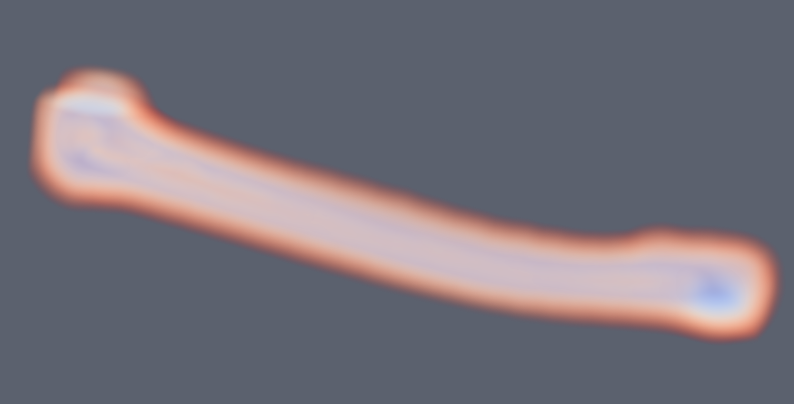
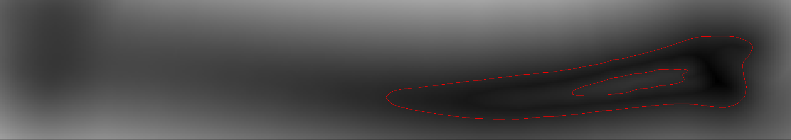
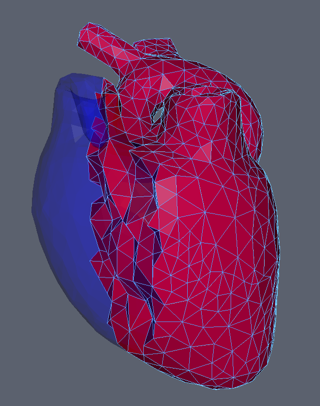

Geometry
========

Base Geometry
=============

Geometry base class implements a concept of pre and post geometry as well as two types of transforms.

- One transform directly applies to both pre and post geometry immediately. (ApplyToData)
- The other transform applies to pre to produce post. (ConcatenateToTransform)
  
First see how to get both post and pre vertices of a PointSet. A similar convention is used among the other geometries (even post and pre values of primitive shapes)

::

    std::shared_ptr<PointSet> myPoints = MeshIO::read<PointSet>("file path here");
    auto preVerticesPtr  = myPoints->getVertexPositions(Geometry::DataType::PostTransform);
    auto postVerticesPtr = myPoints->getVertexPositions(Geometry::DataType::PreTransform);

Similarly, with any geometry you can apply transforms to either pre+post or just to post:

::

    std::shared_ptr<SurfaceMesh> mySurfaceMesh = MeshIO::read<SurfaceMesh>("file path here");

    // Apply immediately to data, transforming both post and pre vertices
    mySurfaceMesh->translate(Vec3d(1.0, 0.0, 0.0), Geometry::TransformType::ApplyToData);
    mySurfaceMesh->rotate(Vec3d(0.0, 1.0, 0.0), 1.57, Geometry::TransformType::ApplyToData);
    // Also available are Quatd (quaternion) and Mat3d(3x3 matrix) rotations
    mySurfaceMesh->scale(Vec3d(2.0, 2.0, 2.0), Geometry::TransformType::ApplyToData);
    mySurfaceMesh->transform(myTransform, Geometry::TransformType::ApplyToData);

    // Concat the transform, when get is later called it will update (lazy update)
    mySurfaceMesh->translate(Vec3d(1.0, 0.0, 0.0), Geometry::TransformType::ConcatenateToTransform);
    mySurfaceMesh->rotate(Vec3d(0.0, 1.0, 0.0), 1.57, Geometry::TransformType::ConcatenateToTransform);
    mySurfaceMesh->scale(Vec3d(2.0, 2.0, 2.0), Geometry::TransformType::ConcatenateToTransform);
    mySurfaceMesh->transform(myTransform, Geometry::TransformType::ConcatenateToTransform);

The advantage of the latter is that transforms are not applied four times and the initial vertices are preserved (which may be useful to some operations, such as dynamical models).

Analytical & Implicit
=====================

Analytical geometries are basic primitives such as sphere, box, capsule, plane, etc. They are given by some parameters. All analytical geometries are also implicit. Implicit geometries provide a function value for all points in space (usually signed or unsigned distance).

Similarly they have post and pre geometry and a transform, but some transforms may not apply correctly. For instance, a sphere cannot anisotropically scale or shear.

::

    imstkNew<Sphere> sphere(Vec3d(0.0, 3.0, 0.0), 2.0); // center, radius
    sphere->translate(Vec3d(0.0, 1.0, 0.0)); // Default is ConcatenateToTransform
    Vec3d newPos = sphere->getPosition(Geometry::DataType::PostTransform);
    // newPos is (0.0, 4.0, 0.0)

    double signedDistance = sphere->getFunctionValue(Vec3d(0.0, 0.0, 0.0));
    // signedDistance is 2.0
    signedDistance = sphere->getFunctionValue(Vec3d(0.0, 2.0, 0.0));
    // signedDistance is 0.0
    signedDistance = sphere->getFunctionValue(Vec3d(0.0, 4.0, 0.0));
    // signedDistance is -2.0

SignedDistanceField
=====================

SignedDistanceField's are types of ImplicitGeometries. They provide signed distances via trilinear interpolation of a field of values. That is, given a uniform (or non-uniform) field of values it finds the the voxel (8 nearest neighbors) and linearly interpolates the value to give you the value at the point.

::

    // This shows how to use a filter to compute the SDF of a SurfaceMesh (slow)
    auto myWatertightMesh = MeshIO::read<SurfaceMesh>("file path here");

    imstkNew<SurfaceMeshDistanceTransform> computeSdf;
    computeSdf->setInputMesh(myWatertightMesh);
    computeSdf->setDimensions(100, 100, 100);
    computeSdf->update();

    imstkNew<SignedDistanceField> sdf(computeSdf->getOutputImage());

    // We can then use
    double signedDist = sdf->getFunctionValue(position);

You may set a scale to the SDF as well which is multiplied with the return value. One should be careful not to anistropically scale an SDF.

The pro to SDFs is that they give some of the fastest collision available just by sampling the 3d image. (normalized gradient = normal, value = penetration depth). Additionally one can inverse transform into them for dynamic objects. The downside is memory consumption and topology changes.

CompositeImplicitGeometry
=========================

CompositeImplicitGeometries allow you to do boolean operations between implicit geometries dynamically. That is, it does not precompute anything but when asked what the signed distance is given a point, it does min & max operations to compute unions, intersections, or differences on the fly.

For example, you can punch and move a hole or grow a capsule in a signed distance field in real time, without any added cost. You are not updating the field. Simply doing some mins/maxes when getting the SDF value. You can also rasterize this back into a field.

::

    // Subtract the sphere from the plane to make a crater
    imstkNew<Plane> planeGeom;
    planeGeom->setWidth(40.0);
    imstkNew<Sphere> sphereGeom;
    sphereGeom->setRadius(25.0);
    sphereGeom->setPosition(0.0, 10.0, 0.0);
    imstkNew<CompositeImplicitGeometry> compGeom;
    compGeom->addImplicitGeometry(planeGeom, CompositeImplicitGeometry::GeometryBoolType::Union);
    compGeom->addImplicitGeometry(sphereGeom, CompositeImplicitGeometry::GeometryBoolType::Difference);

.. image:: media/compositeGeo.png
    :width: 600
    :alt: Alternative text
    :align: center

PointSets
=========

PointSets represent a collection of points. A set of vertices. They can be created like so:

::

    imstkNew<PointSet> pointSet;

    imstkNew<VecDataArray<double, 3>> verticesPtr(2);
    VecDataArray<double, 3>& vertices = *verticesPtr.get();
    vertices[0] = Vec3d(0.0, 1.0, 0.0);
    vertices[1] = Vec3d(0.0, 2.0, 2.0);

    pointSet->initialize(verticesPtr);

Importantly it can also come with a set of named per vertex "attributes". These are abstract arrays. They could be single per vertex scalars, 3d vectors (normals, displacements, velocities), matrices, 2d texture coordinates, etc. There are then a set of designated/labeled/active attributes for normals, texture coordinates, tangents, and scalar. This gives context so one can simply ask the pointset what the active normals are.

Add and access an attribute to the same geometry:

::

    imstkNew<DataArray<double>> scalarsPtr(2);
    DataArray<double>& scalars = *scalarsPtr.get();
    scalars[0] = 5.0;
    scalars[1] = 14.0;

    pointSet->setVertexAttribute("myScalars", scalarsPtr);

    // We can later access by this name, or designate as the active scalars to provide context
    pointSet->setVertexScalars("myScalars");
    Surface, Line, Tetrahedral, & Hexahedral Mesh
    Subclassing PointSet we have SurfaceMesh, LineMesh, TetrahedralMesh, & HexahedralMesh. These are all mostly the same giving indices/order of the vertices per cell. For instance, a triangle has 3 integer indices that specify the location of the 3 vertices involved in the triangle (from the vertex array). Similarly a LineMesh has 2, TetrahedralMesh has 4, HexahedralMesh has 8.

    imstkNew<SurfaceMesh> surfMesh;

    imstkNew<VecDataArray<double, 3>> verticesPtr(3);
    VecDataArray<double, 3>& vertices = *verticesPtr.get();
    vertices[0] = Vec3d(0.0, 1.0, 0.0);
    vertices[1] = Vec3d(-1.0, 0.0, 0.0);
    vertices[2] = Vec3d(0.0, 0.0, 1.0);

    imstkNew<VecDataArray<int, 3>> indicesPtr(1);
    VecDataArray<int, 3>& indices = *indicesPtr.get();
    indices[0] = Vec3i(0, 1, 2);

    pointSet->initialize(verticesPtr, indicesPtr);

Similar to vertex data you may have per cell attributes. That is a normal, scalar, matrix, or whatever specified per cell given a name and labeled/designated as active.

Other notable functions:

- SurfaceMesh::computeVertexNormals
- SurfaceMesh::computeTriangleNormals
- SurfaceMesh::computeVertexTangents
- SurfaceMesh::computeTriangleTangents
- TetrahedralMesh::extractSurfaceMesh

ImageData
=========

Lastly, we have ImageData whose points are not explicitly computed (unless asked for) but given implicitly via origin, spacing, and dimensions of an image. Currently this is aimed at 3d medical images. It does support 2d images, but they aren't widely used in iMSTK.

::

    imstkNew<ImageData> myImage;
    myImage->allocate(
        IMSTK_DOUBLE, // Scalar Type
        1, // Number of Components
        Vec3i(10, 10, 10), // XYZ Dimensions
        Vec3d(1.0, 1.0, 1.0), // XYZ Spacing
        Vec3d(0.0, 0.0, 0.0)); // XYZ origin

::

    // How to access
    std::shared_ptr<AbstractDataArray> myAbstractScalars = myImage->getScalars();
    std::shared_ptr<DataArray<double>> myScalarArray = std::dynamic_pointer_cast<DataArray<double>>(imageData->getScalars());
    imstkNew<ImageData> myImage;
    myImage->allocate(
        IMSTK_DOUBLE, // Scalar Type
        3, // Number of Components
        Vec3i(10, 10, 10), // XYZ Dimensions
        Vec3d(1.0, 1.0, 1.0), // XYZ Spacing
        Vec3d(0.0, 0.0, 0.0)); // XYZ origin
    std::shared_ptr<AbstractDataArray> myAbstractScalars = myImage->getScalars();
    std::shared_ptr<VecDataArray<double, 3>> myScalarArray = std::dynamic_pointer_cast<VecDataArray<double, 3>>(imageData->getScalars());

.. image:: media/vhp.png
    :width: 600
    :alt: Alternative text
    :align: center

ImageData does not support transformations due to sampling performance purposes. You may change the origin for translational offsets and change the spacing for scaling.

Other notable functions:

- ImageData::computePoints
    - Computes the points of the underlying PointSet for the regular grid
- ImageData::cast
    - Returns same image of differing/specified type
- ImageData::getScalarIndex
    - Index into the 1d array for 3d coordinates.