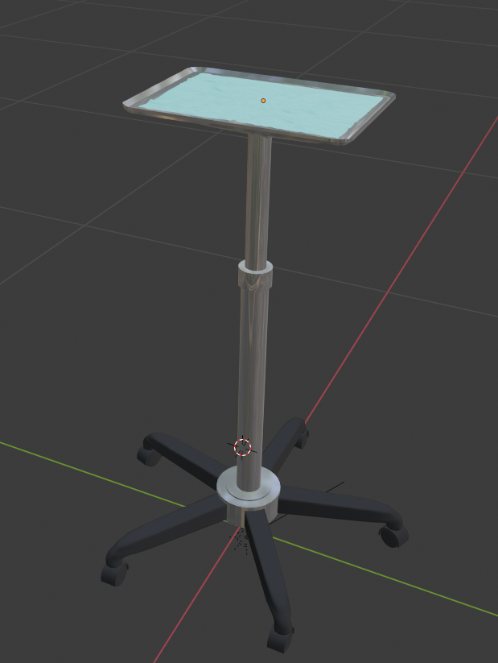

Mesh & Scene IO
===============

Our Mesh and Scene IO is backed by VTK and assimp along with our own readers.

All geometry can read/write through MeshIO.

::

    // Read ".vtk" file into tetMesh
    auto tetMesh = MeshIO::read<TetrahedralMesh>("C:/ExampleLocation/exampleFile.vtk");
    // Write out
    MeshIO::write(tetMesh , "C:/MyLocationToWriteTo/exampleFileOut.vtk");

Here's a full list of supported geometry file types

VisualObjectImporter
====================

The VisualObjectImporter is for importing more complex objects in the scene that cannot be described by a single geometry. This may involve multiple separable meshes, materials, textures, etc. Or even hierarchically defined meshes with multiple parts (it will flatten). In the future, it may be used for full scenes. It supports reading 3ds, obj, fbx, and dae. It can be used as follows:

MeshIO
------

.. csv-table:: 
   :header: "File Format", "Extension", "IO", "Geometry"
   :widths: 15, 10, 20, 25

   "VTK",	.vtk,	read/write,	"HexahedralMesh, SurfaceMesh, TetrahedralMesh"
   "VTU",	.vtu,	read/write,	"HexahedralMesh, TetrahedralMesh"
   "VTP",  	.vtp,	read/write,	"SurfaceMesh"
   "Stereolithic",	.stl, read/write,	"SurfaceMesh"
   "Polygon",	.ply, read/write,	"SurfaceMesh"
    "Nearly Raw Raster Data",	.nrrd, read/write,	"ImageData (Only uncompressed)"
    "Nifti",	.nii, read/write,	"ImageData"
    "Dicom",	.dcm, read,	"ImageData (Basic/limited support)"
    "Meta Images",	".mhd + .raw", read/write,	"ImageData (Compressed)"
    "Wavefront",	.obj, read,	"SurfaceMesh"
    "Collada",	.dae, read,	"SurfaceMesh"
    "Filmbox",	.fbx, read,	"SurfaceMesh (Basic/limited support)"
    "Autodesk 3ds",	.3ds, read,	"SurfaceMesh (Basic/limited support)"
    "Vega",	.veg, read/write,	"HexahedralMesh, TetrahedralMesh"
    "GMSH",	.msh, read,	"HexahedralMesh, TetrahedralMesh"

::

    std::shared_ptr<VisualObject> myObject = ObjectIO::importSceneObject("Object Name", "C:/ExamplePath/ExampleFile.dae", "C:/ExamplePath/");
    // This can then be added to the scene
    scene->addSceneObject(myObject);

Example of file with multiple parts and materials:

