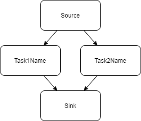

Parallelism
===========

Currently parallelization of code is done in three spots.

- Every module runs in parallel.
- The scene runs with a task graph
- Loop parallelism is applied throughout code
  
We use TBB as the backend for our parallelism which maintains its own thread pool and does its own scheduling. However modules run, by default, on STL threads.

Loop Parallelism
================

iMSTK uses loop based parallelism throughout code. For this we use parallelFor.

::

    #include "imstkParallelUtils.h"

    int main()
    {
        ParallelUtils::parallelFor(100000, [&](const size_T i)
        {
            // Do something
        });
        return 1;
    }

Here we will do something 100000 times in parallel with the optimal number of threads being used.

Task Parallelism
================

While TBB tasks may be used in code, we provide one wrapped mechanism for task based parallelism. That is the Task Graph.

The task graph contains a source and sink. A set of nodes, and set of directional edges. The edges express the succeeding and preceding tasks. A task may not execute until all its preceding tasks are complete. See examples here.

Task graphs are used internally in iMSTK as well. Every DynamicalModel (PBD, SPH, FEM) contains a TaskGraph. Sometimes it's as simple as a few tasks in sequence. Sometimes it's more complex. This is especially useful for inserting intermediate tasks and defining custom physics pipelines. See the Scene interactions section for internal usage. This also provides a very useful debug tool.

Here is a simple task graph construction from the example:

::

    imstkNew<TaskGraph> taskGraph;

    // Create and add the nodes
    std::shared_ptr<TaskNode> task1Node = graph->addFunction("Task1Name",
        [&]()
        {
            // Do task 1 here
        });
    std::shared_ptr<TaskNode> task2Node = graph->addFunction("Task2Name",
        [&]()
        {
            // Do task 2 here
        });

    // Define the edges, add and mult steps will be done in parallel
    graph->addEdge(graph->getSource(), task1Node );
    graph->addEdge(graph->getSource(), task2Node );
    graph->addEdge(task1Node , graph->getSink());
    graph->addEdge(task2Node , graph->getSink());

This defines the following graph where Task1Name and Task2Name may be done in parallel.

We also have numerous convenience functions in TaskGraph's. One may insert a node after or before a existing node in the graph (automatically adding edges).

::

    auto task = std::make_shared<TaskNode>("MyTask",
        [&]()
        {
            // do task here
        });
    graph->insertAfter(task1Node, task);

We also have functions to check for cyclic dependencies, remove non-functional nodes, remove redundant edges (transient reduction), and topological sort.

Additionally, if TaskNode timing is enabled a stopwatch may be used for every node and times reported. You can even ask the graph for the critical path (path that took the longest). In many iMSTK examples, if you press P, you may see the Scene's task graph node timings making bottlenecks very easy to find.

.. image:: media/profiler.png
    :width: 500
    :alt: Alternative text
    :align: center