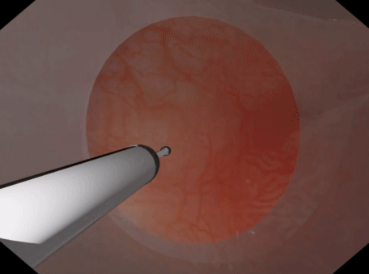
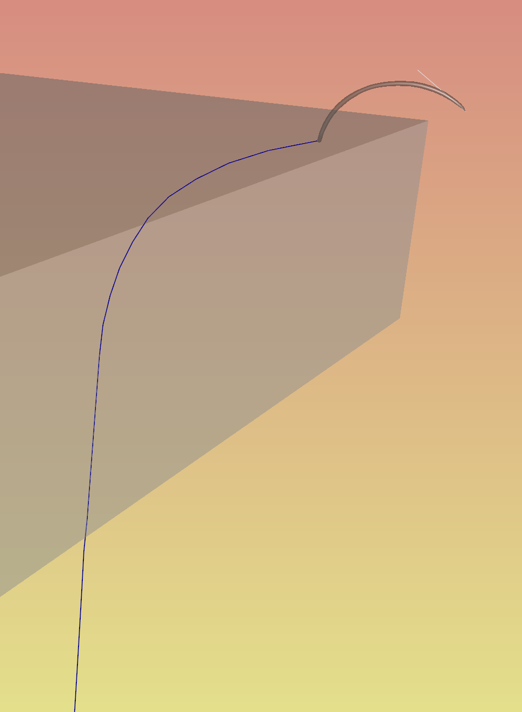

Position Based Dynamics
===================

Position based dynamics [pbd]_, as used in iMSTK, is a first order, particle & constraint based dynamical model. It simulates the dynamics of objects through direct manipulation of particle positions with velocities computed afterwards. This has various pro's and cons, but a major pro is the stability of such method. Pbd in iMSTK is primarily used for deformable bodies but can also be used for fluids (both gas and liquid). Discussed here are its medical applications. The particular implementation of PBD used in iMSTK is Extended PBD [xpbd]_.

The general pbd pipeline is as follows:

- **Integrate Position**: Given the current velocity of every particle, compute the new/tentative position.
- **Solve Internal Constraints**: Solve all internal constraints (directly changing positions). Resolving any violations.
- **Update Velocities**: Compute new velocities from the displacements produced.

Constraints
--------------------------------

Pbd is a constraint based model. Constraints are made for particles in pbd. This constrains the movement of a particle. Constraints are given via a constraint function q, and the gradient of the function q. To solve a constraint is to reduce the scalar, q, to 0. The gradient gives the direction to move the particle to do this. The following constraints are available in iMSTK and referred to in later sections on how to use them:

There are two types of constraints in iMSTK. PbdConstraints and PbdCollisionConstraints. PbdConstraints are generally inernal constraints and work by particle index. They often exist for the entire duration of a simulation. PbdCollisionConstraints are often external, they are added at runtime upon contact, they work by particle pointer value (position and velocity). Among the PbdConstraints are:

- **PbdDistanceConstraint**: Constraints two points by the initial distance between them.
- **PbdDihedralConstraint**: Constrains two triangles by the initial angle between their planes.
- **PbdVolumeConstraint**: Constrains all points of a tetrahedron by the initial volume.
- **PbdFETetConstraint**:
- **PbdBendConstraint**: Constrains 3 points by the angle between the two lines. (like a 1d Dihedral)
- **PbdConstantDensityConstraint**: Constrains all points of a system to achieve constant density using SPH kernels (ie: repels particles in a spherical manner).
- **PbdAreaConstraint**: Constrains 3 points of a triangle by the initial area of that triangle.

To implement your own custom constraint one needs to subclass either ``PbdConstraint`` or ``PbdCollisionConstraint``, construct or initialize it appropriately, then implement/override ``computeValueAndGradient`` which should fill out the constraint value C and constraint gradient dC/dx. This constraint would then need to be added to an existing system or solved in it's own computational block somewhere (depending on when it should be solved).

Deformable Membranes
--------------------------------

For thin deformable membraneous tissues (cloth like) we use surfaces made of triangles. For this simulation one may use **PbdDistanceConstraint**, **PbdDihedralConstraint**, and/or **PbdAreaConstraint**. The most common setup is just distance and dihedral constraints though. The distance constraints keep the cloth together, whilst the dihedral constraint controls how resistent to bending the membrane is.

.. image:: media/PbdModel/tissue1Gif.gif
  :width: 400
  :alt: Cloth simulation
  :align: center

.. image:: media/PbdModel/cloth2.png
  :width: 400
  :alt: Cloth cutting
  :align: center  

Deformable Volumetric Tissue
--------------------------------

For volumetric deformable tissues discretized with tetrahedrons may be used. With the tetrahedrons one may either use (a) **PbdVolumeConstraint** & **PbdDistanceConstraint** constraints Or (b) use **PbdFemConstraint** constraints. The FEM constraints are more accurate than the volume+distance. However, they are much slower in that one may not be able to achieve the target element count or timestep, iteration count, & stiffness. The volume constraints behave well with sign inversion, recovering well from inverted tetrahedrons.

.. image:: media/PbdModel/tissue2.png
  :width: 400
  :alt: Cloth simulation
  :align: center

.. image:: media/PbdModel/heart2.png
  :width: 400
  :alt: Cloth simulation
  :align: center



Deformable Threads
--------------------------------

Surture threads are very common in surgical scenarios. For threads one may use **PbdDistanceConstraint** & **PbdBendConstraint** constraints. The distance constraints keep the particles of the thread together, whilst the bend controls the rigidity of the the thread. The bend constraints may also be generated between multiple sets of particles to reduce iteration count.



Liquids
--------------------------------

Liquids can be modeled with pbd using **PbdConstantDensityConstraint**. Generally, the stiffness is kept as high as possible as liquids are incompressible. If not, you may observe "bouncey" behaviour. Liquids in iMSTK are most useful for bleeding simulation.

.. image:: media/PbdModel/blood.png
  :width: 400
  :alt: Cloth simulation
  :align: center
..
  Gasses
  --------------------------------

  The primary usage for gas is particles during electrocautery. Often these would be billboarded smoke images on particles that fade fairly quickly. There are currently no examples for gas in iMSTK. It is a fluid though, so its approach is not much different than liquids. The **PbdConstantDensityConstraint** may be used. I would suggest using a lower stiffness as liquids tend to be incompressible (constant density) whereas gasses are compressible. The other issue is the lack of proper boundary conditions. Often we are modeling a gas suspended in air. This air must be modeled too if you want accuracy. There do exist some solutions with "ghost particles" to approximate air without adding air particles, but iMSTK does not have such solutions yet. If this is for visual purposes I might suggest lowering gravity, fiddling with mass, etc to get believable behaviour without being suspended in anything.```

Code
====
To setup a PbdModel we do:

::

    // Setup the config
    imstkNew<PbdModelConfig> pbdConfig;

    // Constraints
    pbdConfig->enableConstraint(PbdModelConfig::ConstraintGenType::Distance, 1e2);
    pbdConfig->enableConstraint(PbdModelConfig::ConstraintGenType::Dihedral, 1e1);
    pbdConfig->m_fixedNodeIds = { 0, 1 };

    // Other parameters
    pbdConfig->m_uniformMassValue = 1.0;
    pbdConfig->m_gravity   = Vec3d(0, -9.8, 0);
    pbdConfig->m_dt = 0.005;
    pbdConfig->m_iterations = 10;

    // Setup the model
    imstkNew<PbdModel> pbdModel;
    pbdModel->setModelGeometry(surfMesh);
    pbdModel->configure(pbdConfig);

**Constraints**: Constraints of varying types may be used via ``PbdModelConfig::enableConstraint``, internally this uses PbdConstraintFunctor's which defines how to generate constraints. If one needs more hands on with constraints you may write your own ``PbdConstraintFunctor``. Implemented by subclassing PbdConstraintFunctor and overriding the operator() function. See existing functors in ``imstkPbdConstraintFunctor.h``.

::

    auto myCustomFunctor = std::make_shared<MySuperCustomFunctor>();
    myCustomFunctor->setStiffness(0.95);
    pbdModel->addPbdConstraintFunctor(myCustomFunctor);

**Fixed Node Ids**: This indicates the indices of the particles/nodes that are immovable. Immovable nodes have their inverse masses set to 0 which indicates infinite mass (hence immovable).

**Uniform Mass Value**: This mass value is assigned to all particles/nodes on initialization if masses are not provided as a vertex attribute in the input mesh.

**dt**: The timestep is used during integration to move the particles. Small timesteps are preferable for stability. Real time steps may be used by varying dt every update of the simulation.

::

    connect<Event>(sceneManager, &SceneManager::postUpdate, [&](Event*)
    {
        pbdConfig->m_dt = sceneManager->getDt();
    });

**Iterations**: The iterations of the solver used in the internal constraints. More iterations give changes more time to percolate through the body. For example, a really long thread with numerous segments may have a really high stiffness but if it doesn't have enough iterations it will never be able to reach maximum stiffness. In the original PBD paper stiffness varied with the number of iterations. In xPBD (default) it does not.

Bibliography
------------

.. [pbd] Matthias Müller, Bruno Heidelberger, Marcus Hennix, and John
   Ratcliff. 2007. Position based dynamics. J. Vis. Comun. Image
   Represent. 18, 2 (April 2007), 109-118.

.. [xpbd] Miles Macklin, Matthias Müller, and Nuttapong Chentanez
    1.    XPBD: position-based simulation of compliant constrained dynamics.
    In Proc. of Motion in Games. 49–54