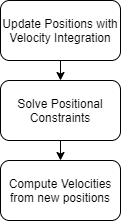
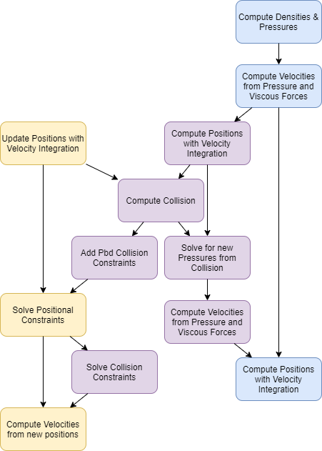

Scene
======

Overview
========

An iMSTK Scene is currently a flat collection of SceneObjects along with an InteractionGraph.

A SceneObject represents something in the scene be it an OR table, a scalpel, a simulated tissue, a light, or even objects you can't see but have function.

An InteractionGraph has a set of InteractionPairs. These are primarily for physics right now but a number of predefined InteractionPair subclasses are provided.

SceneObjects
============

Here's a full list of iMSTKs predefined SceneObjects:

- **SceneObject**: Provides an object with a visual geometry and empty virtual update function. Geometry is optional.
- **CollidingObject**: Provides an object with both visual and colliding geometry.
- **PbdObject**: Provides a PbdModel governing its physics.
- **RigidObject**: Provides a RigidBodyModel governing its physics.
- **RigidObject2**: Provides a RigidBodyModel2 governing its physics. 
- **FemDeformableObject**: Provides a FemModel governing its physics.
- **SPHObject**: Provides a SPHModel governing i
- **LevelSetDeformableObject**: Provides a LevelSetModel governing its physics.

The most important is the base SceneObject. Below we create a Scene and add an empty SceneObject.

::

    imstkNew<Scene> scene("MySceneOfABone");
    imstkNew<SceneObject> boneObject("Bone");
    scene->addSceneObject(boneObject);

If we want to attach visual geometry to this we can do:

::

    imstkNew<Sphere> sphere(Vec3d(0.0, 0.0, 0.0), 1.0);
    boneObject->setVisualGeometry(sphere);

Each SceneObject contains an array of VisualModels. Alternatively, the same object could be created by doing:

::

    imstkNew<SceneObject> boneObject("Bone");
    imstkNew<Sphere> sphere(Vec3d(0.0, 0.0, 0.0), 1.0);
    imstkNew<VisualModel> sphereVisualModel(sphere);
    boneObject->addVisualModel(sphereVisualModel);

In this way, multiple visual models can be added to boneObject.

More complex objects like PbdObject will require more specification. Particularly you must provide it with a valid PbdModel (refer to DynamicalModels and the Pbd examples in iMSTK for this).

Adding Behavior to the Scene
============================

To add function to a scene you have a few options.

Subclass SceneObject
--------------------

If you subclass a SceneObject you may override its update function and provide a constructor

::

    class MyCustomSceneObject : public SceneObject
    {
    public:
        MyCustomSceneObject()
        {
            // do some initialization here
        }
        void update() override
        {
            // do some logic here
        }
    };

Events
------

Events are posted by various objects. You can even post your own events from your own SceneObject subclass. Every module (SceneManager and VTKViewer) provides PostUpdate and PreUpdate events. These would be emitted before and after a scene advance. And before and after a render. You can read more about events here.

::

    connect<Event>(sceneManager, &SceneManager::postUpdate, [&](Event*)
    {
        // do some logic
    });
    
    // OR
    connect<Event>(viewer, &VTKViewer::preUpdate, [&](Event*)
    {
        // do some more logic
    });

Subclass Scene
--------------
If you subclass the Scene itself and reimplement the advance function. Subclassing scene can be a great way to provide a specific scene as you can have members for each object in the scene. This allows you to avoid any type of introspection (name or type checking).

::

    // Here we have a scene for cutting multiple objects.
    // While the tool is given by the scene, the class user is
    // still able to add cuttable objects
    class MyCustomScene : public Scene
    {
    public:
        MyCustomScene()
        {
            // Construct the custom scene
            cutTool = std::make_shared<MyCutToolObject>();
            cuttableObject = std::make_shared<MyCuttableObject>();
        }

        // We could also override initialize and provide init order

        void advance(double dt) override
        {
            // The default parts of scene advance here
            Scene::advance(dt);

            // Any other custom advancement can be done here
            // perhaps you need a specific ordering and want
            // to explicitly give it
            cutTool->update();
            cuttableObject->update();
        }

    public:
        std::shared_ptr<MyCutToolObject> cutTool;
        std::shared_ptr<MyCuttableObject> cuttableObject;
    };

Interactions
------------

Scene interactions in iMSTK are primarily for physics. If you're writing physics code this may be useful to you. While this can be used for more general interactions it may be better to use events, flags, behaviours to achieve your interactions. For example, one can simply queue a message from one SceneObject to another with events. When it comes to physical interactions like collision you will need iMSTK's scene interactions.

On the surface we provide a set of predefined interactions between certain object types and factory methods to make them. For example, if you have two PbdObjects you may use the factory method like so:

::

    scene->getCollisionGraph()->addInteraction(makeObjectInteractionPair(myPbdObj1, 
                                               myPbdObj2,
                                               InteractionType::PbdObjToPbdObjCollision, 
                                               CollisionDetection::Type::MeshToMeshBruteForce));

Or you can simply construct and add the interaction yourself:

::

    auto interaction = std::make_shared<PbdObjectCollisionPair>
        std::dynamic_pointer_cast<PbdObject>(obj1),
        std::dynamic_pointer_cast<PbdObject>(obj2),
        CollisionDetecion::Type::MeshToMeshBruteForce);
    scene->getCollisionGraph()->addInteraction(interaction);

These interactions are meant to keep the API simple. Internally they are quite powerful.

Interactions Internals
----------------------

What the scene interactions in iMSTK provide is intermediate callback between two differing SceneObjects. That is, SceneObjects that have DynamicalModels such as Pbd, Fem, SPH, ... May have a complex pipeline, or set of steps. Certain interactions require intermediate callback that occurs between two steps of these models.

For example take the following steps of PBD:

If we were to compute a collision between two PBDObjects we would want two steps inserted.

- First we would want to compute collision detection AFTER (step 1) tentative positions are computed.
- Then we would want to solve collision constraints AFTER solving internal constraints (step 2).

This would look like the following:

.. image:: media/scene2.png
    :width: 300
    :alt: Alternative text
    :align: center

One might wonder why not just define these steps within the Pbd original set of steps. 

::

    do steps 1 of all pbd objects
    compute collision detection
    do steps 2 of all pbd objects
    solve collision constraints
    do steps 3 of all pbd objects

The above is certainly easy if you're system relies only on Pbd. But we don't just have Pbd. We also have 
SPH, Fem, Levelsets, ... Each with their own respective pipelines. Each with their own places that would be appropriate to do collision (interactions are also not just for collision), some models even have multiple potential spots for collision. With PBD you can clearly see if you want to do collision you need two steps inserted in two spots. Explicitly providing all these permutations of pipelines among objects is next to impossible.

See the below possible explicit SPH and PBD interaction. This is not implemented, but shows how many possible pipeline permutations could happen. This is not the only approach to have PBD and SPH interaction. This particular one has us going back and correcting pressures after collision.

Thus we broke every model up into a set of steps/computational nodes. In the above diagram yellow is PBD default nodes, without interaction. And blue is SPH default nodes, without interaction. One may then define an interaction which specifies what steps are inserted (purple). To specify where to insert we simply give the preceding and succeeding steps. For example, in the above Pbd example, to insert the "Solve Collision Constraints" node. We would simply insert an edge between "Solve Positional Constraints"→"Solve Collision Constraints" and "Solve Collision Constraints"→"Compute Velocities from new Positions".