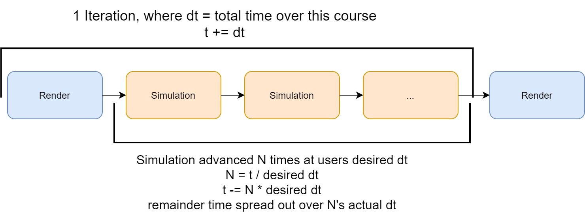

SimulationManager & Modules
===========================

SimulationManager: Usage
========================

iMSTK defines a set of Modules. Modules define something that can be init'd, update'd, and uninit'd. These can be used standalone. The 3 major modules given by iMSTK are:

- VTKViewer
- SceneManager
- HapticManager
  
Each of these can be "driven". That is, something else will be updating them in a loop. That something else is a ModuleDriver.

ModuleDriver is an abstract class which starts and stops a collection of Modules. We provide one such concrete implementation called the SimulationManager. It's used throughout all the examples. The basic setup is as such: 

::

    imstkNew<VTKViewer> viewer;
    viewer->setActiveScene(scene);

    imstkNew<SceneManager> sceneManager;
    sceneManager->setActiveScene(scene);

    imstkNew<SimulationManager> driver;
    driver->addModule(viewer);
    driver->addModule(sceneManager);

    driver->start();

Commonly you will also find it useful to start the scene in a paused state.

::

    sceneManager->pause();

The Update Loop
===============

By default this setup will cause the scene+physics to run in parallel with the rendering. One may specify the execution type like so:

::

    sceneManager->setExecutionType(Module::ExecutionType::ADAPTIVE);

There are three execution modes:

- Adaptive: Run N times per render. How N is computed and why is described below.
- Sequential: Ran every render.
- Parallel: Ran in a loop on another thread. No sync.

Adaptive mode uses something we call sequential substepping. This is important for the update loop of the program. We measure the time a single iteration of physics+rendering takes and then compute how many steps of physics we should take to achieve real time. That is, if 2s pass. And we want 0.5s (desireted delta time/dt) updates. Then we will take 4 steps.

To set this desired dt we use:

::

    driver->setDesiredDt(0.003);

If we wanted to achieve more scene+physics updates per render, we could decrease this value. There is a limit to how low you can go on your machine before you cannot keep up with renders. Frames will start to lag. Then eventually physics will lag.

Additionally, when creating portable software. You will want to optimize for the lowest common denominator (worst machine) you want to support.

The pros of doing such an update is twofold.

- Guarantee a fixed timestep. This is useful for guaranteeing stability in simulation.
- Run in Real Time. As opposed to a fixed dt, which would run faster/slower depending on the speed of the machine. This will run the same speed on any machine (that can achieve the desired dt).