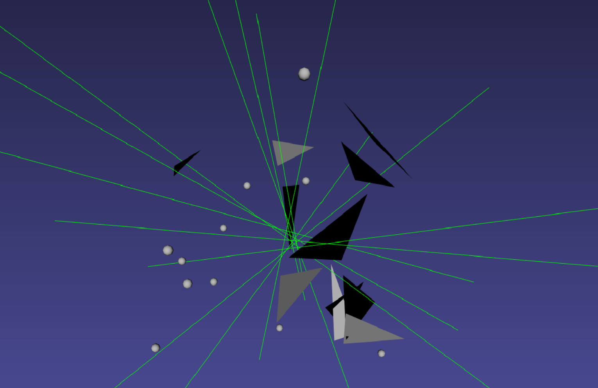
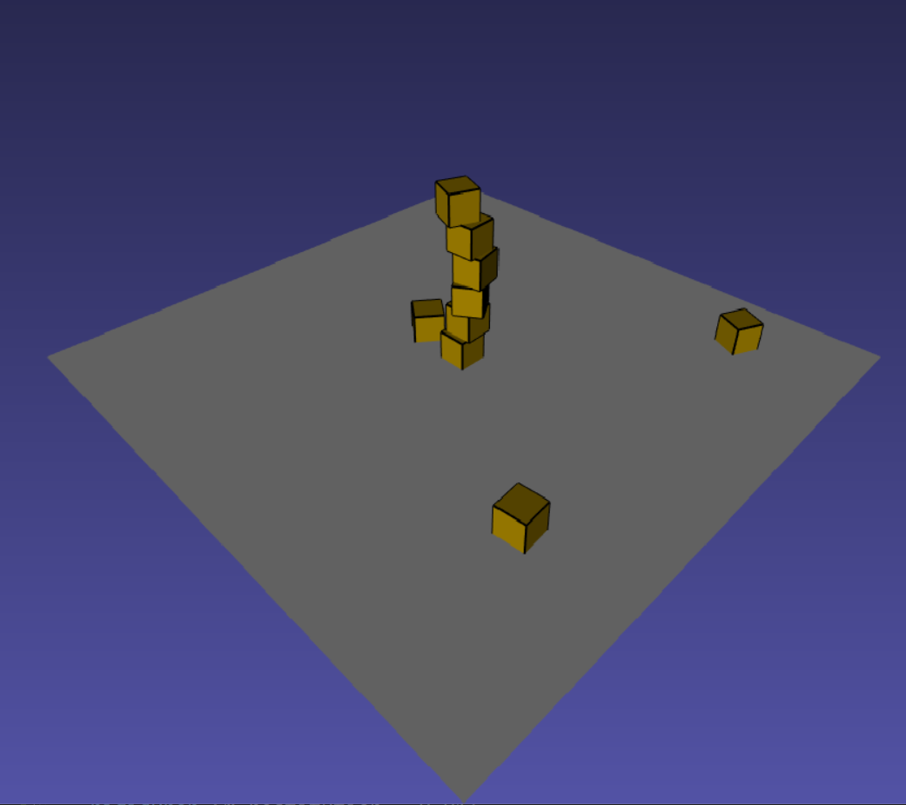
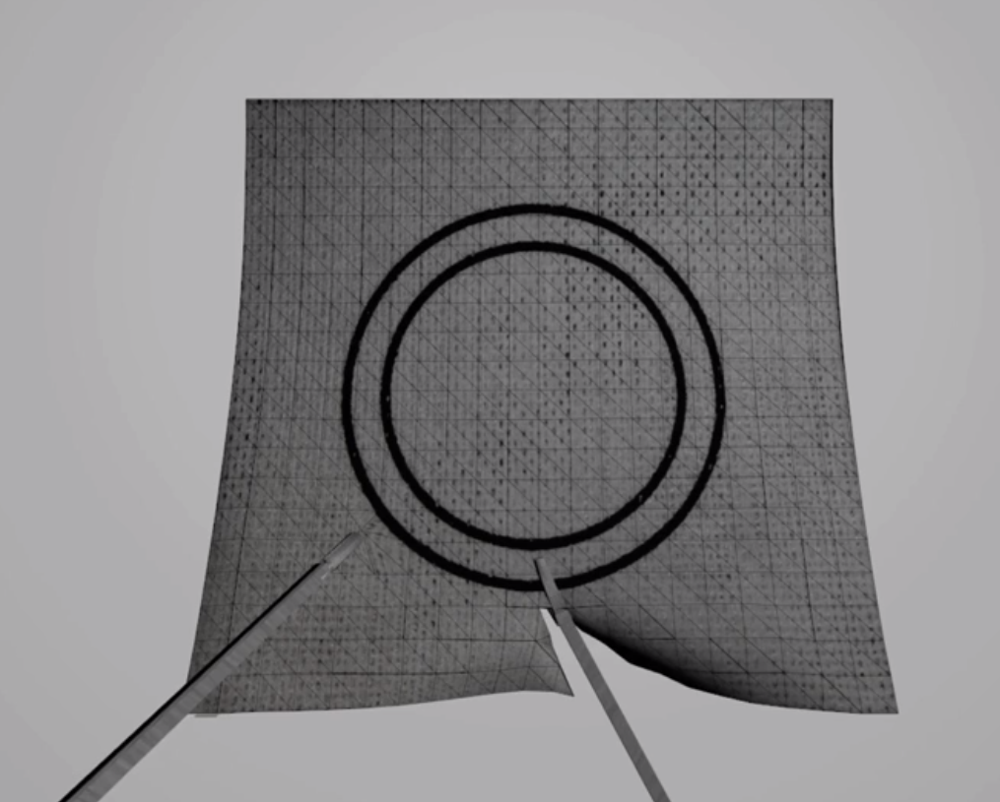
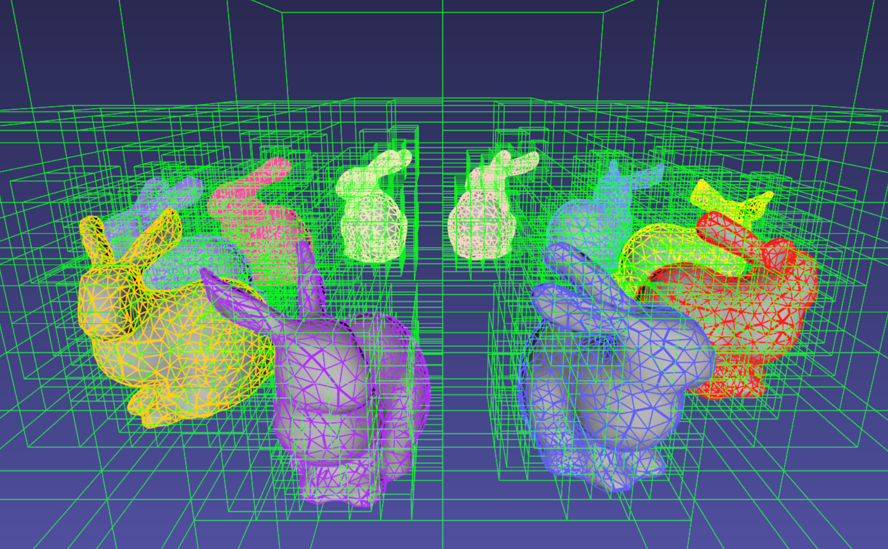

.. centered:: |image0|

.. centered:: **Interactive Medical Simulation Toolkit (iMSTK)**

.. centered:: *User Documentation*

Introduction
============

iMSTK is a free and open source software toolkit written in C++
that aids rapid prototyping of interactive multi-modal surgical
simulations. It provides a highly modular and easy to use framework that
can be extended and be interfaced with other third-party libraries for
the development of medical simulators without restrictive licenses.

iMSTK supports all major platforms (MacOS, Linux, Windows) with the
ability to build all the dependencies automatically using CMake. Current
features include (a) support for a Vulkan and a VTK rendering backend,
(b) VR support, (c) External tracking device hardware support, (d)
linear and nonlinear FEM and PBD (including fluids), (e) standard
numerical solvers such as Newton, CG, Gauss-Seidel, and (e) continuous
collision detection.

This documentation is designed to provide an overview of iMSTK,
introductory concepts needed to comprehend the framework, its component
modules and how they interact to help build simulations. For
implementational level details of the modules and their classes, please
refer to the code. The chapters that follow will describe details of how
to build iMSTK, elements of the simulation scenario and how these
elements are connected using iMSTK modular architecture followed by
detailed description of each of the major modules. The final chapter
includes a walk-through of the code of an all-inclusive example to help
the readers to quickly build their application.

Setup for Development
=====================

iMSTK and its external dependencies can be configured and built from
scratch with Cmake to create a super-build on UNIX (MAC, Linux) and Windows
platforms. The instructions below describe this process in detail.

Configuration and Build
-----------------------

CMake should be used to configure the project on every platform. Please
refer to CMake’s official `page <https://cmake.org/runningcmake/>`__
to read about how to configure using CMake.

**Linux/MacOSx**

Type the following commands from the same location you cloned the 
::

    >> mkdir iMSTK_build
    >> cd iMSTK_build
    >> cmake ../iMSTK    # path to source directory
    >> make -j4 #to build using *4* cores

This will configure the build in a directory adjacent to the source
directory. To easily change some configuration variables such as :code:`CMAKE_BUILD_TYPE`, use ccmake instead of cmake.

One can also use Ninja for a faster build instead of Unix Makefiles. To
do so, configure the cmake project with :code:`-GNinja`
::

    >> cmake -GNinja 
    >> ../iMSTK
    >> ninja

This will checkout, build and link all iMSTK dependencies. When making
changes to iMSTK base source code, you can then build from the
Innerbuild directory.

**Windows**

Run CMake-GUI and follow the directions described on CMake’s official
`page <https://cmake.org/runningcmake/>`__. You need to choose which
version of Visual Studio that you would like to use when configuring the
project. Make sure to select Microsoft Visual Studio C++ 12 2015 or
later. CMake will generate a iMSTK.sln solution file for Visual Studio
at the top level. Open this file and issue build on all targets, which
will checkout, build and link all iMSTK dependencies. When making
changes to iMSTK base source code, you can then build from the iMSTK.sln
solution file located in the Innerbuild directory.   

**Offscreen Rendering**

Offscreen OSMesa/CPU rendering is supported for Linux/MacOSx. This allows one
to build iMSTK without a screen or GPU. Useful for servers. This can be enabled
in the build by using the :code:`iMSTK_USE_VTK_OSMESA` flag to ON.

Running Examples
----------------
The default CMake configuration builds the examples as part of the inner build.
The executables including other targets required to run the executables are placed 
in the :code:`<imstk build dir>/install/bin` directory. The execurables can either 
be run through command line or double clicking.

Options at Configure Time
-------------------------

**Phantom Omni Support**

To support the Geomagic Touch (formerly Sensable Phantom Omni) haptic
device, follow the steps below:

1. Install the `OpenHaptics
   SDK <https://www.3dsystems.com/haptics-devices/openhaptics>`__ as
   well as the device drivers:

   a. for `Windows <https://3dsystems.teamplatform.com/pages/102774?t=r4nk8zvqwa91>`__

   b. for `Linux <https://3dsystems.teamplatform.com/pages/102863?t=fptvcy2zbkcc>`__

2. Reboot your system.

3. Configure your CMake project with the variable :code:`iMSTK_USE_OpenHaptics` set to ON.

4. After configuration, the CMake variable OPENHAPTICS_ROOT_DIR should
   be set to the OpenHaptics path on your system.

**Vulkan Rendering Backend**

To use the Vulkan renderer instead of the default VTK, follow these
steps:

1. Download the `VulkanSDK <https://vulkan.lunarg.com/>`__

2. Download your GPU vendor's latest drivers.

3. Enable the :code:`iMSTK_USE_Vulkan` option in CMake.

.. NOTE:: The examples that depend on this option being on at configure time will not build automatically if this option is not selected.

**Building Examples**

The examples that demonstrate the features and the usage of iMSTK API
can be optionally build. Set :code:`BUILD_EXAMPLES` to ON the examples needs to
be built.

**Audio Support**

iMSTK has the ability to play audio streams at runtime. In order to
enable Audio, set :code:`iMSTK_ENABLE_AUDIO` to ON.

**Uncrustify Support**

iMSTK follows specific code formatting rules. This is enforced through
`Uncrustify <http://uncrustify.sourceforge.net/>`__. For convenience,
iMSTK provides the option to build uncrustify as a target. To enable
this set :code:`iMSTK_USE_UNCRUSTIFY` to ON.

**Virtual Reality Support**

VR supported is provided through OpenVR. This support includes support for
the majority of VR headsets. Notably Oculus and vive headsets.

**Multithreaded build**

The build will be configured to be multithreaded with 8 threads. 
This can be changed by modifying the :code:`iMSTK_NUM_BUILD_PROCESSES` to a positive intiger.

External Dependencies
---------------------

iMSTK builds upon well-established open-source libraries. Below is the
list of iMSTK’s external dependencies and what they are used for in
IMSTK.

+---------------+-----------------------------------------------------------------+
| **Library**   | **Usage**                                                       |
+---------------+-----------------------------------------------------------------+
| Eigen         | linear algebra (vectors, matrices, basic matrix algebra etc.)   |
+---------------+-----------------------------------------------------------------+
| VRPN          | Interfacing with external hardware devices.                     |
+---------------+-----------------------------------------------------------------+
| SFML          | Audio support                                                   |
+---------------+-----------------------------------------------------------------+
| G3log         | Asynchronous logging                                            |
+---------------+-----------------------------------------------------------------+
| Google Test   | Unit testing                                                    |
+---------------+-----------------------------------------------------------------+
| OpenVR        | HMD-based Virtual reality support                               |
+---------------+-----------------------------------------------------------------+
| SCCD          | Continuous collision detection                                  |
+---------------+-----------------------------------------------------------------+
| Uncrustify    | Enforcing code formatting                                       |
+---------------+-----------------------------------------------------------------+
| VEGA Fem      | Rendering, visualization and filters                            |
+---------------+-----------------------------------------------------------------+
| VTK           | Finite element support                                          |
+---------------+-----------------------------------------------------------------+
| TBB           | Intel Thread building block for multithreading                  |
+---------------+-----------------------------------------------------------------+
| Assimp        | Import/export standard 3D mesh formats                          |
+---------------+-----------------------------------------------------------------+
| PhysX         | Rigid body dynamics                                             |
+---------------+-----------------------------------------------------------------+

Secondary external dependencies include *glfw, gli, glm, LibNiFalcon,
Linusb,* and *PThread*.

Overview of iMSTK
=================

Elements of a Scene
-------------------

In iMSTK, a collection of ‘scene objects’, their interaction graph and
inanimate entities like (lights, camera etc.) form a scene. Scene
objects are defined with internal states (eg: displacements,
temperature) that may be governed by a mathematical law. The interaction
between the scene objects is specified by a collision detection and
collision handling. The interaction laws are encoded in the collision
handling.

Module
~~~~~~

A iMSTK module facilitates execution of a set callback function in a
separate thread. Any simulation related logic is executed via one module
or the another. For example, the devices often require a separate thread
for I/O which will be facilitated through the imstkModule class. At any
given instance in time, a module can be in one of the following states:

1. STARTING
2. RUNNING
3. PAUSING
4. PAUSED
5. TERMINATING
6. INACTIVE

the module also allows specifying custom function callbacks that will be
called at the start or end of the execution frame. The examples
demonstrate the usage of these callbacks.

Simulation Manager
~~~~~~~~~~~~~~~~~~

The simulation manager is a high-level class that drives the entire
simulation. Some of the functionalities of the simulation manager
include:

1. Addition and removal of a scene
2. Execution control of a currently active scene: *Start*, *Run*, *Pause*, *Reset*, *End*
3. Setting active scene
4. Adding and remove modules (run in separate threads)
5. Starting the renderer

The simulation manager initialized in the following modes:

- **rendering**: Launch the simulation with a render window
- **runInBackground**: Launch the simulation without a render window but keeps looping the simulation
- **backend**: Launch the simulation without a render window and returns the control

These modes are enumerated at :code:`imstk::SimulationManager::Mode`. The default mode
is *rendering*. The usage is as follows.

::

    auto simManager   = std::make_shared<SimulationManager>(
                              SimulationManager::Mode::rendering /* rendering mode*/, 
                              false /*no VR mode*/);

Scene Manager
~~~~~~~~~~~~~

The scene manager is a module (which runs in a different thread) that
executes each frame of the simulation in the scene on-demand. Each frame
is triggered by the simulation manager. The simulation workflow
described below is implemented in the :code:`runModule()` function of the
sceneManager.

Scene Objects
~~~~~~~~~~~~~

The scene object encapsulates an individual actor that has an internal
state which is governed by a mathematical formulation (*force model*
described later). The internal state (eg: deformation field,
temperature) exists over a finite geometry; therefore each scene object
contains geometric representations for *visual*, *collision* and the
*physics* modules to utilize. The geometric representations could be the
same or separate (for example one might want to do collisions on coarser
geometric representations while the physics is resolved on a denser
representation) for these three modules. The geometric representation
can be a collection of points with or without connectivity or even a
standard shape.

Geometry Mappers
~~~~~~~~~~~~~~~~

The consistency between the visual, collision and the physics geometric
representations is maintained using geometry mappers. At any given
simulation frame, all the internal states are updated, collisions are
computed, interactions are resolved and the new states are passed via
mappers to the renderer to update the visuals. iMSTK provides standard
mappers to map for example, displacement from volumetric mesh the
displayed mesh which is a surface. Arbitrary custom mappers can be
defined by the user.

Collision Graph
~~~~~~~~~~~~~~~

The interaction graph describes the interaction between the scene
objects. Below is a sample code to describe the interaction between an
elastic body and a rigid sphere using penalty-based collision response
and *PointSetToSphere* collision detection.
::

    // Create a collision graph    
    auto graph = scene->getCollisionGraph();
    auto pair = graph->addInteractionPair(elastibBody,
                                        Sphere,
                                        CollisionDetection::Type::PointSetToSphere,
                                        CollisionHandling::Type::Penalty,
                                        CollisionHandling::Type::None);

.. NOTE:: In cases where both the objects are deformable, collision response can be prescribed both ways. More details on the collision detection and response can be found in their respective sections later.

Inanimate Scene Elements
~~~~~~~~~~~~~~~~~~~~~~~~

Background elements of the scene that are not necessarily visible or
affect the simulation are the lights and camera. They are described in
detail in the rendering section.

Simulation Workflow
-------------------

.. centered:: |image1|

The flowchart above shows the brief overview of the simulation workflow.
At any given frame the force vectors and the Jacobian matrices are
computed and passed on to the assembly. The collision detection computes
the intersecting scene objects based on the latest configuration
available from and the collision data is passed to the contact handling
module. Depending on the type of contact handler either the forces or
constraints based are passed to the assembler. The assembled assembles
the discrete set of equations that will be solved by the solver chosen.
Once the solution is obtained the geometry mappers deconstruct this and
update the visual geometries. The mappers further update the physics and
collision mesh representations (if they happen to be different). This is
continued until the user terminates or pauses the simulation.

Object Geometry
===============

iMSTK handles a wide variety of geometric types that will be used for
visual representations of the scene objects, collision computations or
as input domain for physics formulations. The geometry is broadly
classified as (a) Analytic (parameterized) and (b) Discrete geometry.

Analytical Geometry
-------------------

Analytic geometry represents standard shapes that can be fully specified
few parameters. iMSTK supports the following 3D shapes.

- **Sphere**: Specified by radius and center
- **Cube**: Specified by length of the side and the center
- **Plane**: Specified by normal and any point on a plane
- **Capsule**: Specified by radius, length (between the centers of end planes of the cylindrical section) and position (of the center of the cylinder)
- **Cylinder**: Specified by the radius, length and the position (of the center of the cylinder)

The default position is (0,0,0) and the defaulted to unit length along
the cylinder axis. For rendering purposes, the internal representation
of the above shapes is mapped to the VTK data structures.

Discrete Geometry
-----------------

Discrete geometry is where a shape is represented by a collection of
primitives such as points, triangles, tetrahedron, hexahedron etc. iMSTK
currently supports, point clouds, surface mesh, and unstructured
volumetric meshes composed of tetrahedral primitives.

Surface Mesh
~~~~~~~~~~~~

Surface meshes consist of vertices and triangles. The vertices contain
information such as position, normals, UV coordinates, and tangents.
Each triangle contains the index of the three vertices. Surface mesh
normals consider UV seams so that when deformation occurs, the normals
look smooth even when the vertices are duplicated.

Volumetric Mesh
~~~~~~~~~~~~~~~

The volumetric mesh is composed of vertices and tetrahedral elements.
The vertices can also hold additional scalar data for visualization
purposes.

Decals (Vulkan only)
~~~~~~~~~~~~~~~~~~~~

This geometry type actually consists of two related classes: decals and
decal pools. A **decal** a unique object that can project onto
underlying opaque geometry. The projection is along the Z-axis. A
**decal pool** is a collection decals. Memory is preallocated ahead of
time on the GPU side to support additional decals.

.. centered:: |image5| 

In terms of how the decals are rendered, decals are instanced and share
the same material. Therefore, materials should only be assigned to the
decal pool, rather than the decal. This makes a decal pool a relatively
heavy object while decals are lightweight. Decals blend to the layer
underneath, inheriting their normals, meaning that normal maps will not
work. Unlike opaque geometry, decals are only rendered once and cannot
cast shadows.

Decals have a projection box that is by default one meter in each
direction. This can be scaled by setting the scale of each decal. Opaque
geometry that intersects this box will have the decal’s material
projected onto it. If the decal is parallel to a surface, then the
projection will look severely stretched. To avoid this, rotate the decal
by a small amount. If the decal is facing the wrong direction, then it
will be invisible.

Rendering
=========

iMSTK rendering is powered by two rendering APIs: VTK (default) and
Vulkan.

VTK Backend
-----------

The VTK backend is provided to allow for advanced visualization features
for debugging and visualization application behavior such as physics.

Vulkan Backend
--------------

The Vulkan backend concentrates on photorealistic graphics and uses more
much aggressive/expensive approaches to achieve this goal. Currently,
the Vulkan backend follows concepts from physically-based rendering
(PBR). This doesn’t have a clear definition, but the route taken by the
Vulkan backend consists of:

-  Linear color space
-  Microfacet specular BRDF with energy conservation
-  High dynamic range with filmic tonemapping
-  Post processing that operates based on more physical values

Render Material System
----------------------

A render material holds information on the appearance of an item. This
information includes:

-  Textures
-  Display modes (such as wireframe)
-  Values (such as roughness)
-  Shader details

Although a material is a higher level abstraction, it has a large impact
on performance.

The materials properties that are available in iMSTK are described below
along with their definitions:

+----------------+-----------------------------------------------------------------------------------------------------------------------------------------------------------------+
| **Property**   | **Definition**                                                                                                                                                  |
+----------------+-----------------------------------------------------------------------------------------------------------------------------------------------------------------+
| Roughness      | **VTK**: influences how smooth a surface is for Blinn-Phong. This doesn’t have a precise physical meaning.                                                      |
|                |                                                                                                                                                                 |
|                | **Vulkan**: influences roughness. This value is actually squared to allow for more precision for lower roughness values. This has a precise physical meaning.   |
+----------------+-----------------------------------------------------------------------------------------------------------------------------------------------------------------+
| Metalness      | **VTK**: influences specular color.                                                                                                                             |
|                |                                                                                                                                                                 |
|                | **Vulkan**: has a physical meaning, influencing both the specular color and Fresnel strength.                                                                   |
+----------------+-----------------------------------------------------------------------------------------------------------------------------------------------------------------+
| SSS            | **Vulkan**: influences the radius and strength of the subsurface scattering post-processing pass.                                                               |
+----------------+-----------------------------------------------------------------------------------------------------------------------------------------------------------------+
| Tessellation   | **Vulkan**: currently tessellates the mesh                                                                                                                      |
+----------------+-----------------------------------------------------------------------------------------------------------------------------------------------------------------+

.. centered:: |image4|   

Texture Manager
---------------

The texture manager caches textures already in use. Generally most of
the GPU memory in use by the application will be consumed by textures,
so it’s important to avoid redundantly uploading textures. The texture
manager currently uses multiple parameters to detect redundancy
including file path and texture type. It’s possible for the same image
file to be loaded more than once if it’s used in different ways (e.g.,
using the same image for roughness and albedo). This is by design
because different types of texture can be optimized in different image
formats to save space.

Lights
------

.. NOTE:: The intensity of the light can exceed 1.0, which gets clamped in the VTK backend but is smoothed in the Vulkan backend due to the tonemapping. Thus, the resulting appearance will be different.

Directional Lights
~~~~~~~~~~~~~~~~~~

Directional lights have a direction, an intensity, and a color. In the
Vulkan renderer, they can also cast shadows.

Point Lights
~~~~~~~~~~~~

Point lights have a position, an intensity, and a color. Light rays are
calculated coming out from the center of the point light.

Spot Lights
~~~~~~~~~~~

Spot lights are a special case of point lights that also have an angle
cut off along a certain direction.

Image-Based Lighting (Vulkan only)
~~~~~~~~~~~~~~~~~~~~~~~~~~~~~~~~~~

Image-based lighting (IBL) allows the scene to be illuminated by a
surrounding light source. This can be used in the Vulkan backend. To use
it, a global IBL probe object must be created and assigned to the scene.
The object takes three textures: an irradiance cubemap, a radiance
cubemap, and a BRDF lookup table. The two cubemap textures must be in
DDS format, and should also use high-dynamic range for the best results.
The radiance cubemap in particular should be mipmapped.

Debug Rendering
---------------

Developers often need to visualize geometrical primitives that are not necessarily 
part of the scene object geometry. For example, octree grid which is not part of the scene objects
need to be optionally displayed in order to monitor accuracy. *DebugRenderGeometry* class is designed 
for this purpose. Users can add arbitrirary number of points, lines and traingle primitives at runtime 
to the scene that will be rendered along with the regular scene geometry. One difference 
to be noted is that each geometric primitives should be by themselves meaning they are not connected to each other
even though in reality they may be. While in some cases this is redundant but offers greater flexibility
due to greatly reduced bookkeeping of the connectivity. The screenshot below shows randomly created primitives
of the debug geometry displayed in the scene.

.. centered:: |image7|

Usage:

::

      // Create lines for debug rendering
      auto debugLines = std::make_shared<DebugRenderLines>("Debug Lines");
      auto material   = std::make_shared<RenderMaterial>();
      material->setBackFaceCulling(false);
      material->setDebugColor(Color::Green);
      material->setLineWidth(2.0);
      debugLines->setRenderMaterial(material);
      scene->addDebugGeometry(debugLines);

      ...

      // At runtime add points that represent lines      
      debugLines->appendVertex(p);
      debugLines->appendVertex(q);

Custom On-screen text
~~~~~~~~~~~~~~~~~~~~~

Often times it is useful to display additional information on the render window. iMSTK's *VTKTextStatusManager*
class makes this possible. Below is the snippet from the *DebugRendering* example that displays the number of debug
primitives currently dislpayed in the render window. 

::

    auto statusManager = viewer->getTextStatusManager();
    statusManager->setStatusFontSize(VTKTextStatusManager::Custom, 30);
    statusManager->setStatusFontColor(VTKTextStatusManager::Custom, Color::Orange);

    statusManager->setCustomStatus("Primatives: " +
                           std::to_string(debugPoints->getNumVertices()) + " (points) | " +
                           std::to_string(debugLines->getNumVertices() / 2) + " (lines) | " +
                           std::to_string(debugTriangles->getNumVertices() / 3) + " (triangles)"
                );

The font size, color, display corner and padding spaces of the texture manager can be configured.

.. NOTE:: This feature is only available with the VTK rendering backend.

Collision Detection
===================

A typical simulation scenario can feature multiple objects interacting with each other in real-time. Collision detection (CD) is the first step to resolving the physical contact between the objects that are typically represented using a collection of simpler geometric primitives such as vertices, edges, and triangles. Collision detection algorithms are tasked to not only detect and but also report the geometric details of all the points of contact. Accurately and efficiently detecting collisions between interacting objects and handling them using appropriate mechanisms can enhance the accuracy and the realism of application.

Collision detection is typically divided into two phases: (a) the broad phase where a set of candidate collision primitive pairs is identified, and (b) the narrow phase where the geometric intersection tests are performed on these candidate primitive pairs [cd1]_. The narrow phase intersection tests are computationally expensive and hence the broad phase algorithms aim to achieve smallest possible candidate set of collision pairs (with all the actual collision pairs being a subset) with a minimal computational cost.

The broad phase algorithms typically employ hierarchical spatial partitioning data structures such as octrees or BVH to organize and store geometric information for efficient retrieval and processing. Collision detection has been researched extensively in the computer graphics area and its implementation can vary widely depending on the assumptions that are valid for the problem at hand and the target hardware. 

Broad Phase
-----------

iMSTK's broad phase uses octree data structure to perform quick culling of the primitive collision pairs.

Octree Collision
~~~~~~~~~~~~~~~~

An octree is an axis-aligned hierarchical data structure that is generated by recursively subdividing the axis-aligned bounding box (AABB) into eight equally-sized cells as necessary. Generally speaking, the choice of whether to subdivide an octree node or not depends on the density of information present at that node which in this case is the geometry of the primitives.

.. centered:: |image10|

A brute-force way to find collisions between a set of n disjointed primitives can mean testing all the possible pairs which can be computationally prohibitive requiring O(n2) work. The broad phase of the collision detection aims to efficiently eliminate a subset of primitive pairs (also called culling) that are guaranteed not to collide thus leaving only fewer combinations for which expensive geometric tests are performed. An efficient broad phase algorithm aims to minimize the size of the left out pairs while still retaining guarantees (i.e., all the colliding pairs are part of this set).

The broad phase of the octree collision detection consists of two stages:

**Tree update**: In this step, each primitive under consideration for collision are assigned to an octree node depending on the spatial extent, position, and orientation. For this purpose, the AABB of each primitive is recursively checked against the cells starting at the root node. A primitive will be assigned to a node if either the primitive size exceeds the extent of the cells of the child nodes or the current node cannot be further subdivided due to a preset limit on the maximum depth of the octree. 

**Culling**: This step aims to take advantage of the spatial partitioning of the octree and eliminate as many non-colliding primitive pairs as possible from the list of all the possible pairs. Given a primitive, it is first checked for intersection with the boundary of the root node. If the primitive does not intersect with the node boundary, no further operation is performed with the tree node. Otherwise, it is then tested for intersection with all the primitives stored in the tree node. This process is then recursively called on the child nodes until reaching leaf nodes. With n primitives, detecting a collision between them has a time complexity O(nhk) in the worst case, where h is the height of the octree, and k is the maximum number of primitives at any octree node. In practice, h is around 10 and most primitives are stored at the leaf nodes; thus, the cost of detecting collision for each primitive is bounded and can be very cheap.

In iMSTK, OctreeBasedCD class embeds the implementation of the above-described functionality. Users can both access the list of primitives at any given node in the hierarchy and collision data through public API. The code snippet below shows how an octree is built and used to detect collision between two mesh objects that contain triangle primitives:

::

    // Initialize the octree
    OctreeBasedCD octreeCD(Vec3d(0, 0, 0), // Center of the root node
                           100.0, // Side length of the root node
                           0.1);  // Minimum allowed width for any octree cell
     
    // Add mesh objects containing triangle primitives to the octree
    octreeCD.addTriangleMesh(triMesh_1);
    octreeCD.addTriangleMesh(triMesh_2);
     
    // Build the Octree
    octreeCD.build();
     
    // Add collision pairs between meshes
    octreeCD.addCollisionPair(triMesh_1, triMesh_2, 
                            CollisionDetection::Type::SurfaceMeshToSurfaceMesh);

At any given frame during the simulation, querying the generated collision data:

::

    // Update octree (primitives might have moved in the prior frame)
    octreeCD.update();
     
    // Access the collision data for the mesh pair
    const auto& colData = octreeCD.getCollisionPairData(
                               indx1,  // Global index of triMesh_1
                               indx2); // Global index of triMesh_2

Narrow Phase
------------

iMSTK provides numerous narrow phase intersection tests between primitives 
and are implemented as static functions within the *imstk::NarrowPhaseCD* namespace. The current list of functions provide the following intersection tests:

- *BidirectionalPlane-Sphere*
- *UnidirectionalPlane-Sphere*
- *Sphere-Cylinder*
- *Sphere-Sphere*
- *Point-Capsule*
- *Point-Plane*
- *Point-Sphere*
- *Triangle-Triangle*
- *Point-Triangle*

Continuous collision detection
------------------------------

Continuous collision detection (CCD) algorithm extends the collision in time thereby capturing the 
collisions otherwise missed by the traditional collision detection algorithms.
CCD is typically used in cases where there are fast moving objects in the scene causing the traditional *discrete* CD fail to  detect collisions. CCD performs collision of the volumes swept by the colliding primitives
in order to detect the exact time of intersection (if any). In iMSTK, CCD is made available 
through selfCCD library. The class *SurfaceMeshToSurfaceMeshCCD* imlpements this feature. 
Note that in addition to the geometry information resulting from intersection tests, CCD
outputs a scalar 'time' that is normalized between 0-1 for the time period between the frames being considered.

Collision data
--------------

The collision data that is produced as a
result of the collisions and is passed on to the collision handling module for processing. Any collision detection algorithm results in one or more of the following data types:

    - Vertex-Triangle
    - Edge-Edge
    - Mesh-AnalyticalGeometry
    - Point-Tetrahedron
    - Position-Direction

The definitions of the above collifion data types can
be found in *imstkCollisionData.h*.

Collision Handling
==================

Collision handling determines what needs to be done in the event of
collision. The collision data obtained from the CD module is used to
either compute the response forces or generate constraints that will be
solved along with the internal forces. iMSTK currently supports penalty,
linear projection constraints, PBD collision constraints, virtual
coupling and picking collision handling.

Physics
=======

iMSTK is designed to accommodate varied physics-based formulations that
govern the internal states ascribed to the scene objects. The
architecture is designed in such a way that different physical
modalities such as 3D elastic objects, fluids (such as liquids and
smoke), thin elastic sheets, elastic strings can be accommodated with
the choice of different formulations for each modality.

+---------------------------------------------+-------------------+----------------------------------------+
| **Modality**                                | **Formulation**   | **Usage**                              |
+---------------------------------------------+-------------------+----------------------------------------+
| 3D Elastic object                           | FE                | Tissue                                 |
|                                             |                   |                                        |
|                                             | SPH               | Generic elastic solids                 |
|                                             |                   |                                        |
|                                             | Meshless          |                                        |
+---------------------------------------------+-------------------+----------------------------------------+
| Fluids                                      | Finite Volume     | Blood                                  |
|                                             |                   |                                        |
|                                             | SPH               | Smoke                                  |
|                                             |                   |                                        |
|                                             | PBD               |                                        |
+---------------------------------------------+-------------------+----------------------------------------+
| Elastic objects in 3D with 2D topology      | PBD               | Thin tissue layers                     |
|                                             |                   |                                        |
|                                             | FE                | Cloth-like objects in skill trainers   |
+---------------------------------------------+-------------------+----------------------------------------+
| Elastic objects 3D with 1D topology         | PBD               | Suture thread                          |
|                                             |                   |                                        |
|                                             | FE                |                                        |
+---------------------------------------------+-------------------+----------------------------------------+
| Other: Heat diffusion, electric potential   | FE                | Use of energy in surgery               |
+---------------------------------------------+-------------------+----------------------------------------+

The table above lists various modalities, ]physics based formulations
that help realized them and their potential usage in medical
simulations. While the architecture itself allows extension to most
modalities and their formulations, only a subset of them are currently
available in iMSTK.

In iMSTK, the partial differential equations that describes the
evolution of the physical quantities both in space and time are modeled
using dynamicalModel class. The dynamical model is composed of the
*internal force* model and the *time stepping* scheme which are designed
to take in the current internal states and produce force (analogous)
vector and Jacobian matrices to be used by the solvers.

3D Deformable Objects
---------------------
Finite Element Method (FEM)
~~~~~~~~~~~~~~~~~~~~~~~~~~~~~~~

iMSTK supports elastic solids both using finite element (FE) and PBD. FE
support is only limited to tetrahedral elements while the PBD
formulation is agnostic to the underlying mesh.
::

    auto dynaModel = std::make_shared<FEMDeformableBodyModel>();
    dynaModel->configure(iMSTK_DATA_ROOT"/asianDragon/asianDragon.config");
    dynaModel->setTimeStepSizeType(TimeSteppingType::realTime);
    dynaModel->setModelGeometry(volTetMesh);

    // Create and add Backward Euler time integrator
    auto timeIntegrator = std::make_shared<BackwardEuler>(0.001);

    dynaModel->setTimeIntegrator(timeIntegrator);

FE dynamical model can be configured by using an external configuration
file. The configuration file specifies (a) an external file listing the
IDs of the nodes that are fixed, (b) density, (c) Damping coefficients,
(d) elastic modulus, (e) Poisson’s ratio, (f) the choice of FE
formulation available. The formulation that are available are (i) Linear
(ii) Co-rotation (iii) invertable (iv) Saint-Venant Kirchhoff. Currently
backward Euler is the only time stepping that is available in iMSTK.

Position Based Dynamics (PBD)
~~~~~~~~~~~~~~~~~~~~~~~~~~~~~~~

Below is a sample code that shows the configuration of an elastic object
with PBD formulation.
::

    auto pbdModel      = std::make_shared<PbdModel>();
    pbdModel->setModelGeometry(surfMesh);
    auto pbdParams = std::make_shared<PBDModelConfig>();

    // Constraints
    pbdParams->enableConstraint(PbdConstraint::Type::Distance, 1e2);
    pbdParams->enableConstraint(PbdConstraint::Type::Dihedral, 1e1);
    pbdParams->m_fixedNodeIds = { 0, 1 };

    // Other parameters
    pbdParams->m_uniformMassValue = 1.0;
    pbdParams->m_gravity   = Vec3d(0, -9.8, 0);
    pbdParams->m_defaultDt = 0.005; 
    pbdParams->m_iterations = 10;
    pbdParam->m_solverType = PbdConstraint::SolverType::PBD;

Note that unlike FE, for the case of PBD formulation, the choice of time
stepping scheme and solver is restricted in choice resulting in a
compact API to prescribe the entirety of the object configuration.

xPBD
~~~~~~~~~~~~~~~~~~~~~~~~~~~~~~~

An well known drawback of PBD is that PBD’s behavior depends on the time step
and the number of iterations of the simulation [pbd]_; that is, constraints become
extremely stiff as the time step decreases, or the number of interactions increases.
To alleviate this problem, extended PBD (xPBD) was introduced in [xpbd]_ based on a small
modification to the original PBD algorithm. Compared to PBD, it can simulate elastic
objects with physically meaningful material parameters, and requires computing and
storing a single additional scalar for each constraint.

Due to the superiority of xPBD over PBD, PbdModel is created using xPBD by default.
In order to use PBD, users have to change the solver type in PBDModelConfig, ie,
pbdParam->m_solverType = PbdConstraint::SolverType::PBD;. Another significant
difference from PBD happens when specifying the stiffness: the stiffness in xPBD
is indeed Young’s Modulus of materials, rather than a parameter between [0,1] without
physics meaning as in PBD.

::

    auto pbdModel      = std::make_shared<PbdModel>();
    pbdModel->setModelGeometry(surfMesh);
    auto pbdParams = std::make_shared<PBDModelConfig>();

    // Constraints
    pbdParams->enableConstraint(PbdConstraint::Type::Distance, 1e2);
    pbdParams->enableConstraint(PbdConstraint::Type::Dihedral, 1e1);
    pbdParams->m_fixedNodeIds = { 0, 1 };

    // Other parameters
    pbdParams->m_uniformMassValue = 1.0;
    pbdParams->m_gravity   = Vec3d(0, -9.8, 0);
    pbdParams->m_defaultDt = 0.005; 
    pbdParams->m_iterations = 10;

    // Set the parameters
    pbdModel->configure(pbdParams);

Model order reduction
~~~~~~~~~~~~~~~~~~~~~~~~~~~~~~~
In the solid mechanics community, the finite element methods are usually used to simulate
the dynamic systems of deformable objects. These simulations are set up in an offline,
non-interactive manner, partially due to the high computational and storage cost. For
example, in a typical simulation there are tens of thousands of degrees of freedoms. Hence,
interactive simulations are prohibited for objects with complex geometry and non-trivial
material. As an alternative, model order reduction (MOR, also called dimensional model reduction)
provides quantitatively accurate descriptions of the dynamics of systems at a computational
cost much lower than the original numerical model. 

The idea is to project the original, high-dimensional solution space onto a low-dimensional
subspace to arrive at a reduced model that approximates the original system. The low-dimensional
subspace is carefully chosen such that the most important characteristics (also known as modes)
of the original system's behaviors are preserved. With much less degrees of freedom, the reduced
model can be solved much faster than the original system.

In the following is an example of how to create and configure an MOR dynamical model. Two input
files generated in Vega for the time being have to be specified, one storing the coefficients
of the cubic polynomials for the reduced internal forces, and the other the basis matrix.

::

    auto dynaModel = std::make_shared<ReducedStVK>();
    auto config = std::make_shared<ReducedStVKConfig>();
    config->m_cubicPolynomialFilename = iMSTK_DATA_ROOT "/asianDragon/asianDragon.cub";
    config->m_modesFileName = iMSTK_DATA_ROOT "/asianDragon/asianDragon.URendering.float";
    dynaModel->configure(config);
    dynaModel->setTimeStepSizeType(TimeSteppingType::Fixed);
    dynaModel->setModelGeometry(volTetMesh);
    auto timeIntegrator = std::make_shared<BackwardEuler>(0.01);
    dynaModel->setTimeIntegrator(timeIntegrator);

.. Note:: Model order reduction requires installation of MKL and arpack, only on Linux.

Cloth
-----

Currently iMSTK supports the thin elastic sheets like cloth via PBD
formulation which are governed by *distance* and *dihedral* constraints.
The code below demonstrates the initialization of the PbdModel and its
configuration.

.. centered:: |image9|

::

    auto deformableObj = std::make_shared<PbdObject>("Cloth");
    auto pbdModel = std::make_shared<PbdModel>();
    pbdModel->setModelGeometry(surfMesh);
    pbdModel->configure(/*Number of constraints*/ 2,
                        /*Constraint configuration*/ "Distance 0.1",
                        /*Constraint configuration*/ "Dihedral 0.001",
                        /*Mass*/ 1.0,
                        /*Gravity*/ "0 -9.8 0",
                        /*TimeStep*/ 0.03,
                        /*FixedPoint*/ "1 2 3 4 5 6 7 8 9 10 11",
                        /*NumberOfIterationInConstraintSolver*/ 5);
    deformableObj->setDynamicalModel(pbdModel);
    deformableObj->setVisualGeometry(surfMesh);
    deformableObj->setPhysicsGeometry(surfMesh);

The dihedral constraints require that the mesh supplied is a surface
mesh. Note that for the PBD formulation the number of iterations of the
solver can determine the eventual stiffness exhibited by the cloth.

Fluids
------
iMSTK provides two options to simulated fluids: Smoothed-Particle Hydrodynamics (SPH) and PBD. 
Both of them are particle-based formulations.

Smoothed Particle Hydrodynamics
~~~~~~~~~~~~~~~~~~~~~~~~~~~~~~~
Smoothed Particle Hydrodynamics (SPH) is one of the widely used methods for simulating fluid flow (and solid mechanics) in distinct areas such as computer graphics, astrophysics, and oceanography among others. SPH is a mesh-free Lagrangian method that employs a kernel function to interpolate fluid properties and spatial derivatives at discrete particle positions.

.. centered:: |image6|

The SPH model in iMSTK is a form of Weakly Compressible SPH (WSPH) introduced by Becker and Teschner [sph1]_, but with a number of modifications. In particular, their proposed momentum equation for acceleration update and Tait’s equation for pressure computation was employed. However, two different functions for kernel evaluation and evaluation of kernel derivatives were used, similar to Muller et al. [sph2]_. In addition, a variant of XSPH [sph3]_ is used to model viscosity that is computationally cheaper than the traditional formulation. The forces of surface tension are modeled using a robust formulation proposed by Akinci et al. [sph4]_ allowing simulation of large surface tension forces in a realistic manner.

During the simulation, each of the SPH particles needs to search for its neighbors within a preset radius of influence of the kernel function (see figure 1). In iMSTK, the nearest neighbor search is achieved using a uniform spatial grid data structure or using spatial hashing based lookup [sph5]_. For fluid-solid interaction, the current implementation only supports one-way coupling in which fluid particles are repelled from solids upon collision by penalty force generation.

The code snippet below show creation and configuration of the SPH model and solver.
::

    // Create and configure SPH model
    auto sphModel = std::make_shared<SPHModel>();
    sphModel->setModelGeometry(fluidGeometry);

    auto sphParams = std::make_shared<SPHModelConfig>(particleRadius);
    sphParams->m_bNormalizeDensity = true;
    sphParams->m_kernelOverParticleRadiusRatio = 6.0;
    sphParams->m_viscosityCoeff                = 0.5;
    sphParams->m_surfaceTensionStiffness       = 5.0;
    sphModel->configure(sphParams);
    sphModel->setTimeStepSizeType(TimeSteppingType::realTime);

    ...

    // Configure SPH solver
    auto sphSolver = std::make_shared<SPHSolver>();
    sphSolver->setSPHObject(fluidObj);
    scene->addNonlinearSolver(sphSolver);

Position based dynamics
~~~~~~~~~~~~~~~~~~~~~~~~~~~~~~~

Fluids (in this case liquids) are supported in iMSTK via PBD. Constant
density constraints are solved within the PBD solution framework in
order to achieve the fluid flow. The formulation operates on a set of
points.
::

    auto deformableObj = std::make_shared<PbdObject>("Dragon");
    deformableObj->setVisualGeometry(fluidMesh);
    deformableObj->setCollidingGeometry(fluidMesh);
    deformableObj->setPhysicsGeometry(fluidMesh);
    auto pbdModel = std::make_shared<PbdModel>();
    pbdModel->setModelGeometry(fluidMesh);
    pbdModel->configure(/*Number of Constraints*/ 1,
                        /*Constraint configuration*/ "ConstantDensity 1.0 0.3",
                        /*Mass*/ 1.0,
                        /*Gravity*/ "0 -9.8 0",
                        /*TimeStep*/ 0.005,
                        /*FixedPoint*/ "",
                        /*NumberOfIterationInConstraintSolver*/ 2,
                        /*Proximity*/ 0.1,
                        /*Contact stiffness*/ 1.0);
    deformableObj->setDynamicalModel(pbdModel);

Rigid Body Dynamics
-------------------

The rigid body dynamics is made available in iMSTK through `PhysX
<https://www.geforce.com/hardware/technology/physx>`__. 
The rigid body can either be static, kinematic or dynamic. Currently cube, sphere, 
plane and a mesh geometry types can be assigned to the physics geometry of the 
rigid body dynamics object. Below is the code snippet to configure the rigid body 
dynamical model and assign it to an object described in 3D by a surface geometry.
As can be seen the firction properties of the body can be configured through the 
*RigidBodyPropertyDesc* object.

.. centered:: |image8|

::

    /* create a rigid scene object */
    auto rigidObject = std::make_shared<RigidObject>("RigidObject");
    rigidObject->setVisualGeometry(cubeGeom);
    rigidObject->setCollidingGeometry(cubeGeom);
    rigidObject->setPhysicsGeometry(cubeGeom);
    
    /* Create and configure cube dynamic model */
    auto rigidModel = std::make_shared<RigidBodyModel>();
    auto rigidProp = std::make_shared<RigidBodyPropertyDesc>();
    rigidProp->m_dynamicFriction = 0.01;
    rigidProp->m_restitution = 0.01;
    rigidProp->m_staticFriction = 0.005;

    rigidModel->configure(cubeGeom, rigidProp, RigidBodyType::Dynamic);
    cubeObj->setDynamicalModel(rigidModel);

Additionally, external force can be added to each dynamic rigid object through 
:code:`RigidBodyModel::addForce()` function.

.. Note:: All the rigid bodies in the scene currently interact with every 
          other rigid body in the rigid body world (*RigidBodyWorld*). This needs to be 
          modified to follow the collision graph of imstk.

.. Note:: For dynamic mesh objects the mesh needs to be convex and can contain a maximum of
          256 polygons. These restrictions are placed by the PhysX library due to efficiency considerations.

Computational Algebra
=====================

Direct Linear Solvers
---------------------

iMSTK provides interface to all the direct solvers (based on dense and
sparse matrices) that Eigen provide. They are: (a) LU factorization, (b)
LDLT, (c) QR factorization, (d) Cholesky factorization.

Iterative Linear Solvers
------------------------

iMSTK also provides access to Eigen’s iterative solvers like Conjugate
Gradient and Gauss Seidel. In addition, the following custom solvers are
available:

1. **Modified conjugate gradient (MCG)**: Solves linear system of
   equations with the symmetric positive definite system matrix along
   with orthogonal linear projection constraints [mcg]_.

2. **Modified Gauss-Seidel**: Similar to modified MCG but solves the
   linear system by projecting the constraints node-wise at each
   iteration.

3. **PBD solver**: Position based dynamics [pbd]_ formulation generates a
   list of heterogeneous non-linear set of constraints that need to be
   solved using nonlinear Gauss-Seidel. PBD solver implements this
   solution.

External Devices
================

Most surgical simulators require the users to interact with the software
using a hardware interface. For this purpose, iMSTK uses VRPN library
[vrpn]_ to interface with wide number of hardware devices. Currently,
iMSTK supports a subset of these devices, specifically, Novint Falcon,
Geomagic Touch, OSVR, Arduino, 3D Connexion Navigator and 3D Connexion
Space Explorer.

Audio
=====

Simulation of some surgical scenarios require reproduction of the sounds
produced during surgery. iMSTK provides the capability to do so via SFML
library [sfml]_. Features include ability to configure the position of
the sound source, position of the listener, attenuation coefficients,
sound pitch. Please refer to audio example for details.

.. NOTE:: Currently, in order to enable the audio capability, :code:`iMSTK_AUDIO_ENABLED` has to be set to ON at CMake configure time.

Haptic Rendering
================

Many medical simulations involve the surgeon feeling the force feedback
from the organs through the surgical tools. The ability to allow for
algorithms to reproduce this is crucial for the framework. iMSTK
currently supports GeoMagic Touch and Novint Falcon devices for force
rendering.

+------------------+-----------------+
| |image2|         | |image3|        |
|                  |                 |
| GeoMagic Touch   | Novint Falcon   |
+------------------+-----------------+

An example code on how to instantiate a haptic device is shown below
::

    // Create Device Client
    auto client = std::make_shared<HDAPIDeviceClient>(“Phantom1”);

    // Create Device Server
    auto server = std::make_shared<HDAPIDeviceServer>(); 
    server->addDeviceClient(client);
    sdk->addModule(server);

Parallel Support
===============

iMSTK allows CPU based shared memory parallelization using Intel TBB library. 
:code:`imstk::ParallelUtils` features utilities that allows users to explot loop-based
parallelism.

Below is the sample usage of the paralle for loop in the :code:`PointSetToCapsuleCD` 
static function since collision computation can be run independently on each point in the set.

::

    void PointSetToCapsuleCD::computeCollisionData()
    {
        m_colData->clearAll();
        ParallelUtils::parallelFor(static_cast<unsigned int>(m_pointSet->getVertexPositions().size()),
            [&](const unsigned int idx)
            {
                const auto& point = m_pointSet->getVertexPosition(idx);
                NarrowPhaseCD::pointToCapsule(point, idx, m_capsule.get(), m_colData);
            });
    }

Additional utility functions are available in the same namespace that allow
parallel execution of computational kernel over nested indices in 2D and 3D with
options to parallelize over a dimension of choice.

Miscellaneous Topics
====================

Task Graphs
------------------
iMSTK provides Task Graphs. These are used internally but may also be used by the user.
A TaskGraph contains a set of TaskNode's. Each node accomplishes some computation.
The TaskGraph also contains edges establishing successor/predeccessor relationships between
the tasks. For example, one could specify that a task may only happen after two others have
completed. Additionally a TaskGraph will always contain a source and sink node.

This TaskGraph may be then executed by the user using one of the TaskGraphControllers.
Currently, there are two provided TaskGraphControllers. SequentialTaskGraphController and 
TbbTaskGraphController. Sequential executes the tasks one by one in topological order while
Tbb executes them in parallel.

To use a TaskGraph, create one and begin adding functions/nodes to it. One can either
create a TaskNode or use the overloaded function in TaskGraph to directly supply a function
pointer. Then we can establish edges between the nodes and execute.

::

    // Inputs
    const int x = 0;
    const int y = 2;
    const int z = 3;
    const int w = 5;

    // Results
    int a = 0;
    int b = 0;
    int c = 0;

    std::shared_ptr<TaskGraph> graph = std::make_shared<TaskGraph>();

    // Setup Nodes
    std::shared_ptr<TaskNode> addXYNode = graph->addFunction([&]() { a = x + y; });
    std::shared_ptr<TaskNode> multZWNode = graph->addFunction([&]() { b = z * w; });
    std::shared_ptr<TaskNode> addABNode = graph->addFunction([&]() { c = a + b; });

    // Setup Edges
    graph->addEdge(graph->getSource(), addXYNode);
    graph->addEdge(graph->getSource(), multZWNode);
    graph->addEdge(addXYNode, addABNode);
    graph->addEdge(multZWNode, addABNode);
    graph->addEdge(addABNode, graph->getSink());

    // Finally, execute
    std::shared_ptr<TbbTaskGraphController> controller = std::make_shared<TbbTaskGraphController>();
    controller->setInput(graph);
    controller->init(); // Possible preprocessing steps
    controller->execute();

TaskGraphs are also used internally in iMSTK's physics loop. This allows one to reconfigure
iMSTK's sequence of events. The Scene, SceneObject, and AbstractDynamicalModel classes all contain
member TaskGraphs which are composited into each other. To modify the main physics loop one should
modify the top level TaskGraph, that would be the Scene TaskGraph. Keep in mind that the Scene's TaskGraph
is rebuilt on initialize. One can have their own step within initialization like so:

::

    scene->setComputeGraphConfigureCallback([&](Scene* scene)
    {
        // Insert nodes or edges
    });

Additionally many of the classes in iMSTK expose getters for their nodes. This is useful, for example,
if one wanted to insert a step after PbdModel does its position integration.

::

    std::shared_ptr<PbdModel> pbdModel = clothObj->getPbdModel();
    ...
    scene->setComputeGraphConfigureCallback([&](Scene* scene)
    {
        std::shared_ptr<ComputeGraph> graph = scene->getComputeGraph();

        // A TaskNode to print all velocities
        std::shared_ptr<TaskNode> printVelocities = std::make_shared<TaskNode>([&]()
        {
            const StdVectorOfVec3d& velocities = *pbdModel->getCurrentState()->getVelocities();
            for (size_t i = 0; i < velocities.size(); i++)
            {
                printf("Velocity: %f, %f, %f\n", velocities[i].x(), velocities[i].y(), velocities[i].z());
            }
        });

        // Add to the graph, after positions are integrated
        graph->insertAfter(pbdModel->getIntegratePositionNode(), printVelocities);
    });    

Lastly, the TaskGraph comes with a number of graph functions. Static functions such as sum, nest, topological sort,
transitive reduction, cyclic check, etc. Member functions such as addNode, addFunction, addEdge, insertAfter, 
insertBefore, ... The graph sum and nest are especially useful when maintaining multiple decoupled graphs with identical
nodes between them that you would then like to combine.

Object Controllers
------------------

The scene objects in the scene can be controlled in real-time by the
user through user inputs such as keyboard inputs or movement of the end
effector of one of the supported devices. This feature becomes handy for
surgical scenarios where the surgical tools are controlled by the user
movements.

*imstkSceneObject* controller class implements this feature. Given a
scene object and the device tracker, object control can be instantiated
by the following statement
::

    auto controller = std::make_shared<SceneObjectController>(object, trackCtrl);
    scene->addObjectController(controller);

At runtime, the scene object’s pose (position and orientation) will be
set to that of the device tracker. In addition, imstk provides a utility
class for two-jawed laparoscopic tool. Its usage can be found in
*LaparoscopicToolController* example. In addition, a *DummyClient* class
allows for external program to provide the updated pose. This is
especially useful when imstk is used as an external library where the
main program handles the device control.

Event Handling
--------------

Currently, the events are handled in imstk using three different
mechanisms which will be unified in the future. Standard key press and
mouse events are handled in iMSTK via VTK’s interactor style. Currently
pan-zoom-rotate via input from the mouse is achieved through this
mechanism. Below is the example of setting a custom callback linked to
press of a key
::

    .. // Create a call back on key press of 'b' to take the screen shot"
    viewer->setOnCharFunction('b', [&](InteractorStyle\* c) -> bool
    {
        screenShotUtility->saveScreenShot();
        return false;   
    });

Any event triggered by non-standard external devices (eg: foot pedal) is
implemented in collision handling or via lambda mechanism of the imstk
Module.

File Formats
------------

iMSTK handles a range of file formats for various types of media.

- **Surface/Volumetric Meshes**: .fbx, .dae, .obj, .stl, .3ds, .ply, .vtk, .vtu
- **Texture Formats**: .png, .jpg, .bmp, .dds (for Vulkan cubemaps)
- **Configuration Files**: .config (from vega)
- **Misc.**: .bou (boundary condition files)

I/O
---

The file I/O is handled by MeshIO module. Any file format can be loaded
using a simple call shown below.
::

    auto objMesh = MeshIO::read(iMSTK_DATA_ROOT"/asianDragon/asianDragon.obj");
    auto plyMesh = MeshIO::read(iMSTK_DATA_ROOT"/cube/cube.ply");
    auto stlMesh = MeshIO::read(iMSTK_DATA_ROOT"/cube/cube.stl");
    auto vtkMesh = MeshIO::read(iMSTK_DATA_ROOT"/cube/cube.vtk");
    auto vegaMesh = MeshIO::read(iMSTK_DATA_ROOT"/cube/cube.veg");

Please refer to MeshIOExample for more details on the usage. Currently
imstk do not support file output.

Format Check
------------

iMSTK has a set of guidelines for code style formatting and is enfored
automatically using *uncrustify* external library. The check for the
code style is embedded on the unit tests. However, in order to make it
convenient for the developed, *uncrustify_Run* project get shipped and
build at the time of building iMSTK. Running the executable from the
project will modify the code to enforce the code style.

Utilities
---------

Imstk captures commonly used code patterns inside the utilities in order
to reduce the amount of code in the application and to quickly create a
working application.

**API utilities**

The namespace imstk::APIUtilities contains utility functions that allows
for quick creation and configuring of scene objects.
::

    createVisualAnalyticalSceneObject(imstk::Geometry::Type type,
                                      std::shared_ptr<imstk::Scene> scene,
                                      const std::string objName,
                                      const double scale = 1.,
                                      const imstk::Vec3d t(0.,0.,0.));

Above is a declaration of a utility function that allows creation and do
initial transform of any analytical object (that is visual only) in one
call. Additional utilities include (a) creation of a colliding scene
object that is represented by analytic geometry, (b) an utility to
create a nonlinear system, and (c) an utility to print the framerate of
the simulation into the standard output window.

More utilities will be added in the future when different usage patterns
are identified.

Walk-through Example
====================

This chapter walks through an example scene where a tool controlled by
the user through the use of a haptic device interacts with a deformable
object (finite element based).

**Step 1:** Instantiating a simulation manager and setting up the scene
::

    auto sdk = std::make_shared<SimulationManager>();
    auto scene = sdk->createNewScene("LiverToolInteraction");
    scene->getCamera()->setPosition(0, 2.0, 40.0);

**Step 2:** Loading model data from a file
::

    auto tetMesh =
    imstk::MeshIO::read(iMSTK_DATA_ROOT"/oneTet/oneTet.veg");

    if (!tetMesh)
    {
        (WARNING) << "Could not read mesh from file.";
        return 1;
    }

**Step 3:** Extracting the surface mesh that is needed for rendering
::

    auto surfMesh = std::make_shared<imstk::SurfaceMesh>();
    auto volTetMesh = std::dynamic_pointer_cast<imstk::TetrahedralMesh>(tetMesh);

    if (!volTetMesh)
    {
        LOG(WARNING) << "Dynamic pointer cast from imstk::Mesh to
        imstk::TetrahedralMesh failed!";

        return 1;
    }

    volTetMesh->extractSurfaceMesh(surfMesh);

**Step 4:** Creating a mapping between the volume and surface mesh
::

    auto oneToOneNodalMap = std::make_shared<imstk::OneToOneMap>();
    oneToOneNodalMap->setMaster(tetMesh);
    oneToOneNodalMap->setSlave(surfMesh);
    oneToOneNodalMap->compute();

**Step 5:** Setting up the dynamic model that will be used in the scene
::

    auto dynaModel = std::make_shared<FEMDeformableBodyModel>();
    dynaModel->configure(iMSTK_DATA_ROOT"/oneTet/oneTet.config");
    dynaModel->initialize(volTetMesh);

    // Create and add Backward Euler time integrator
    auto timeIntegrator = std::make_shared<BackwardEuler>(0.001);

    dynaModel->setTimeIntegrator(timeIntegrator);

**Step 6:** Creating a deformable object and adding it to the scene
::

    auto deformableObj = std::make_shared<DeformableObject>("Dragon");
    deformableObj->setVisualGeometry(surfMesh);
    deformableObj->setPhysicsGeometry(volTetMesh);
    deformableObj->setPhysicsToVisualMap(oneToOneNodalMap); //assign the computed map
    deformableObj->setDynamicalModel(dynaModel);
    deformableObj->initialize();
    scene->addSceneObject(deformableObj);

**Step 7:** Creating a nonlinear system
::

    auto nlSystem = std::make_shared<NonLinearSystem>(dynaModel->getFunction(),
                                                       dynaModel->getFunctionGradient());

    std::vector<LinearProjectionConstraint> projList;

    for (auto i : dynaModel->getFixNodeIds())
    {
        auto s = LinearProjectionConstraint(i, false);
        s.setProjectorToDirichlet(i);
        s.setValue(Vec3d(0.001, 0, 0));
        projList.push_back(s);
    }

    nlSystem->setLinearProjectors(projList);
    nlSystem->setUnknownVector(dynaModel->getUnknownVec());
    nlSystem->setUpdateFunction(dynaModel->getUpdateFunction());
    nlSystem->setUpdatePreviousStatesFunction(dynaModel->getUpdatePrevStateFunction());

**Step 8:** Creating a linear solver and adding it to the nonlinear system
::

    // create a linear solver
    auto cgLinSolver = std::make\shared<ConjugateGradient>();

    // create a non-linear solver and add to the scene
    auto nlSolver = std::make\shared<NewtonSolver>();

    nlSolver->setLinearSolver(cgLinSolver);
    nlSolver->setSystem(nlSystem);
    //nlSolver->setToFullyImplicit();
    scene->addNonlinearSolver(nlSolver);

**Step 9:** Setting up the haptics interface
::

    // Device clients
    auto client = std::make_shared<imstk::HDAPIDeviceClient>("Default Device");

    // Device Server
    auto server = std::make_shared<imstk::HDAPIDeviceServer>();

    server->addDeviceClient(client);

    sdk->addModule(server);

**Step 10:** Creating tool-related scene objects and adding them to the scene
::

    // Load tool mesh from a file
    auto pivot = apiutils::createAndAddVisualSceneObject(scene,
                                                         iMSTK_DATA_ROOT"/laptool/pivot.obj", 
                                                         "pivot");

    // Or analytical object
    auto sphere0Obj = apiutils::createCollidingAnalyticalSceneObject(imstk::Geometry::Type::Sphere, 
                                                                     scene, 
                                                                     "Sphere0", 
                                                                     3, 
                                                                     Vec3d(1, 0.5, 0));
    auto trackingCtrl = std::make_shared<imstk::DeviceTracker>(client);

    auto lapToolController = std::make_shared<imstk::SceneObjectController>(sphere0Obj,
                                                                            trackingCtrl);

    scene->addObjectController(lapToolController);

**Step 11:** Creating the collision interaction graph
::

    scene->getCollisionGraph()->addInteractionPair(deformableObj,
                                                   sphere0Obj, 
                                                   CollisionDetection::Type::MeshToSphere,
                                                   CollisionHandling::Type::Penalty, 
                                                   CollisionHandling::Type::None);

**Step 12:** Setting up camera parameters in the scene (if necessary)
::

    // Set Camera configuration
    auto cam = scene->getCamera();

    cam->setPosition(imstk::Vec3d(0, 20, 20));
    cam->setFocalPoint(imstk::Vec3d(0, 0, 0));

**Step 13:** Running the simulation
::

    sdk->setCurrentScene(scene);
    sdk->startSimulation(true);
    
Bibliography
------------

.. [mcg] Uri M. Ascher and Eddy Boxerman. 2003. On the modified
   conjugate gradient method in cloth simulation. Vis. Comput. 19, 7-8
   (December 2003), 526-531.

.. [pbd] Matthias Müller, Bruno Heidelberger, Marcus Hennix, and John
   Ratcliff. 2007. Position based dynamics. J. Vis. Comun. Image
   Represent. 18, 2 (April 2007), 109-118.

.. [xpbd] Miles Macklin, Matthias Müller, and Nuttapong Chentanez
    2016. XPBD: position-based simulation of compliant constrained dynamics.
    In Proc. of Motion in Games. 49–54

.. [vrpn] Russell M. Taylor, II, Thomas C. Hudson, Adam Seeger, Hans Weber,
    Jeffrey Juliano, and Aron T. Helser. 2001. VRPN: a device-independent,
    network-transparent VR peripheral system. In Proceedings of the ACM
    symposium on Virtual reality software and technology (VRST '01). ACM,
    New York, NY, USA, 55-61.

.. [sfml] Simple and Fast Multimedia Library: https://github.com/SFML/SFML

.. [sph1] Markus Becker and Matthias Teschner, “Weakly compressible SPH for free surface flows”. 
   In Proceedings of the ACM SIGGRAPH/Eurographics symposium on Computer Animation, 209-217 (2007).

.. [sph2] Matthias Müller, David Charypar, and Markus Gross, 
   “Particle-based fluid simulation for interactive applications”. 
   In Proceedings of the 2003 ACM SIGGRAPH/Eurographics symposium on Computer Animation, 154-159 (2003).

.. [sph3] Hagit Schechter and Robert Bridson, “Ghost SPH for animating water”. 
   ACM Transaction on Graphics, 31, 4, Article 61 (July 2012).

.. [sph4] Nadir Akinci, Gizem Akinci, and Matthias Teschner, “Versatile surface tension and adhesion for SPH fluids”. 
   ACM Transaction on Graphics, 32, 6, Article 182 (November 2013).

.. [sph5] Teschner, M., Heidelberger, B., Müller, M., Pomeranets, D., and Gross, M, 
   “Optimized spatial hashing for collision detection of deformable objects”. Proc. VMV, 47–54.

.. [cd1] Christer Ericson. Real-Time Collision Detection. CRC Press, Inc., Boca Raton, FL, USA, 2004.

.. |image0| image:: media/logo.png
   :width: 3.5in
   :height: 1.28515625in
   
.. |image1| image:: media/dataFlow.png 
   :width: 5.57813in
   :height: 3.83496in
   
.. |image2| image:: media/omni.png
   :width: 1.53958in
   :height: 1.1in
   
.. |image3| image:: media/falcon.png
   :width: 1.53125in
   :height: 1.11056in
   
.. |image4| image:: media/pbr.png
   :width: 513px
   :height: 438px
   
.. |image5| image:: media/decalsDemo.png
   :width: 570px
   :height: 188px

.. |image6| image:: media/sph.png
   :width: 711px
   :height: 394px

