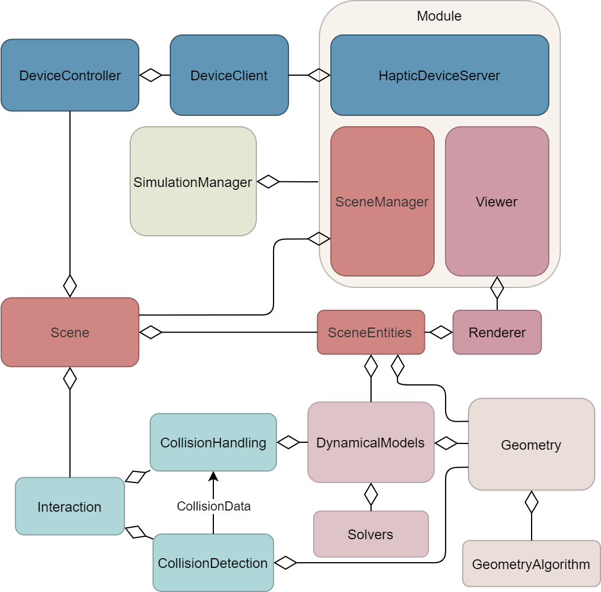

.. centered:: |image0|

.. centered:: **Interactive Medical Simulation Toolkit (iMSTK)**

.. centered:: *User Documentation*

Introduction
============

iMSTK is an open-source C++-based software toolkit that aids rapid prototyping of interactive multi-modal medical simulations. It provides a highly modular and easy-to-use framework that can be extended and interfaced with third-party libraries for the development of medical simulators without restrictive licenses.

iMSTK supports all three major platforms-macOS, Linux, Windows and comes with a CMake-based automatic build system. This documentation is designed to provide an overview of iMSTK, introductory concepts needed to comprehend the framework, its component modules, and how they interact to help build simulations. For a detailed insight into the usage of various modules, you may refer to an extensive set of examples that are built by default. For implementational level details of the modules and their classes, please refer to the code documentation. The chapters that follow will describe details of how to build iMSTK, elements of the simulation scenario, and how these elements are connected using iMSTK's modular architecture followed by a detailed description of each of the major modules. The final chapter includes a walk-through of the code of an all-inclusive example to help the readers quickly build their application.

Setup for Development
=====================

iMSTK and its external dependencies can be configured and built from scratch using iMSTK's CMake super-build (build project dependencies and then the project) on UNIX (MAC, Linux) and Windows platforms.

Configuration and Build
-----------------------

CMake should be used to configure the project on every platform. Please
refer to CMake’s official `page <https://cmake.org/runningcmake/>`__
to read about how to configure using CMake.

**Linux/MacOSx**

Type the following commands from the same location you cloned the 

::

    >> mkdir iMSTK_build
    >> cd iMSTK_build
    >> cmake ../iMSTK    # path to source directory
    >> make -j4 #to build using *4* cores

This will configure the build in a directory adjacent to the source
directory. To easily change some configuration variables such as :code:`CMAKE_BUILD_TYPE`, use ccmake instead of cmake.

One can also use Ninja for a faster build instead of Unix Makefiles. To
do so, configure the cmake project with :code:`-GNinja`
::

    >> cmake -GNinja 
    >> ../iMSTK
    >> ninja

This will checkout, build and link all iMSTK dependencies. When making
changes to iMSTK base source code, you can then build from the
Innerbuild directory.

**Windows**

Run CMake-GUI and follow the directions described on `CMake’s official page <https://cmake.org/runningcmake/>`__. You need to choose which version of Visual Studio that you would like to use when configuring the project. Make sure to select Microsoft Visual Studio C++ 12 2015 or later. CMake will generate a iMSTK.sln solution file for Visual Studio inside the build directory. Open this file and issue build on :code:`ALL_BUILD` target, which will perform the superbuild. 

The above procedures will configure and build iMSTK in the build directory (`iMSTK_build`).  To easily change some configuration variables such as :code:`CMAKE_BUILD_TYPE`, use ccmake instead of cmake. When using the CMake-GUI, one can edit the configuration directly.

Once the superbuild is complete, you may notice that (a) all of iMSTK's dependencies are cloned and built inside their respective folders inside :code:`<iMSTK_build_dir>/External` (b) iMSTK itself is built inside the :code:`<iMSTK_build_dir>/Innerbuild`. Beyond this point, when making changes to iMSTK base source code, one can then build from the "innerbuild" target.

Note that one can create and maintain multiple builds from the same source. For example, as is typical to interactive applications testing typically is performed with the Release build while debugging using the Debug build. Additionally, it is usually recommended to separate the build and source directories for cleaner development and maintenance esp. with git-based workflows.

Running Examples
----------------
The default CMake configuration builds the examples as part of the inner build.
The executables including other targets required to run the executables are placed 
in the :code:`<imstk build dir>/install/bin` directory. The execurables can either 
be run through command line or double clicking.

Options at Configure Time
-------------------------

**Phantom Omni Support (haptics)**

To support the Geomagic Touch (formerly Sensable Phantom Omni) haptic
device, follow the steps below:

1. Install the `OpenHaptics
   SDK <https://www.3dsystems.com/haptics-devices/openhaptics>`__ as
   well as the device drivers:

   a. for `Windows <https://3dsystems.teamplatform.com/pages/102774?t=r4nk8zvqwa91>`__

   b. for `Linux <https://3dsystems.teamplatform.com/pages/102863?t=fptvcy2zbkcc>`__

2. Reboot your system.

3. Configure your CMake project with the variable :code:`iMSTK_USE_OpenHaptics` set to ON.

4. After configuration, the CMake variable OPENHAPTICS_ROOT_DIR should
   be set to the OpenHaptics path on your system.

.. NOTE:: The examples that depend on this option being on at configure time will not build automatically if this option is not selected.

**Building Examples**

The examples that demonstrate the features and the usage of iMSTK API
can be optionally build. Set :code:`BUILD_EXAMPLES` to ON the examples needs to
be built.

**Offscreen Rendering**

Offscreen OSMesa/CPU rendering is supported for Linux/MacOSx. This allows one
to build iMSTK without a screen or GPU. Useful for servers. This can be enabled
in the build by using the :code:`iMSTK_USE_VTK_OSMESA` flag to ON.

**Audio Support**

iMSTK has the ability to play audio streams at runtime. In order to
enable Audio, set :code:`iMSTK_ENABLE_AUDIO` to ON.

**Uncrustify Support**

iMSTK follows specific code formatting rules. This is enforced through
`Uncrustify <http://uncrustify.sourceforge.net/>`__. For convenience,
iMSTK provides the option to build uncrustify as a target. To enable
this set :code:`iMSTK_USE_UNCRUSTIFY` to ON.

**Multithreaded build**

The build will be configured to be multi-threaded with 8 threads. 
This can be changed by modifying the :code:`iMSTK_NUM_BUILD_PROCESSES` to a positive integer.

Overview of iMSTK
=================

iMSTK is structured similar to many game engines with a focus on real time scene level rendering and simulating. However, iMSTK is aimed at surgical simulation. With this we can assume:

- Surgical scenes are being rendered. These are generally small, confined to an operating room at most.
- Surgical simulation software's are often used for training. This requires a balance between how it feels and looks. Having both is difficult.
    -  Haptics often impose >1000 Hz performance requirements which limits rendering and other things one might do in their software.
-  Interactions are fewer but far more complex in surgeries. Often requiring a wide variety of expensive dynamical models and collision detection + response to govern the physics of objects such as deformable, fluid, or rigid bodies.

The following diagram gives a high level view of iMSTK architecture. Most of the components shown in this high level view correspond to the APIs libraries. Here we will give a brief overview of every part with detailed pages for each should you choose to learn more.

Geometry
--------

Geometries are used throughout iMSTK. The geometries themselves can be used standalone though. We have analytical, implicit, surface, volumetric, and image geometries.

Read more about iMSTK geometry :doc:`here <../Geometry>`.

Dynamical Models
----------------

Geometries are great. But you're likely going to want to do something with it. The primary use case is to advance it in time via some dynamical model. In iMSTK we provide models for dynamic and static deformable/soft bodies, fluids, & rigid bodies. We include PBD, SPH, FEM, and Rigid Bodies.

Read more about dynamical models :doc:`here <../Dynamical_Models>`.

Geometric Filtering
-------------------

What else can you do with geometries? Filtering! Our filtering library provides a set of geometry algorithms we have found useful for surgical simulations.

Read more about filtering :doc:`here <../Filtering>`.

Devices
--------

Devices are an important part to iMSTK. This is an the interactive surgical simulation toolkit after all. 

-  OpenVR: iMSTK, by default, builds with OpenVR. With a headset on, you may use OpenVR controllers for tools. See examples.
-  Mouse & Keyboard: These are provided under the same API as our other devices for convenience.
-  OpenHaptics: Allows one to use haptic tracking devices such as the Phantom Omni, these provide force feedback, under the right models we can stop your hand from moving when touching something, or give slight resistance.
-  Coming Soon: VRPN, Bluetooth, Arduino ...

Read more about iMSTK's device support :doc:`here <../Devices>`.

Controllers
-----------

Controllers implement the controls of a device. We provide a couple of abstract base classes such as MouseControl, KeyboardControl, TrackingDeviceControl. As well as a few subclasses such as KeyboardSceneControl and MouseSceneControl which have some default behaviors such as stopping, starting, pausing a scene. But it's heavily encouraged you to subclass your own. You may also use lambdas on the devices for fast prototyping.

Read more about controllers :doc:`here <../Controllers>`.

Collision Detection
-------------------

Collision detection can be standalone in iMSTK but often finds it use through Interactions, later described in Scene. Put simply, its the act of computing "CollisionData" from two geometries. Most of the time these are "contacts" such as point normal contacts which give a point, a normal, and penetration depth. Often these are then later given to constraints to be added to a dynamical model.

Read more about iMSTK's collision detection support :doc:`here <../Collision_Detection>`.

Collision Handling
------------------

Collision handling implements how to consume collision data. For this reason it takes input CollisionData which is generally shared with CollisionDetection. iMSTK provides a number of handling methods, generally these call upon the functions of a DynamicalModel to immediately respond (explicit solve) or add something (such as a constraint) to later implicitly solve.

Read more about iMSTK's collision handling support :doc:`here <../Collision_Handling>`.

Scene
--------
A scene contains a flat collection of SceneObjects and can fully represent the virtual environment. These SceneObjects may be something like an OR table, a tissue, a leg, a light, or even non-visual objects. Additionally a scene contains a set of interactions via it's InteractionGraph. A number of predefined InteractionPairs are available for iMSTK physics.

Read more about iMSTK scene :doc:`here <../Scene>`.

Mesh IO
--------
Geometries are great. But to fully leverage them you need to be able to import from other tools which are much better at creating them.

Read more about the geometry file types supported in iMSTK. Additionally about Scene and SceneObject importing :doc:`here <../Mesh_IO>`.

SimulationManager & Modules
---------------------------

Whilst scene's define the virtual environment and how to update it. They don't define how to drive it. You can certainly just call advance on the scene in a loop. That will get you decently far, but there's a bit more too it than that.

Modules in iMSTK define something that can be init'd, update'd, and uninit'd and added to a ModuleDriver. In every iMSTK example you can simply add modules to our concrete ModuleDriver called the SimulationManager to run them. It defines a special way of updating them.

Read more about the SimulationManager in iMSTK with code samples :doc:`here <../SimManager_Modules>`.

Rendering
---------
Rendering in iMSTK is done through delegation to support multiple backends. This means we setup delegate classes for each thing we want to render. And map what we want to render to what the backend allows us to render. Primarily we use VTK.

Read more about Rendering in iMSTK with code samples :doc:`here <../Rendering>`.

Miscellaneous Topics
====================

Parallelism
-----------
Visit :doc:`Parallelism page <../Parallelism>` which goes over loop, task, and module parallelism in iMSTK.

Events
------
Visit :doc:`iMSTK events Page <../Event_System>` which goes over events. Direct and message queues.

Computational Flow
------------------
Visit :doc:`Computational Flow Page <../Computational_Flow>` which goes over the flow of the advancement of a scene.

  

.. |image0| image:: media/logo.png
   :width: 3.5in
   :height: 1.28515625in